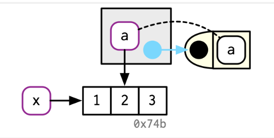

# Names and values

**Learning objectives:**

- test your knowledge
- identify objects in R (size, id, ...)


## Quiz {-}

1. How do I create a new column called "3" that contains the sum of 1 and 2?
```{r}
df <- data.frame(runif(3), runif(3))
df
```


```{r}
names(df) <- c(1, 2)
```
```{r}
df$`3`
```


```{r}
df$`3` <- df$`1` + df$`2`

df
```


2. How much memory does y occupy?
hint: use `library(lobstr)` 
```{r}
x <- runif(1e6)
y <- list(x, x, x)

length(y)

```


```{r}
library(lobstr)
lobstr::obj_size(y)
```


3. On which line does a get copied in the following example?
```{r}
a <- c(1, 5, 3, 2)
a
```


```{r}
b <- a
b
```


```{r}
b[[1]] <- 10
```

```{r}
b
```


### Object’s identifier

```{r}
x <- c(1, 2, 3)
obj_addr(x)
```


### Exercises

Do they all point to the same underlying function object? hint: `lobstr::obj_addr()`
```{r}
mean
base::mean
get("mean")
evalq(mean)
match.fun("mean")
```


### Copy-on-modify
```{r}
x <- c(1, 2, 3)
cat(tracemem(x), "\n")
#> <0x7f80c0e0ffc8> 
```

> untracemem() is the opposite of tracemem(); it turns tracing off.

```{r}
y <- x

y[[3]] <- 5L

untracemem(x)
```

### Introduction to functions

How to make a function in r:
```{r eval=FALSE}
name <- function(variables) {
  
}
```

```{r}
f <- function(a) {
  a
}

x <- c(1, 2, 3)
cat(tracemem(x), "\n")
#> <0x7fe1121693a8>

z <- f(x)
# there's no copy here!

untracemem(x)
```


### Lists
```{r}
l1 <- list(1, 2, 3)
```

### Data Frames
```{r}
d1 <- data.frame(x = c(1, 5, 6), y = c(2, 4, 3))
```

### Character vectors
```{r}
x <- c("a", "a", "abc", "d")
```


## Meeting Videos

### Cohort 1

(no video recorded)

### Cohort 2

`r knitr::include_url("https://www.youtube.com/embed/pCiNj2JRK50")`

### Cohort 3

`r knitr::include_url("https://www.youtube.com/embed/-bEXdOoxO_E")`

### Cohort 4

`r knitr::include_url("https://www.youtube.com/embed/gcVU_F-L6zY")`

### Cohort 5

`r knitr::include_url("https://www.youtube.com/embed/aqcvKox9V0Q")`

### Cohort 6

`r knitr::include_url("https://www.youtube.com/embed/O4Oo_qO7SIY")`

<details>
<summary> Meeting chat log </summary>

```
00:16:57	Federica Gazzelloni:	cohort 2 video: https://www.youtube.com/watch?v=pCiNj2JRK50
00:18:39	Federica Gazzelloni:	cohort 2 presentation: https://r4ds.github.io/bookclub-Advanced_R/Presentations/Week02/Cohort2_America/Chapter2Slides.html#1
00:40:24	Arthur Shaw:	Just the opposite, Ryan. Very clear presentation!
00:51:54	Trevin:	parquet?
00:53:00	Arthur Shaw:	We may all be right. {arrow} looks to deal with feather and parquet files: https://arrow.apache.org/docs/r/
01:00:04	Arthur Shaw:	Some questions for future meetings. (1) I find Ryan's use of slides hugely effective in conveying information. Would it be OK if future sessions (optionally) used slides? If so, should/could we commit slides to some folder on the repo? (2) I think reusing the images from Hadley's books really helps understanding and discussion. Is that OK to do? Here I'm thinking about copyright concerns. (If possible, I would rather not redraw variants of Hadley's images.)
01:01:35	Federica Gazzelloni:	It's all ok, you can use past presentation, you don't need to push them to the repo, you can use the images from the book
01:07:19	Federica Gazzelloni:	Can I use: gc(reset = TRUE) safely?
```
</details>

### Cohort 7

`r knitr::include_url("https://www.youtube.com/embed/kpAUoGO6elE")`

<details>

<summary>Meeting chat log</summary>
```
00:09:40	Ryan Honomichl:	https://drdoane.com/three-deep-truths-about-r/
00:12:51	Robert Hilly:	Be right back
00:36:12	Ryan Honomichl:	brb
00:41:18	Ron:	I tried mapply and also got different answers
00:41:44	collinberke:	Interesting, would like to know more what is going on.
00:49:57	Robert Hilly:	simple_map <- function(x, f, ...) {
  out <- vector("list", length(x))
  for (i in seq_along(x)) {
    out[[i]] <- f(x[[i]], ...)
  }
  out
}
```
</details>
