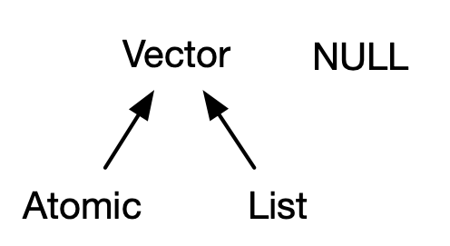
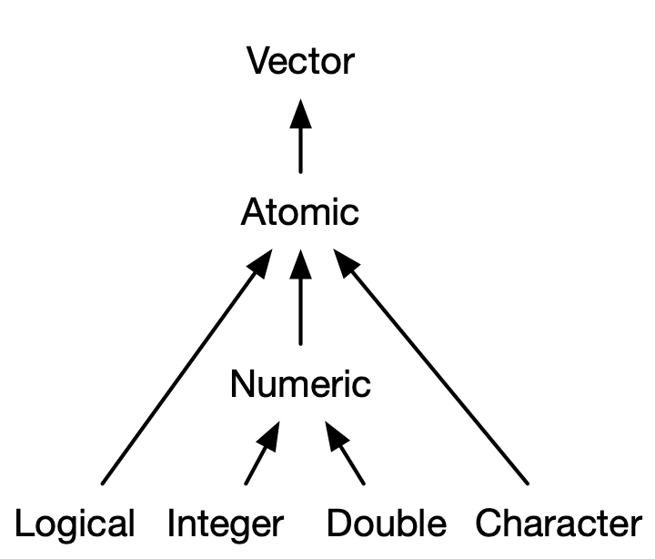
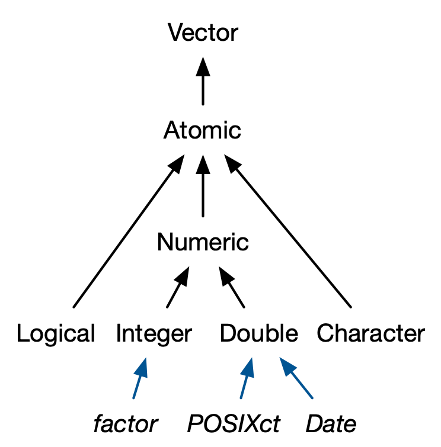
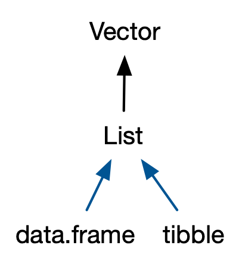

# Vectors

**Learning objectives:**

- Learn about different types of vectors
- Learn how these types relate to one another

## Types of vectors

The family tree of vectors:


Credit: [Advanced R](https://adv-r.hadley.nz/index.html) by Hadley Wickham

- **Atomic.** Elements all the same type.
- **List.** Elements are different Types.
- **NULL** Null elements. Length zero.

## Atomic vectors

### Types

- The vector family tree revisited. 
- Meet the children of atomic vectors


Credit: [Advanced R](https://adv-r.hadley.nz/index.html) by Hadley Wickham

### Length one

"Scalars" that consist of a single value.

```{r vec_lgl}
# Logicals
lgl1 <- TRUE
lgl2 <- T
```

```{r vec_dbl}
# Doubles
# integer, decimal, scientific, or hexidecimal format
dbl1 <- 1
dbl2 <- 1.234
dbl3 <- 1.234e0
dbl4 <- 0xcafe
```

```{r vec_int}
# Integers
# Note: L denotes an integer
int1 <- 1L
int2 <- 1.234L
int3 <- 1.234e0L
int4 <- 0xcafeL
```

```{r vec_str}
# Strings
str1 <- "hello" # double quotes
str2 <- 'hello' # single quotes
str3 <- "مرحبًا" # Unicode
str4 <- "\U0001f605" # sweaty_smile
```

### Longer

Several ways to make longer:

**1. With single values**

```{r long_single}
lgl_vec <- c(TRUE, FALSE)

```


**2. With other vectors**

```{r long_vec}
c(c(1, 2), c(3, 4))
```

**See also**

`{rlang}` has [vector constructor functions too](https://rlang.r-lib.org/reference/vector-construction.html):

- `rlang::lgl(...)`
- `rlang::int(...)`
- `rlang::dbl(...)`
- `rlang::chr(...)`

They look to do both more and less than `c()`.

- More: 
  - Enforce type
  - Splice lists
  - More types: `rlang::bytes()`, `rlang::cpl(...)`
- Less: 
  - Stricter rules on names

Note: currently has `questioning` lifecycle badge, since these constructors may get moved to `vctrs`

### Missing values

**Contagion**

For most computations, an operation over values that includes a missing value yields a missing value (unless you're careful)

```{r na_contagion}
# contagion
5*NA
sum(c(1, 2, NA, 3))

# innoculate
sum(c(1, 2, NA, 3), na.rm = TRUE)

```
**Types**

Each type has its own NA type

- Logical: `NA`
- Integer: `NA_integer`
- Double: `NA_double`
- Character: `NA_character`

This may not matter in many contexts.

But this does matter for operations where types matter like `dplyr::if_else()`.

### Testing

**What type of vector `is.*`() it?**

Test data type:

- Logical: `is.logical()`
- Integer: `is.integer()`
- Double: `is.double()`
- Character: `is.character()`

**What type of object is it?**

Don't test objects with these tools:

- `is.vector()`
- `is.atomic()`
- `is.numeric()`

Instead, maybe, use `{rlang}`

- `rlang::is_vector`
- `rlang::is_atomic`

```{r test_rlang}
# vector
rlang::is_vector(c(1, 2))
rlang::is_vector(list(1, 2))

# atomic
rlang::is_atomic(c(1, 2))
rlang::is_atomic(list(1, "a"))

```


See more [here](https://rlang.r-lib.org/reference/type-predicates.html)

### Coercion

R follows rules for coercion: character → double → integer → logical

R can coerce either automatically or explicitly

**Automatic**

Two contexts for automatic coercion:

1. Combination
1. Mathematical

Combination:

```{r coerce_c}
str(c(TRUE, "TRUE"))
```

Mathematical operations

```{r coerce_math}
# imagine a logical vector about whether an attribute is present
has_attribute <- c(TRUE, FALSE, TRUE, TRUE)

# number with attribute
sum(has_attribute)
```

**Explicit**

Use `as.*()`

- Logical: `as.logical()`
- Integer: `as.integer()`
- Double: `as.double()`
- Character: `as.character()`

But note that coercions may fail in one of two ways, or both:

- With warning/error
- NAs

```{r coerce_error}
as.integer(c(1, 2, "three"))
```

## Attributes

- What
- How
- Why

### What

Two perspectives:

- Name-value pairs
- Metadata

**Name-value pairs**

Formally, attributes have a name and a value.

**Metadata**

- Not data itself
- But data about the data

### How

Two operations:

1. Get
1. Set

Two cases:

1. Single attribute
2. Multiple attributes

**Single attribute**

Use `attr()`

```{r attr_single}
# some object
a <- c(1, 2, 3)

# set attribute
attr(x = a, which = "some_attribute_name") <- "some attribute"

# get attribute
attr(x = a, which = "some_attribute_name")
```
**Multiple attributes**

To set multiple attributes, use `structure()`
To get multiple attributes, use `attributes()`

```{r attr_multiple}
b <- c(4, 5, 6)

# set
b <- structure(
  .Data = b,
  attrib1 = "one",
  attrib2 = "two"
)

# get
str(attributes(b))
```

### Why

Two common use cases:

- Names
- Dimensions

**Names**

~~Three~~ Four ways to name:

```{r}
# 1. At creation
one <- c(one = 1, two = 2, three = 3)

# 2. By assigning a character vector of names
two <- c(1, 2, 3)
names(two) <- c("one", "two", "three")

# 3. By setting names--with base R
three <- c(1, 2, 3)
stats::setNames(
  object = three, 
  nm = c("One", "Two", "Three")
)

# 4. By setting names--with {rlang}
rlang::set_names(
  x = three,
  nm = c("One", "Two", "Three")
)
```

Thematically but not directly related: labelled class vectors with `haven::labelled()`

**Dimensions**

Important for arrays and matrices.

```{r}
# length 6 vector spread across 2 rows of 3 columns
matrix(1:6, nrow = 2, ncol = 3)
```

## S3 atomic vectors

- The vector family tree revisited. 
- Meet the children of typed atomic vectors


Credit: [Advanced R](https://adv-r.hadley.nz/index.html) by Hadley Wickham

This list could (more easily) be expanded to new  vector types with [`{vctrs}`](https://vctrs.r-lib.org/). See [rstudio::conf(2019) talk on the package around 18:27](https://www.rstudio.com/resources/rstudioconf-2019/vctrs-tools-for-making-size-and-type-consistent-functions/). See also [rstudio::conf(2020) talk on new vector types for dealing with non-decimal currencies](https://www.rstudio.com/resources/rstudioconf-2020/vctrs-creating-custom-vector-classes-with-the-vctrs-package/).

What makes S3 atomic vectors different than their parents?

Two things:

1. Class
2. Attributes (typically)

### Factors

Factors are integer vectors with:

- Class: "factor"
- Attributes: "levels", or the set of allowed values

```{r factor}
# Build a factor
a_factor <- factor(
  # values
  x = c(1, 2, 3),
  # exhaustive list of values
  levels = c(1, 2, 3, 4)
)

# Inspect
a_factor

# Dissect
# - type
typeof(a_factor)

# - attributes
attributes(a_factor)
```

Factors can be ordered. This can be useful for models or visaulations where order matters.

```{r factor_ordered}
# Build
ordered_factor <- ordered(
  # values
  x = c(1, 2, 3),
  # levels in ascending order
  levels = c(4, 3, 2, 1)
)

# Inspect
ordered_factor
```

### Dates

Dates are:

- Double vectors
- With class "Date"

The double component represents the number of days since since `1970-01-01`

```{r dates}
notes_date <- Sys.Date()

# type
typeof(notes_date)

# class
attributes(notes_date)
```

### Date-times

There are 2 Date-time representations in base R:

- POSIXct, where "ct" denotes calendar time
- POSIXlt, where "lt" designates local time.

Let's focus on POSIXct because:

- Simplest
- Built on an atomic vector
- Most apt to be in a data frame

Let's now build and deconstruct a Date-time

```{r date_time}
# Build
note_date_time <- as.POSIXct(
  # time
  x = Sys.time(),
  # time zone, used only for formatting
  tz = "EDT"
)

# Inspect
note_date_time

# Dissect
# - type
typeof(note_date_time)
# - attributes
attributes(note_date_time)
```


### Durations

Durations are:

- Double vectors
- Class: "difftime"
- Attributes: "units", or the unit of duration (e.g., weeks, hours, minutes, seconds, etc.)

```{r durations}
# Construct
one_minute <- as.difftime(1, units = "mins")

# Inspect
one_minute

# Dissect
# - type
typeof(one_minute)
# - attributes
attributes(one_minute)
```

See also:

- [`lubridate::make_difftime()`](https://lubridate.tidyverse.org/reference/make_difftime.html)
- [`clock::date_time_build()`](https://clock.r-lib.org/reference/date_time_build.html)

## Lists

Sometimes called a generic vector, a list can be composed of elements of different types.

### Constructing

Simple lists:

```{r list_simple}
# Construct
simple_list <- list(
  # logicals
  c(TRUE, FALSE),
  # integers
  1:20,
  # doubles
  c(1.2, 2.3, 3.4),
  # characters
  c("primo", "secundo", "tercio")
)

# Inspect
# - type
typeof(simple_list)
# - structure
str(simple_list)

```
Nested lists:

```{r list_nested}
nested_list <- list(
  # first level
  list(
    # second level
    list(
      # third level
      list(1)
    )
  )
)

str(nested_list)
```

Like JSON.

Combined lists

```{r list_combined}
# with list()
list_comb1 <- list(list(1, 2), list(3, 4))
# with c()
list_comb2 <- c(list(1, 2), list(3, 4))

# compare structure
str(list_comb1)
str(list_comb2)
```

### Testing

Check that is a list:

- `is.list()`
- `rlang::is_list()``

The two do the same, except that the latter can check for the number of elements

```{r list_test}
# is list
base::is.list(list_comb2)
rlang::is_list(list_comb2)

# is list of 4 elements
rlang::is_list(x = list_comb2, n = 4)

# is a vector (of a special type)
# remember the family tree?
rlang::is_vector(list_comb2)
```


### Coercion

## Data frames and tibbles

- The vector family tree revisited. 
- Meet the children of lists


Credit: [Advanced R](https://adv-r.hadley.nz/index.html) by Hadley Wickham

### Data frame

A data frame is a:

- Named list of vectors (i.e., column names)
- Class: "data frame"
- Attributes:
  - (column) `names`
  - `row.names``

```{r data_frame}
# Construct
df <- data.frame(
  # named atomic vector
  col1 = c(1, 2, 3),
  # another named atomic vector
  col2 = c("un", "deux", "trois"),
  # not necessary after R 4.1 (?)
  stringsAsFactors = FALSE
)

# Inspect
df

# Deconstruct
# - type
typeof(df)
# - attributes
attributes(df)
```


Unlike other lists, the length of each vector must be the same (i.e. as many vector elements as rows in the data frame).

### Tibble

As compared to data frames, tibbles are data frames that are:

- Lazy
- Surly

#### Lazy

Tibbles do not:

- Coerce strings
- Transform non-syntactic names
- Recycle vectors of length greater than 1

**Coerce strings**

```{r tbl_no_coerce}
chr_col <- c("don't", "factor", "me", "bro")

# data frame
df <- data.frame(
  a = chr_col,
  # in R 4.1 and earlier, this was the default
  stringsAsFactors = TRUE
)

# tibble
tbl <- tibble::tibble(
  a = chr_col
)

# contrast the structure
str(df$a)
str(tbl$a)

```

**Transform non-syntactic names**

```{r tbl_col_name}
# data frame
df <- data.frame(
  `1` = c(1, 2, 3)
)

# tibble
tbl <- tibble::tibble(
  `1` = c(1, 2, 3)
)

# contrast the names
names(df)
names(tbl)
```

**Recycle vectors of length greater than 1**

```{r tbl_recycle, error=TRUE}
# data frame
df <- data.frame(
  col1 = c(1, 2, 3, 4),
  col2 = c(1, 2)
)

# tibble
tbl <- tibble::tibble(
  col1 = c(1, 2, 3, 4),
  col2 = c(1, 2)
)
```


#### Surly

Tibbles do only what they're asked and complain if what they're asked doesn't make sense:

- Subsetting always yields a tibble
- Complains if cannot find column

**Subsetting always yields a tibble**

```{r tbl_subset}
# data frame
df <- data.frame(
  col1 = c(1, 2, 3, 4)
)

# tibble
tbl <- tibble::tibble(
  col1 = c(1, 2, 3, 4)
)

# contrast
df_col <- df[, "col1"]
str(df_col)
tbl_col <- tbl[, "col1"]
str(tbl_col)

# to select a vector, do one of these instead
tbl_col_1 <- tbl[["col1"]]
str(tbl_col_1)
tbl_col_2 <- dplyr::pull(tbl, col1)
str(tbl_col_2)
```

**Complains if cannot find column**

```{r tbl_col_match, warning=TRUE}
names(df)
df$col

names(tbl)
tbl$col
```

### Testing

Whether data frame: `is.data.frame()`. Note: both data frame and tibble are data frames.

Whether tibble: `tibble::is_tibble`. Note: only tibbles are tibbles. Vanilla data frames are not.

### Coercion

- To data frame: `as.data.frame()`
- To tibble: `tibble::as_tibble()`

## `NULL`

Special type of object that:

- Length 0
- Cannot have attributes

```{r null, error=TRUE}
typeof(NULL)
#> [1] "NULL"

length(NULL)
#> [1] 0

x <- NULL
attr(x, "y") <- 1
```


## Meeting Videos

### Cohort 1

`r knitr::include_url("https://www.youtube.com/embed/pQ-xDAPEQaw")`

### Cohort 2

`r knitr::include_url("https://www.youtube.com/embed/CpLM6SdpTFY")`

### Cohort 3

`r knitr::include_url("https://www.youtube.com/embed/9E4RlbW8vxU")`

### Cohort 4

`r knitr::include_url("https://www.youtube.com/embed/LCAgxwm5Ydg")`

### Cohort 5

`r knitr::include_url("https://www.youtube.com/embed/DrVY6DE9ymY")`

### Cohort 6

`r knitr::include_url("https://www.youtube.com/embed/URL")`

<details>
<summary> Meeting chat log </summary>

```
LOG
```
</details>
