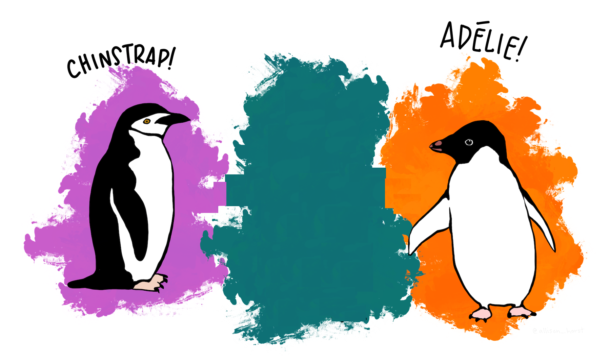

# Vectors

**Learning objectives:**

-   Learn about different types of vectors and their attributes
-   Navigate through vector types and their value types
-   Venture into factors and date-time objects
-   Discuss the differences between data frames and tibbles
-   Do not get absorbed by the `NA` and `NULL` black hole

```{r ch9_setup, message = FALSE, warning = FALSE}
library("dplyr")
library("gt")
library("palmerpenguins")
```


<details>
<summary>Session Info</summary>
```{r}
utils::sessionInfo()
```
</details>

## Aperitif


### Counting Penguins

Consider this code to count the number of Gentoo penguins in the `penguins` data set. We see that there are 124 Gentoo penguins.

```{r, eval = FALSE}
sum("Gentoo" == penguins$species)
# output: 124
```

### In

One subtle error can arise in trying out `%in%` here instead.

```{r, results = 'hide'}
species_vector <- penguins |> select(species)
print("Gentoo" %in% species_vector)
# output: FALSE
```



### Fix: base R 

```{r, results = 'hide'}
species_unlist <- penguins |> select(species) |> unlist()
print("Gentoo" %in% species_unlist)
# output: TRUE
```

### Fix: dplyr

```{r, results = 'hide'}
species_pull <- penguins |> select(species) |> pull()
print("Gentoo" %in% species_pull)
# output: TRUE
```

### Motivation

* What are the different types of vectors?
* How does this affect accessing vectors?

<details>
<summary>Side Quest: Looking up the `%in%` operator</summary>
If you want to look up the manual pages for the `%in%` operator with the `?`, use backticks:

```{r, eval = FALSE}
?`%in%`
```

and we find that `%in%` is a wrapper for the `match()` function.

</details>


## Types of Vectors

 

Two main types:

-   **Atomic**: Elements all the same type.
-   **List**: Elements are different Types.

Closely related but not technically a vector:

-   **NULL**: Null elements. Often length zero.

## Atomic Vectors

### Types of atomic vectors

 

-   **Logical**: True/False
-   **Integer**: Numeric (discrete, no decimals)
-   **Double**: Numeric (continuous, decimals)
-   **Character**: String

### Vectors of Length One

**Scalars** are vectors that consist of a single value.

#### Logicals

```{r vec_lgl}
lgl1 <- TRUE
lgl2 <- T #abbreviation for TRUE
lgl3 <- FALSE
lgl4 <- F #abbreviation for FALSE
```

#### Doubles

```{r vec_dbl}
# integer, decimal, scientific, or hexidecimal format
dbl1 <- 1
dbl2 <- 1.234 # decimal
dbl3 <- 1.234e0 # scientific format
dbl4 <- 0xcafe # hexidecimal format
```

#### Integers

Integers must be followed by L and cannot have fractional values

```{r vec_int}
int1 <- 1L
int2 <- 1234L
int3 <- 1234e0L
int4 <- 0xcafeL
```

<details>
<summary>Pop Quiz: Why "L" for integers?</summary>
Wickham notes that the use of `L` dates back to the **C** programming language and its "long int" type for memory allocation.
</details>

#### Strings

Strings can use single or double quotes and special characters are escaped with \

```{r vec_str}
str1 <- "hello" # double quotes
str2 <- 'hello' # single quotes
str3 <- "مرحبًا" # Unicode
str4 <- "\U0001f605" # sweaty_smile
```

### Longer

There are several ways to make longer vectors:

**1. With single values** inside c() for combine.

```{r long_single}
lgl_var <- c(TRUE, FALSE)
int_var <- c(1L, 6L, 10L)
dbl_var <- c(1, 2.5, 4.5)
chr_var <- c("these are", "some strings")
```

 

**2. With other vectors**

```{r long_vec}
c(c(1, 2), c(3, 4)) # output is not nested
```

<details>
<summary>Side Quest: rlang</summary>

`{rlang}` has [vector constructor functions too](https://rlang.r-lib.org/reference/vector-construction.html):

-   `rlang::lgl(...)`
-   `rlang::int(...)`
-   `rlang::dbl(...)`
-   `rlang::chr(...)`

They look to do both more and less than `c()`.

-   More:
    -   Enforce type
    -   Splice lists
    -   More types: `rlang::bytes()`, `rlang::cpl(...)`
-   Less:
    -   Stricter rules on names

Note: currently has `questioning` lifecycle badge, since these constructors may get moved to `vctrs`

</details>

### Type and Length

We can determine the type of a vector with `typeof()` and its length with `length()`

```{r type_length, echo = FALSE}
# typeof(lgl_var)
# typeof(int_var)
# typeof(dbl_var)
# typeof(chr_var)
# 
# length(lgl_var)
# length(int_var)
# length(dbl_var)
# length(chr_var)

var_names <- c("lgl_var", "int_var", "dbl_var", "chr_var")
var_values <- c("TRUE, FALSE", "1L, 6L, 10L", "1, 2.5, 4.5", "'these are', 'some strings'")
var_type <- c("logical", "integer", "double", "character")
var_length <- c(2, 3, 3, 2)

type_length_df <- data.frame(var_names, var_values, var_type, var_length)

# make gt table
type_length_df |>
  gt() |>
  cols_align(align = "center") |>
  cols_label(
    var_names ~ "name",
    var_values ~ "value",
    var_type ~ "typeof()",
    var_length ~ "length()"
  ) |>
  tab_header(
    title = "Types of Atomic Vectors",
    subtitle = ""
  ) |>
  tab_footnote(
    footnote = "Source: https://adv-r.hadley.nz/index.html",
    locations = cells_title(groups = "title")
  ) |>
  tab_style(
    style = list(cell_fill(color = "#F9E3D6")),
    locations = cells_body(columns = var_type)
  ) |>
  tab_style(
    style = list(cell_fill(color = "lightcyan")),
    locations = cells_body(columns = var_length)
  )
```

<details>
<summary>Side Quest: Penguins</summary>
```{r}
typeof(penguins$species)
class(penguins$species)

typeof(species_unlist)
class(species_unlist)

typeof(species_pull)
class(species_pull)
```

</details>

### Missing values

#### Contagion

For most computations, an operation over values that includes a missing value yields a missing value (unless you're careful)

```{r na_contagion}
# contagion
5*NA
sum(c(1, 2, NA, 3))
```

#### Exceptions

```{r na_exceptions, eval = FALSE}
NA ^ 0
#> [1] 1
NA | TRUE
#> [1] TRUE
NA & FALSE
#> [1] FALSE
```


#### Innoculation

```{r na_innoculation, eval = FALSE}
sum(c(1, 2, NA, 3), na.rm = TRUE)
# output: 6
```

To search for missing values use `is.na()`

```{r na_search, eval = FALSE}
x <- c(NA, 5, NA, 10)
x == NA
# output: NA NA NA NA [BATMAN!]
```

```{r na_search_better, eval = FALSE}
is.na(x)
# output: TRUE FALSE TRUE FALSE
```

<details>
<summary>Side Quest: NA Types</summary>

Each type has its own NA type

-   Logical: `NA`
-   Integer: `NA_integer`
-   Double: `NA_double`
-   Character: `NA_character`

This may not matter in many contexts.

But this does matter for operations where types matter like `dplyr::if_else()`.
</details>


### Testing

**What type of vector `is.*`() it?**

Test data type:

-   Logical: `is.logical()`
-   Integer: `is.integer()`
-   Double: `is.double()`
-   Character: `is.character()`

**What type of object is it?**

Don't test objects with these tools:

-   `is.vector()`
-   `is.atomic()`
-   `is.numeric()` 

They don’t test if you have a vector, atomic vector, or numeric vector; you’ll need to carefully read the documentation to figure out what they actually do (preview: *attributes*)

<details>
<summary>Side Quest: rlang</summary>

Instead, maybe, use `{rlang}`

-   `rlang::is_vector`
-   `rlang::is_atomic`

```{r test_rlang}
# vector
rlang::is_vector(c(1, 2))
rlang::is_vector(list(1, 2))

# atomic
rlang::is_atomic(c(1, 2))
rlang::is_atomic(list(1, "a"))

```

See more [here](https://rlang.r-lib.org/reference/type-predicates.html)
</details>


### Coercion

* R follows rules for coercion: character → double → integer → logical

* R can coerce either automatically or explicitly

#### **Automatic**

Two contexts for automatic coercion:

1.  Combination
2.  Mathematical

##### Coercion by Combination:

```{r coerce_c}
str(c(TRUE, "TRUE"))
```

##### Coercion by Mathematical operations:

```{r coerce_math}
# imagine a logical vector about whether an attribute is present
has_attribute <- c(TRUE, FALSE, TRUE, TRUE)

# number with attribute
sum(has_attribute)
```

#### **Explicit**

<!--

Use `as.*()`

-   Logical: `as.logical()`
-   Integer: `as.integer()`
-   Double: `as.double()`
-   Character: `as.character()`

-->

```{r explicit_coercion, echo = FALSE}
# dbl_var
# as.integer(dbl_var)
# lgl_var
# as.character(lgl_var)

var_names <- c("lgl_var", "int_var", "dbl_var", "chr_var")
var_values <- c("TRUE, FALSE", "1L, 6L, 10L", "1, 2.5, 4.5", "'these are', 'some strings'")
as_logical <- c("TRUE FALSE", "TRUE TRUE TRUE", "TRUE TRUE TRUE", "NA NA")
as_integer <- c("1 0", "1 6 10", "1 2 4", 'NA_integer')
as_double <- c("1 0", "1 6 10", "1.0 2.5 4.5", 'NA_double')
as_character <- c("'TRUE' 'FALSE'", "'1' '6' '10'", "'1' '2.5' '4.5'", "'these are', 'some strings'")

coercion_df <- data.frame(var_names, var_values, as_logical, as_integer, as_double, as_character)

coercion_df |>
  gt() |>
  cols_align(align = "center") |>
  cols_label(
    var_names ~ "name",
    var_values ~ "value",
    as_logical ~ "as.logical()",
    as_integer ~ "as.integer()",
    as_double ~ "as.double()",
    as_character ~ "as.character()"
  ) |>
  tab_header(
    title = "Coercion of Atomic Vectors",
    subtitle = ""
  ) |>
  tab_footnote(
    footnote = "Source: https://adv-r.hadley.nz/index.html",
    locations = cells_title(groups = "title")
  ) |>
  tab_style(
    style = list(cell_fill(color = "#F9E3D6")),
    locations = cells_body(columns = c(as_logical, as_double))
  ) |>
  tab_style(
    style = list(cell_fill(color = "lightcyan")),
    locations = cells_body(columns = c(as_integer, as_character))
  )
```

But note that coercion may fail in one of two ways, or both:

-   With warning/error
-   NAs

```{r coerce_error}
as.integer(c(1, 2, "three"))
```

### Exercises

1. How do you create raw and complex scalars?

<details><summary>Answer(s)</summary>
```{r, eval = FALSE}
as.raw(42)
#> [1] 2a
charToRaw("A")
#> [1] 41
complex(length.out = 1, real = 1, imaginary = 1)
#> [1] 1+1i
```
</details>

2. Test your knowledge of the vector coercion rules by predicting the output of the following uses of c():

```{r, eval = FALSE}
c(1, FALSE)
c("a", 1)
c(TRUE, 1L)
```

<details><summary>Answer(s)</summary>
```{r, eval = FALSE}
c(1, FALSE)      # will be coerced to double    -> 1 0
c("a", 1)        # will be coerced to character -> "a" "1"
c(TRUE, 1L)      # will be coerced to integer   -> 1 1
```
</details>

3. Why is `1 == "1"` true? Why is `-1 < FALSE` true? Why is `"one" < 2` false?

<details><summary>Answer(s)</summary>
These comparisons are carried out by operator-functions (==, <), which coerce their arguments to a common type. In the examples above, these types will be character, double and character: 1 will be coerced to "1", FALSE is represented as 0 and 2 turns into "2" (and numbers precede letters in lexicographic order (may depend on locale)).

</details>

4. Why is the default missing value, NA, a logical vector? What’s special about logical vectors?

<details><summary>Answer(s)</summary>
The presence of missing values shouldn’t affect the type of an object. Recall that there is a type-hierarchy for coercion from character → double → integer → logical. When combining `NA`s with other atomic types, the `NA`s will be coerced to integer (`NA_integer_`), double (`NA_real_`) or character (`NA_character_`) and not the other way round. If `NA` were a character and added to a set of other values all of these would be coerced to character as well.
</details>

5. Precisely what do `is.atomic()`, `is.numeric()`, and `is.vector()` test for?

<details><summary>Answer(s)</summary>
The documentation states that:

* `is.atomic()` tests if an object is an atomic vector (as defined in *Advanced R*) or is `NULL` (!).
* `is.numeric()` tests if an object has type integer or double and is not of class `factor`, `Date`, `POSIXt` or `difftime`.
* `is.vector()` tests if an object is a vector (as defined in *Advanced R*) or an expression and has no attributes, apart from names.

Atomic vectors are defined in *Advanced R* as objects of type logical, integer, double, complex, character or raw. Vectors are defined as atomic vectors or lists.
</details>


## Attributes

Attributes are name-value pairs that attach metadata to an object(vector).

* **Name-value pairs**: attributes have a name and a value
* **Metadata**: not data itself, but data about the data

### How? 

#### Getting and Setting

Three functions:

1. retrieve and modify single attributes with `attr()`
2. retrieve en masse with `attributes()`
3. set en masse with `structure()`

**Single attribute**

Use `attr()`

```{r attr_single}
# some object
a <- c(1, 2, 3)

# set attribute
attr(x = a, which = "attribute_name") <- "some attribute"

# get attribute
attr(a, "attribute_name")
```

**Multiple attributes**

To set multiple attributes, use `structure()` To get multiple attributes, use `attributes()`

```{r attr_multiple_not_from_textbook, echo = FALSE}
# b <- c(4, 5, 6)
# 
# # set
# b <- structure(
#   .Data = b,
#   attrib1_name = "first_attribute",
#   attrib2_name = "second_attribute"
# )
# 
# # get
# attributes(b)
# str(attributes(b))
```


```{r attr_multiple, eval = FALSE}
a <- 1:3
attr(a, "x") <- "abcdef"
attr(a, "x")
#> [1] "abcdef"

attr(a, "y") <- 4:6
str(attributes(a))
#> List of 2
#>  $ x: chr "abcdef"
#>  $ y: int [1:3] 4 5 6

# Or equivalently
a <- structure(
  1:3, 
  x = "abcdef",
  y = 4:6
)
str(attributes(a))
#> List of 2
#>  $ x: chr "abcdef"
#>  $ y: int [1:3] 4 5 6
```

 

### Why

Three particularly important attributes: 

1. **names** - a character vector giving each element a name
2. **dimension** - (or dim) turns vectors into matrices and arrays 
3. **class** - powers the S3 object system (we'll learn more about this in chapter 13)

Most attributes are lost by most operations.  Only two attributes are routinely preserved: names and dimension.

#### Names

~~Three~~ Four ways to name:

```{r names}
# (1) When creating it: 
x <- c(A = 1, B = 2, C = 3)
x

# (2) By assigning a character vector to names()
y <- 1:3
names(y) <- c("a", "b", "c")
y

# (3) Inline, with setNames():
z <- setNames(1:3, c("a", "b", "c"))
z

```

 

```{r names_via_rlang}
# (4) By setting names--with {rlang}
a <- 1:3
rlang::set_names(
  x = a,
  nm = c("a", "b", "c")
)

```

 

* You can remove names from a vector by using `x <- unname(x)` or `names(x) <- NULL`.
* Thematically but not directly related: labelled class vectors with `haven::labelled()`


#### Dimensions

Create matrices and arrays with `matrix()` and `array()`, or by using the assignment form of `dim()`:

```{r dimensions}
# Two scalar arguments specify row and column sizes
x <- matrix(1:6, nrow = 2, ncol = 3)
x

# One vector argument to describe all dimensions
y <- array(1:24, c(2, 3, 4)) # rows, columns, no of arrays
y

# You can also modify an object in place by setting dim()
z <- 1:6
dim(z) <- c(2, 3) # rows, columns
z

a <- 1:24
dim(a) <- c(2, 3, 4) # rows, columns, no of arrays
a
```

##### Functions for working with vectors, matrices and arrays:

Vector | Matrix	| Array
:----- | :---------- | :-----
`names()` | `rownames()`, `colnames()` | `dimnames()`
`length()` | `nrow()`, `ncol()` | `dim()`
`c()` | `rbind()`, `cbind()` | `abind::abind()`
— | `t()` | `aperm()`
`is.null(dim(x))` | `is.matrix()` | `is.array()`

* **Caution**: A vector without a `dim` attribute set is often thought of as 1-dimensional, but actually has `NULL` dimensions.
* One dimension?

```{r examples_of_1D, eval = FALSE}
str(1:3)                   # 1d vector
#>  int [1:3] 1 2 3
str(matrix(1:3, ncol = 1)) # column vector
#>  int [1:3, 1] 1 2 3
str(matrix(1:3, nrow = 1)) # row vector
#>  int [1, 1:3] 1 2 3
str(array(1:3, 3))         # "array" vector
#>  int [1:3(1d)] 1 2 3
```


### Exercises

1. How is `setNames()` implemented? How is `unname()` implemented? Read the source code.

<details><summary>Answer(s)</summary>
`setNames()` is implemented as:

```{r, eval = FALSE}
setNames <- function(object = nm, nm) {
  names(object) <- nm
  object
}
```

Because the data argument comes first, `setNames()` also works well with the magrittr-pipe operator. When no first argument is given, the result is a named vector (this is rather untypical as required arguments usually come first):

```{r, eval = FALSE}
setNames( , c("a", "b", "c"))
#>   a   b   c 
#> "a" "b" "c"
```

`unname()` is implemented in the following way:

```{r, eval = FALSE}
unname <- function(obj, force = FALSE) {
  if (!is.null(names(obj))) 
    names(obj) <- NULL
  if (!is.null(dimnames(obj)) && (force || !is.data.frame(obj))) 
    dimnames(obj) <- NULL
  obj
}
```

`unname()` removes existing names (or dimnames) by setting them to `NULL`.
</details>

2. What does `dim()` return when applied to a 1-dimensional vector? When might you use `NROW()` or `NCOL()`?

<details><summary>Answer(s)</summary>

> dim() will return NULL when applied to a 1d vector.

One may want to use `NROW()` or `NCOL()` to handle atomic vectors, lists and NULL values in the same way as one column matrices or data frames. For these objects `nrow()` and `ncol()` return NULL:

```{r, eval = FALSE}
x <- 1:10

# Return NULL
nrow(x)
#> NULL
ncol(x)
#> NULL

# Pretend it's a column vector
NROW(x)
#> [1] 10
NCOL(x)
#> [1] 1
```

</details>

3. How would you describe the following three objects? What makes them different from `1:5`?

```{r}
x1 <- array(1:5, c(1, 1, 5))
x2 <- array(1:5, c(1, 5, 1))
x3 <- array(1:5, c(5, 1, 1))
```

<details><summary>Answer(s)</summary>
```{r, eval = FALSE}
x1 <- array(1:5, c(1, 1, 5))  # 1 row,  1 column,  5 in third dim.
x2 <- array(1:5, c(1, 5, 1))  # 1 row,  5 columns, 1 in third dim.
x3 <- array(1:5, c(5, 1, 1))  # 5 rows, 1 column,  1 in third dim.
```
</details>


4. An early draft used this code to illustrate `structure()`:

```{r, eval = FALSE}
structure(1:5, comment = "my attribute")
#> [1] 1 2 3 4 5
```

But when you print that object you don’t see the comment attribute. Why? Is the attribute missing, or is there something else special about it?

<details><summary>Answer(s)</summary>
The documentation states (see `?comment`):

> Contrary to other attributes, the comment is not printed (by print or print.default).

Also, from `?attributes:`

> Note that some attributes (namely class, comment, dim, dimnames, names, row.names and tsp) are treated specially and have restrictions on the values which can be set.

We can retrieve comment attributes by calling them explicitly:

```{r, eval = FALSE}
foo <- structure(1:5, comment = "my attribute")

attributes(foo)
#> $comment
#> [1] "my attribute"
attr(foo, which = "comment")
#> [1] "my attribute"
```

</details>


## **Class** - S3 atomic vectors

 

Credit: [Advanced R](https://adv-r.hadley.nz/index.html) by Hadley Wickham

**Having a class attribute turns an object into an S3 object.**

What makes S3 atomic vectors different?

1. behave differently from a regular vector when passed to a generic function 
2. often store additional information in other attributes

Four important S3 vectors used in base R:

1. **Factors** (categorical data)
2. **Dates**
3. **Date-times** (POSIXct)
4. **Durations** (difftime)

### Factors

A factor is a vector used to store categorical data that can contain only predefined values.

Factors are integer vectors with:

-   Class: "factor"
-   Attributes: "levels", or the set of allowed values

```{r factor}
colors = c('red', 'blue', 'green','red','red', 'green')
# Build a factor
a_factor <- factor(
  # values
  x = colors,
  # exhaustive list of values
  levels = c('red', 'blue', 'green', 'yellow')
)
```

```{r factor_table}
# Useful when some possible values are not present in the data
table(colors)
table(a_factor)

# - type
typeof(a_factor)
class(a_factor)

# - attributes
attributes(a_factor)
```

#### Custom Order

Factors can be ordered. This can be useful for models or visualizations where order matters.

```{r factor_ordered}

values <- c('high', 'med', 'low', 'med', 'high', 'low', 'med', 'high')

ordered_factor <- ordered(
  # values
  x = values,
  # levels in ascending order
  levels = c('low', 'med', 'high')
)

# Inspect
ordered_factor

table(values)
table(ordered_factor)
```

### Dates

Dates are:

-   Double vectors
-   With class "Date"
-   No other attributes

```{r dates}
notes_date <- Sys.Date()

# type
typeof(notes_date)

# class
attributes(notes_date)
```

The double component represents the number of days since since the [Unix epoch](https://en.wikipedia.org/wiki/Unix_time) `1970-01-01`

```{r days_since_1970}
date <- as.Date("1970-02-01")
unclass(date)
```

### Date-times

There are 2 Date-time representations in base R:

-   POSIXct, where "ct" denotes *calendar time*
-   POSIXlt, where "lt" designates *local time*

<!--

Just for fun:
"How to pronounce 'POSIXct'?"
https://www.howtopronounce.com/posixct

-->

We'll focus on POSIXct because:

-   Simplest
-   Built on an atomic (double) vector
-   Most appropriate for use in a data frame

Let's now build and deconstruct a Date-time

```{r date_time}
# Build
note_date_time <- as.POSIXct(
  x = Sys.time(), # time
  tz = "America/New_York" # time zone, used only for formatting
)

# Inspect
note_date_time

# - type
typeof(note_date_time)

# - attributes
attributes(note_date_time)

structure(note_date_time, tzone = "Europe/Paris")
```

```{r date_time_format}
date_time <- as.POSIXct("2024-02-22 12:34:56", tz = "EST")
unclass(date_time)
```


### Durations

Durations represent the amount of time between pairs of dates or date-times.

-   Double vectors
-   Class: "difftime"
-   Attributes: "units", or the unit of duration (e.g., weeks, hours, minutes, seconds, etc.)

```{r durations}
# Construct
one_minute <- as.difftime(1, units = "mins")
# Inspect
one_minute

# Dissect
# - type
typeof(one_minute)
# - attributes
attributes(one_minute)
```

```{r durations_math}
time_since_01_01_1970 <- notes_date - date
time_since_01_01_1970
```


See also:

-   [`lubridate::make_difftime()`](https://lubridate.tidyverse.org/reference/make_difftime.html)
-   [`clock::date_time_build()`](https://clock.r-lib.org/reference/date_time_build.html)


### Exercises

1. What sort of object does `table()` return? What is its type? What attributes does it have? How does the dimensionality change as you tabulate more variables?

<details><summary>Answer(s)</summary>

`table()` returns a contingency table of its input variables. It is implemented as an integer vector with class table and dimensions (which makes it act like an array). Its attributes are dim (dimensions) and dimnames (one name for each input column). The dimensions correspond to the number of unique values (factor levels) in each input variable.

```{r, eval = FALSE}
x <- table(mtcars[c("vs", "cyl", "am")])

typeof(x)
#> [1] "integer"
attributes(x)
#> $dim
#> [1] 2 3 2
#> 
#> $dimnames
#> $dimnames$vs
#> [1] "0" "1"
#> 
#> $dimnames$cyl
#> [1] "4" "6" "8"
#> 
#> $dimnames$am
#> [1] "0" "1"
#> 
#> 
#> $class
#> [1] "table"
```
</details>

2. What happens to a factor when you modify its levels?

```{r, eval = FALSE}
f1 <- factor(letters)
levels(f1) <- rev(levels(f1))
```

<details><summary>Answer(s)</summary>
The underlying integer values stay the same, but the levels are changed, making it look like the data has changed.

```{r, eval = FALSE}
f1 <- factor(letters)
f1
#>  [1] a b c d e f g h i j k l m n o p q r s t u v w x y z
#> Levels: a b c d e f g h i j k l m n o p q r s t u v w x y z
as.integer(f1)
#>  [1]  1  2  3  4  5  6  7  8  9 10 11 12 13 14 15 16 17 18 19 20 21 22 23 24 25
#> [26] 26

levels(f1) <- rev(levels(f1))
f1
#>  [1] z y x w v u t s r q p o n m l k j i h g f e d c b a
#> Levels: z y x w v u t s r q p o n m l k j i h g f e d c b a
as.integer(f1)
#>  [1]  1  2  3  4  5  6  7  8  9 10 11 12 13 14 15 16 17 18 19 20 21 22 23 24 25
#> [26] 26
```
</details>

3. What does this code do? How do `f2` and `f3` differ from `f1`?

```{r, eval = FALSE}
f2 <- rev(factor(letters))
f3 <- factor(letters, levels = rev(letters))
```

<details><summary>Answer(s)</summary>
For `f2` and `f3` either the order of the factor elements or its levels are being reversed. For `f1` both transformations are occurring.

```{r, eval = FALSE}
# Reverse element order
(f2 <- rev(factor(letters)))
#>  [1] z y x w v u t s r q p o n m l k j i h g f e d c b a
#> Levels: a b c d e f g h i j k l m n o p q r s t u v w x y z
as.integer(f2)
#>  [1] 26 25 24 23 22 21 20 19 18 17 16 15 14 13 12 11 10  9  8  7  6  5  4  3  2
#> [26]  1

# Reverse factor levels (when creating factor)
(f3 <- factor(letters, levels = rev(letters)))
#>  [1] a b c d e f g h i j k l m n o p q r s t u v w x y z
#> Levels: z y x w v u t s r q p o n m l k j i h g f e d c b a
as.integer(f3)
#>  [1] 26 25 24 23 22 21 20 19 18 17 16 15 14 13 12 11 10  9  8  7  6  5  4  3  2
#> [26]  1
```
</details>


## Lists

* sometimes called a generic vector or recursive vector
* Recall ([section 2.3.3](https://adv-r.hadley.nz/names-values.html#list-references)): each element is really a *reference* to another object
* an be composed of elements of different types (as opposed to atomic vectors which must be of only one type)

### Constructing

Simple lists:

```{r list_simple}
# Construct
simple_list <- list(
  c(TRUE, FALSE),   # logicals
  1:20,             # integers
  c(1.2, 2.3, 3.4), # doubles
  c("primo", "secundo", "tercio") # characters
)

simple_list

# Inspect
# - type
typeof(simple_list)
# - structure
str(simple_list)

# Accessing
simple_list[1]
simple_list[2]
simple_list[3]
simple_list[4]

simple_list[[1]][2]
simple_list[[2]][8]
simple_list[[3]][2]
simple_list[[4]][3]
```

Even Simpler List

```{r list_simpler}
# Construct
simpler_list <- list(TRUE, FALSE, 
                    1, 2, 3, 4, 5, 
                    1.2, 2.3, 3.4, 
                    "primo", "secundo", "tercio")

# Accessing
simpler_list[1]
simpler_list[5]
simpler_list[9]
simpler_list[11]
```

Nested lists:

```{r list_nested}
nested_list <- list(
  # first level
  list(
    # second level
    list(
      # third level
      list(1)
    )
  )
)

str(nested_list)
```

Like JSON.

Combined lists

```{r list_combined}
# with list()
list_comb1 <- list(list(1, 2), list(3, 4))
# with c()
list_comb2 <- c(list(1, 2), list(3, 4))

# compare structure
str(list_comb1)
str(list_comb2)

# does this work if they are different data types?
list_comb3 <- c(list(1, 2), list(TRUE, FALSE))
str(list_comb3)
```

### Testing

Check that is a list:

-   `is.list()`
-   \`rlang::is_list()\`\`

The two do the same, except that the latter can check for the number of elements

```{r list_test}
# is list
base::is.list(list_comb2)
rlang::is_list(list_comb2)

# is list of 4 elements
rlang::is_list(x = list_comb2, n = 4)

# is a vector (of a special type)
# remember the family tree?
rlang::is_vector(list_comb2)
```

### Coercion

Use `as.list()`

```{r list_coercion}
list(1:3)
as.list(1:3)
```

### Matrices and arrays

Although not often used, the dimension attribute can be added to create **list-matrices** or **list-arrays**.

```{r list_matrices_arrays}
l <- list(1:3, "a", TRUE, 1.0)
dim(l) <- c(2, 2)
l

l[[1, 1]]
```


### Exercises

1. List all the ways that a list differs from an atomic vector.

<details><summary>Answer(s)</summary>

* Atomic vectors are always homogeneous (all elements must be of the same type). Lists may be heterogeneous (the elements can be of different types) as described in the introduction of the vectors chapter.
* Atomic vectors point to one address in memory, while lists contain a separate reference for each element. (This was described in the list sections of the vectors and the names and values chapters.)

```{r, eval = FALSE}
lobstr::ref(1:2)
#> [1:0x7fcd936f6e80] <int>
lobstr::ref(list(1:2, 2))
#> █ [1:0x7fcd93d53048] <list> 
#> ├─[2:0x7fcd91377e40] <int> 
#> └─[3:0x7fcd93b41eb0] <dbl>
```


* Subsetting with out-of-bounds and NA values leads to different output. For example, [ returns NA for atomics and NULL for lists. (This is described in more detail within the subsetting chapter.)

```{r, eval = FALSE}
# Subsetting atomic vectors
(1:2)[3]
#> [1] NA
(1:2)[NA]
#> [1] NA NA

# Subsetting lists
as.list(1:2)[3]
#> [[1]]
#> NULL
as.list(1:2)[NA]
#> [[1]]
#> NULL
#> 
#> [[2]]
#> NULL
```


</details>

2. Why do you need to use `unlist()` to convert a list to an atomic vector? Why doesn’t `as.vector()` work?

<details><summary>Answer(s)</summary>
A list is already a vector, though not an atomic one! Note that as.vector() and is.vector() use different definitions of “vector!”

```{r, eval = FALSE}
is.vector(as.vector(mtcars))
#> [1] FALSE
```

</details>

3. Compare and contrast `c()` and `unlist()` when combining a date and date-time into a single vector.

<details><summary>Answer(s)</summary>
Date and date-time objects are both built upon doubles. While dates store the number of days since the reference date 1970-01-01 (also known as “the Epoch”) in days, date-time-objects (POSIXct) store the time difference to this date in seconds.

```{r, eval = FALSE}
date    <- as.Date("1970-01-02")
dttm_ct <- as.POSIXct("1970-01-01 01:00", tz = "UTC")

# Internal representations
unclass(date)
#> [1] 1
unclass(dttm_ct)
#> [1] 3600
#> attr(,"tzone")
#> [1] "UTC"
```

As the c() generic only dispatches on its first argument, combining date and date-time objects via c() could lead to surprising results in older R versions (pre R 4.0.0):

```{r, eval = FALSE}
# Output in R version 3.6.2
c(date, dttm_ct)  # equal to c.Date(date, dttm_ct) 
#> [1] "1970-01-02" "1979-11-10"
c(dttm_ct, date)  # equal to c.POSIXct(date, dttm_ct)
#> [1] "1970-01-01 02:00:00 CET" "1970-01-01 01:00:01 CET"
```

In the first statement above c.Date() is executed, which incorrectly treats the underlying double of dttm_ct (3600) as days instead of seconds. Conversely, when c.POSIXct() is called on a date, one day is counted as one second only.

We can highlight these mechanics by the following code:

```{r, eval = FALSE}
# Output in R version 3.6.2
unclass(c(date, dttm_ct))  # internal representation
#> [1] 1 3600
date + 3599
#> "1979-11-10"
```

As of R 4.0.0 these issues have been resolved and both methods now convert their input first into POSIXct and Date, respectively.

```{r, eval = FALSE}
c(dttm_ct, date)
#> [1] "1970-01-01 01:00:00 UTC" "1970-01-02 00:00:00 UTC"
unclass(c(dttm_ct, date))
#> [1]  3600 86400

c(date, dttm_ct)
#> [1] "1970-01-02" "1970-01-01"
unclass(c(date, dttm_ct))
#> [1] 1 0
```

However, as c() strips the time zone (and other attributes) of POSIXct objects, some caution is still recommended.

```{r, eval = FALSE}
(dttm_ct <- as.POSIXct("1970-01-01 01:00", tz = "HST"))
#> [1] "1970-01-01 01:00:00 HST"
attributes(c(dttm_ct))
#> $class
#> [1] "POSIXct" "POSIXt"
```

A package that deals with these kinds of problems in more depth and provides a structural solution for them is the {vctrs} package9 which is also used throughout the tidyverse.10

Let’s look at unlist(), which operates on list input.

```{r, eval = FALSE}
# Attributes are stripped
unlist(list(date, dttm_ct))  
#> [1]     1 39600
```

We see again that dates and date-times are internally stored as doubles. Unfortunately, this is all we are left with, when unlist strips the attributes of the list.

To summarise: c() coerces types and strips time zones. Errors may have occurred in older R versions because of inappropriate method dispatch/immature methods. unlist() strips attributes.
</details>


## Data frames and tibbles

 

Credit: [Advanced R](https://adv-r.hadley.nz/index.html) by Hadley Wickham

### Data frame

A data frame is a:

-   Named list of vectors (i.e., column names)
-   Attributes:
    -   (column) `names`
    -   `row.names`
    -   Class: "data frame"

```{r data_frame}
# Construct
df <- data.frame(
  col1 = c(1, 2, 3),              # named atomic vector
  col2 = c("un", "deux", "trois") # another named atomic vector
  # ,stringsAsFactors = FALSE # default for versions after R 4.1
)

# Inspect
df

# Deconstruct
# - type
typeof(df)
# - attributes
attributes(df)
```

```{r df_functions}
rownames(df)
colnames(df)
names(df) # Same as colnames(df)

nrow(df) 
ncol(df)
length(df) # Same as ncol(df)
```

Unlike other lists, the length of each vector must be the same (i.e. as many vector elements as rows in the data frame).

### Tibble

Created to relieve some of the frustrations and pain points created by data frames, tibbles are data frames that are:

-   Lazy (do less)
-   Surly (complain more)

#### Lazy

Tibbles do not:

-   Coerce strings
-   Transform non-syntactic names
-   Recycle vectors of length greater than 1

**Coerce strings**

```{r tbl_no_coerce}
chr_col <- c("don't", "factor", "me", "bro")

# data frame
df <- data.frame(
  a = chr_col,
  # in R 4.1 and earlier, this was the default
  stringsAsFactors = TRUE
)

# tibble
tbl <- tibble::tibble(
  a = chr_col
)

# contrast the structure
str(df$a)
str(tbl$a)

```

**Transform non-syntactic names**

```{r tbl_col_name}
# data frame
df <- data.frame(
  `1` = c(1, 2, 3)
)

# tibble
tbl <- tibble::tibble(
  `1` = c(1, 2, 3)
)

# contrast the names
names(df)
names(tbl)
```

**Recycle vectors of length greater than 1**

```{r tbl_recycle, error=TRUE}
# data frame
df <- data.frame(
  col1 = c(1, 2, 3, 4),
  col2 = c(1, 2)
)

# tibble
tbl <- tibble::tibble(
  col1 = c(1, 2, 3, 4),
  col2 = c(1, 2)
)
```

#### Surly

Tibbles do only what they're asked and complain if what they're asked doesn't make sense:

-   Subsetting always yields a tibble
-   Complains if cannot find column

**Subsetting always yields a tibble**

```{r tbl_subset}
# data frame
df <- data.frame(
  col1 = c(1, 2, 3, 4)
)

# tibble
tbl <- tibble::tibble(
  col1 = c(1, 2, 3, 4)
)

# contrast
df_col <- df[, "col1"]
str(df_col)
tbl_col <- tbl[, "col1"]
str(tbl_col)

# to select a vector, do one of these instead
tbl_col_1 <- tbl[["col1"]]
str(tbl_col_1)
tbl_col_2 <- dplyr::pull(tbl, col1)
str(tbl_col_2)
```

**Complains if cannot find column**

```{r tbl_col_match, warning=TRUE}
names(df)
df$col

names(tbl)
tbl$col
```

#### One more difference

**`tibble()` allows you to refer to variables created during construction**

```{r df_tibble_diff}
tibble::tibble(
  x = 1:3,
  y = x * 2 # x refers to the line above
)
```

<details>
<summary>Side Quest: Row Names</summary>

- character vector containing only unique values
- get and set with `rownames()`
- can use them to subset rows

```{r row_names}
df3 <- data.frame(
  age = c(35, 27, 18),
  hair = c("blond", "brown", "black"),
  row.names = c("Bob", "Susan", "Sam")
)
df3

rownames(df3)
df3["Bob", ]

rownames(df3) <- c("Susan", "Bob", "Sam")
rownames(df3)
df3["Bob", ]
```

There are three reasons why row names are undesirable:

3. Metadata is data, so storing it in a different way to the rest of the data is fundamentally a bad idea. 
2. Row names are a poor abstraction for labelling rows because they only work when a row can be identified by a single string. This fails in many cases.
3. Row names must be unique, so any duplication of rows (e.g. from bootstrapping) will create new row names.

</details>


### Printing

Data frames and tibbles print differently

```{r df_tibble_print}
df3
tibble::as_tibble(df3)
```


### Subsetting

Two undesirable subsetting behaviours:

1. When you subset columns with `df[, vars]`, you will get a vector if vars selects one variable, otherwise you’ll get a data frame, unless you always remember to use `df[, vars, drop = FALSE]`.
2. When you attempt to extract a single column with `df$x` and there is no column `x`, a data frame will instead select any variable that starts with `x`. If no variable starts with `x`, `df$x` will return NULL.

Tibbles tweak these behaviours so that a [ always returns a tibble, and a $ doesn’t do partial matching and warns if it can’t find a variable (*this is what makes tibbles surly*).

### Testing

Whether data frame: `is.data.frame()`. Note: both data frame and tibble are data frames.

Whether tibble: `tibble::is_tibble`. Note: only tibbles are tibbles. Vanilla data frames are not.

### Coercion

-   To data frame: `as.data.frame()`
-   To tibble: `tibble::as_tibble()`

### List Columns

List-columns are allowed in data frames but you have to do a little extra work by either adding the list-column after creation or wrapping the list in `I()`

```{r list_columns}
df4 <- data.frame(x = 1:3)
df4$y <- list(1:2, 1:3, 1:4)
df4

df5 <- data.frame(
  x = 1:3, 
  y = I(list(1:2, 1:3, 1:4))
)
df5
```

### Matrix and data frame columns

- As long as the number of rows matches the data frame, it’s also possible to have a matrix or data frame as a column of a data frame.
- same as list-columns, must either addi the list-column after creation or wrapping the list in `I()`

```{r matrix_df_columns}
dfm <- data.frame(
  x = 1:3 * 10,
  y = I(matrix(1:9, nrow = 3))
)

dfm$z <- data.frame(a = 3:1, b = letters[1:3], stringsAsFactors = FALSE)

str(dfm)
dfm$y
dfm$z
```


### Exercises

1. Can you have a data frame with zero rows? What about zero columns?

<details><summary>Answer(s)</summary>
Yes, you can create these data frames easily; either during creation or via subsetting. Even both dimensions can be zero. Create a 0-row, 0-column, or an empty data frame directly:

```{r, eval = FALSE}
data.frame(a = integer(), b = logical())
#> [1] a b
#> <0 rows> (or 0-length row.names)

data.frame(row.names = 1:3)  # or data.frame()[1:3, ]
#> data frame with 0 columns and 3 rows

data.frame()
#> data frame with 0 columns and 0 rows
```

Create similar data frames via subsetting the respective dimension with either 0, `NULL`, `FALSE` or a valid 0-length atomic (`logical(0)`, `character(0)`, `integer(0)`, `double(0)`). Negative integer sequences would also work. The following example uses a zero:

```{r, eval = FALSE}
mtcars[0, ]
#>  [1] mpg  cyl  disp hp   drat wt   qsec vs   am   gear carb
#> <0 rows> (or 0-length row.names)

mtcars[ , 0]  # or mtcars[0]
#> data frame with 0 columns and 32 rows

mtcars[0, 0]
#> data frame with 0 columns and 0 rows
```


</details>

2. What happens if you attempt to set rownames that are not unique?

<details><summary>Answer(s)</summary>
Matrices can have duplicated row names, so this does not cause problems.

Data frames, however, require unique rownames and you get different results depending on how you attempt to set them. If you set them directly or via `row.names()`, you get an error:

```{r, eval = FALSE}
data.frame(row.names = c("x", "y", "y"))
#> Error in data.frame(row.names = c("x", "y", "y")): duplicate row.names: y

df <- data.frame(x = 1:3)
row.names(df) <- c("x", "y", "y")
#> Warning: non-unique value when setting 'row.names': 'y'
#> Error in `.rowNamesDF<-`(x, value = value): duplicate 'row.names' are not allowed
```

If you use subsetting, `[` automatically deduplicates:

```{r, eval = FALSE}
row.names(df) <- c("x", "y", "z")
df[c(1, 1, 1), , drop = FALSE]
#>     x
#> x   1
#> x.1 1
#> x.2 1
```

</details>

3. If `df` is a data frame, what can you say about `t(df)`, and `t(t(df))`? Perform some experiments, making sure to try different column types.

<details><summary>Answer(s)</summary>
Both of `t(df)` and `t(t(df))` will return matrices:

```{r, eval = FALSE}
df <- data.frame(x = 1:3, y = letters[1:3])
is.matrix(df)
#> [1] FALSE
is.matrix(t(df))
#> [1] TRUE
is.matrix(t(t(df)))
#> [1] TRUE
```

The dimensions will respect the typical transposition rules:

```{r, eval = FALSE}
dim(df)
#> [1] 3 2
dim(t(df))
#> [1] 2 3
dim(t(t(df)))
#> [1] 3 2
```

Because the output is a matrix, every column is coerced to the same type. (It is implemented within `t.data.frame()` via `as.matrix()` which is described below).

```{r, eval = FALSE}
df
#>   x y
#> 1 1 a
#> 2 2 b
#> 3 3 c
t(df)
#>   [,1] [,2] [,3]
#> x "1"  "2"  "3" 
#> y "a"  "b"  "c"
```

</details>

4. What does `as.matrix()` do when applied to a data frame with columns of different types? How does it differ from `data.matrix()`?

<details><summary>Answer(s)</summary>
The type of the result of as.matrix depends on the types of the input columns (see `?as.matrix`):

> The method for data frames will return a character matrix if there is only atomic columns and any non-(numeric/logical/complex) column, applying as.vector to factors and format to other non-character columns. Otherwise the usual coercion hierarchy (logical < integer < double < complex) will be used, e.g. all-logical data frames will be coerced to a logical matrix, mixed logical-integer will give an integer matrix, etc.

On the other hand, `data.matrix` will always return a numeric matrix (see `?data.matrix()`).

> Return the matrix obtained by converting all the variables in a data frame to numeric mode and then binding them together as the columns of a matrix. Factors and ordered factors are replaced by their internal codes. […] Character columns are first converted to factors and then to integers.

We can illustrate and compare the mechanics of these functions using a concrete example. `as.matrix()` makes it possible to retrieve most of the original information from the data frame but leaves us with characters. To retrieve all information from `data.matrix()`’s output, we would need a lookup table for each column.

```{r, eval = FALSE}
df_coltypes <- data.frame(
  a = c("a", "b"),
  b = c(TRUE, FALSE),
  c = c(1L, 0L),
  d = c(1.5, 2),
  e = factor(c("f1", "f2"))
)

as.matrix(df_coltypes)
#>      a   b       c   d     e   
#> [1,] "a" "TRUE"  "1" "1.5" "f1"
#> [2,] "b" "FALSE" "0" "2.0" "f2"
data.matrix(df_coltypes)
#>      a b c   d e
#> [1,] 1 1 1 1.5 1
#> [2,] 2 0 0 2.0 2
```

</details>


## `NULL`

Special type of object that:

-   Length 0
-   Cannot have attributes

```{r null, results = 'hide'}
typeof(NULL)
#> [1] "NULL"

length(NULL)
#> [1] 0
```

```{r null_attr, error=TRUE}
x <- NULL
attr(x, "y") <- 1
```

```{r null_check}
is.null(NULL)
```


## Digestif

Let is use some of this chapter's skills on the `penguins` data.

### Attributes

```{r}
str(penguins_raw)
```

```{r}
str(penguins_raw, give.attr = FALSE)
```

### Data Frames vs Tibbles

```{r}
penguins_df <- data.frame(penguins)
penguins_tb <- penguins #i.e. penguins was already a tibble
```

#### Printing

* Tip: print out these results in RStudio under different editor themes

```{r, eval = FALSE}
print(penguins_df) #don't run this
```

```{r}
head(penguins_df)
```

```{r}
penguins_tb
```

### Atomic Vectors

```{r}
species_vector_df <- penguins_df |> select(species)
species_unlist_df <- penguins_df |> select(species) |> unlist()
species_pull_df   <- penguins_df |> select(species) |> pull()

species_vector_tb <- penguins_tb |> select(species)
species_unlist_tb <- penguins_tb |> select(species) |> unlist()
species_pull_tb   <- penguins_tb |> select(species) |> pull()
```

<details>
<summary>`typeof()` and `class()`</summary>
```{r}
typeof(species_vector_df)
class(species_vector_df)

typeof(species_unlist_df)
class(species_unlist_df)

typeof(species_pull_df)
class(species_pull_df)

typeof(species_vector_tb)
class(species_vector_tb)

typeof(species_unlist_tb)
class(species_unlist_tb)

typeof(species_pull_tb)
class(species_pull_tb)
```
</details>

### Column Names

```{r}
colnames(penguins_tb)
```

```{r}
names(penguins_tb) == colnames(penguins_tb)
```

```{r}
names(penguins_df) == names(penguins_tb)
```

* What if we only invoke a partial name of a column of a tibble?

```{r, error = TRUE}
penguins_tb$y 
```


* What if we only invoke a partial name of a column of a data frame?

```{r}
head(penguins_df$y) #instead of `year`
```

* Is this evaluation in alphabetical order or column order?

```{r}
penguins_df_se_sp <- penguins_df |> select(sex, species)
penguins_df_sp_se <- penguins_df |> select(species, sex)
```

```{r}
head(penguins_df_se_sp$s)
```

```{r}
head(penguins_df_sp_se$s)
```


## Chapter Quiz

1. What are the four common types of atomic vectors? What are the two rare types?

<details><summary>Answer(s)</summary>
The four common types of atomic vector are logical, integer, double and character. The two rarer types are complex and raw.
</details>

2. What are attributes? How do you get them and set them?

<details><summary>Answer(s)</summary>
Attributes allow you to associate arbitrary additional metadata to any object. You can get and set individual attributes with `attr(x, "y")` and `attr(x, "y") <- value`; or you can get and set all attributes at once with `attributes()`.
</details>

3. How is a list different from an atomic vector? How is a matrix different from a data frame?

<details><summary>Answer(s)</summary>
The elements of a list can be any type (even a list); the elements of an atomic vector are all of the same type. Similarly, every element of a matrix must be the same type; in a data frame, different columns can have different types.
</details>

4. Can you have a list that is a matrix? Can a data frame have a column that is a matrix?

<details><summary>Answer(s)</summary>
You can make a list-array by assigning dimensions to a list. You can make a matrix a column of a data frame with `df$x <- matrix()`, or by using `I()` when creating a new data frame `data.frame(x = I(matrix()))`.
</details>

5. How do tibbles behave differently from data frames?

<details><summary>Answer(s)</summary>
Tibbles have an enhanced print method, never coerce strings to factors, and provide stricter subsetting methods.
</details>


## Meeting Videos

### Cohort 1

`r knitr::include_url("https://www.youtube.com/embed/pQ-xDAPEQaw")`

### Cohort 2

`r knitr::include_url("https://www.youtube.com/embed/CpLM6SdpTFY")`

### Cohort 3

`r knitr::include_url("https://www.youtube.com/embed/9E4RlbW8vxU")`

### Cohort 4

`r knitr::include_url("https://www.youtube.com/embed/LCAgxwm5Ydg")`

### Cohort 5

`r knitr::include_url("https://www.youtube.com/embed/DrVY6DE9ymY")`

### Cohort 6

`r knitr::include_url("https://www.youtube.com/embed/mmcnkIjANps")`

<details>
<summary>Meeting chat log</summary>

```
00:10:18	Oluwafemi Oyedele:	Hi, good evening
00:23:31	Federica Gazzelloni:	Hi Kiante!
00:24:21	Federica Gazzelloni:	Thanks Arthur
00:25:46	Trevin:	Welcome Matt!
00:26:02	Matt Dupree:	hello! thank you!
00:30:34	Federica Gazzelloni:	Hello Matt!
00:30:46	Matt Dupree:	hello!
00:38:24	Ryan Metcalf:	`rlang::cpl()` = “complex”. For example `0+1i`
00:55:37	Trevin:	> two <- c(1,2,3)
> names(two) <- c("one", "two")
> two
 one  two <NA> 
   1    2    3
00:57:25	Ryan Metcalf:	Excellent Trevin. You beat me to the output! Assuming we didn't supply the string, `NA` is entered instead.
01:08:50	Ryan Metcalf:	Without further research, this is the "Unix Epoch”. However, varying operating systems use different Epochs.
```
</details>

### Cohort 7

`r knitr::include_url("https://www.youtube.com/embed/QcdByYHo1ms")`

<details>

<summary>Meeting chat log</summary>
```
00:54:07	Ron:	https://www.tidyverse.org/blog/2021/03/clock-0-1-0/
01:14:39	Robert Hilly:	https://www.amazon.com/Effective-Pandas-Patterns-Manipulation-Treading/dp/B09MYXXSFM
```
</details>
