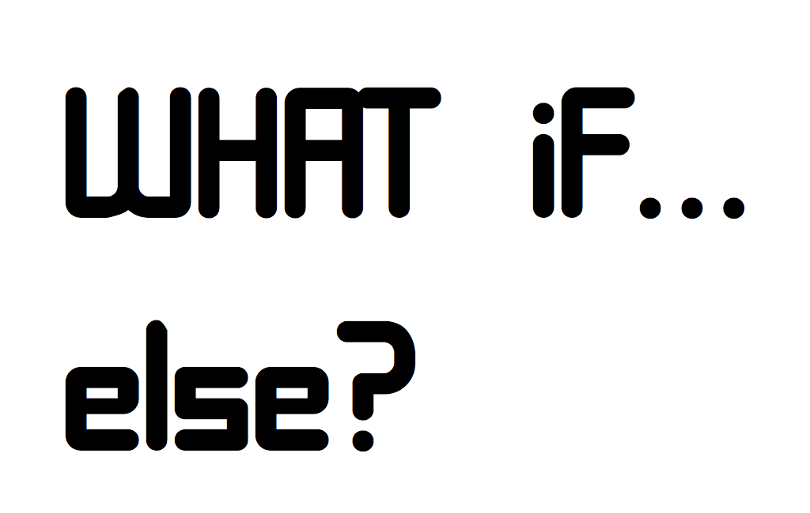

# Control flow

**Learning objectives:**

- What are the **tools** for controlling a flow
- What is the difference between **choices (if, switch)** and **loops (for, while)**
- How to use conditional tools in data analysis

---

## Introduction

In this chapter we will see how to use conditions for making data analysis.
There are two main group of conditional tools: **choices** and **loops**. These are both very useful for making iterating data analysis such as multiple substitutions matching predefined inputs or performing more or less flexible indexing.

```{r echo=FALSE,fig.align='center',fig.dim="100%"}

```

---


## Choices and Loops

Iterators of objects pointing to an element inside the container

Use if to specify a block of code to be executed, if a specified condition is true. Use else to specify a block of code to be executed, if the same condition is false. Use else if to specify a new condition to test, if the first condition is false.

```{r echo=FALSE,fig.align='left',fig.dim="100%"}
knitr::include_graphics("images/whatif2.png")
```
```{r echo=FALSE,fig.align='right',fig.dim="100%"}
knitr::include_graphics("images/forloop.png")
```

----


## Choises

- `if()` and `ifelse()`

    
```{r 05-lib,include=FALSE}
library(DiagrammeR)
```
<center>
```{r echo=FALSE, fig.align='center', fig.dim="100%"}
DiagrammeR("
graph TD
A{if}-->B(condition)
     B-->C(true action)
     
D{if}-->E(condition)
     E-->F(true action)
E-->G((else))
     G-->H(false action)
     
I{ifelse}-->L(condition)
     L-->M(true action)
     L-->N(false action)

style A fill:#f96
style D fill:#f96
style I fill:#f96
style G fill:#f96
style B fill:#bbf,stroke:#f66,stroke-width:2px,color:#fff,stroke-dasharray: 5 5
style E fill:#bbf,stroke:#f66,stroke-width:2px,color:#fff,stroke-dasharray: 5 5
style L fill:#bbf,stroke:#f66,stroke-width:2px,color:#fff,stroke-dasharray: 5 5

 ",height = '100%', width = '100%')
```
</center>

`if (condition) true_action`
<br>
`if (condition) true_action else false_action`

```{r eval=FALSE, include=T}
if (test_expression) {
   yes
 }
    
    
if (test_expression) {   
  yes
  } else if (other test_expression) {
    no
    } else {
      other
      }
    
---  
ifelse(test, yes, no)
```

Note: **What is the difference?** 

`dplyr::if_else()` and base R `ifelse()` 

>if_else is more strict. It checks that both alternatives are of the same type and otherwise throws an error, while ifelse will promote types as necessary. This may be a benefit in some circumstances, but may otherwise break scripts if you don't check for errors or explicitly force type conversion. 
source: https://stackoverflow.com/questions/50646133/dplyr-if-else-vs-base-r-ifelse

**For example:**

```{r eval=FALSE, include=T}
ifelse(c(TRUE,TRUE,FALSE),"a",3)
dplyr::if_else(c(TRUE,TRUE,FALSE),"a",3)
```

It releases an error in `dplyr::if_else(c(TRUE, TRUE, FALSE), "a", 3)` :

`must be a character vector, not a double vector.`


An alternative to `ifelse` defined as **condition-vector pairs** and more broadly as a general vectorised `if` is:
    
- `case_when()` 

It allows you to vectorise multiple `if_else()` statements


<center>
```{r echo=FALSE, fig.align='center', fig.dim="100%"}
DiagrammeR("
   graph TD

I{ifelse}-->L(condition)

A{case_when}-->B(condition)

C{switch}-->D((list of conditions))

style I fill:#f27,stroke:#f66,stroke-width:3px
style A fill:#f99,stroke:#f66,stroke-width:3px
style C fill:#f96,stroke:#f66,stroke-width:3px
style L fill:#bbf,stroke:#f66,stroke-width:2px,color:#fff,stroke-dasharray: 5 5
style B fill:#bbf,stroke:#f66,stroke-width:2px,color:#fff,stroke-dasharray: 5 5
style D fill:#bbf,stroke:#f66,stroke-width:2px,color:#fff,stroke-dasharray: 5 5

 ",height = '100%', width = '100%')
```
</center>

Finally, the last tool just mentioned is `switch()`, here is an example on how to use it:

```{r message=FALSE, warning=FALSE}
require(stats)
centre <- function(x, type) {
  switch(type,
         mean = mean(x),
         median = median(x),
         trimmed = mean(x, trim = .1))
}

set.seed(123)
x <- rcauchy(10)

require(ggplot2)
ggplot(data = data.frame(x), aes(x))+
  geom_density()+
  geom_vline(xintercept = c(centre(x, "mean"),
                            centre(x, "median"),
                            centre(x, "trimmed")),
             size=0.5,linetype="dashed",
             color=c("darkgreen","red","blue"))+
  xlim(-10,10)+
  theme_bw()
```


## Loops

Iteration of a set of values with:

- `for (var in seq) expr`
- `while (cond) expr`
- `repeat expr`
- `break`
- `next`


`for (item in vector) perform_action`

```{r eval=FALSE, include=T}
? for (variable in vector) {
  
}
```

**First example**
```{r}
for(i in 1:5) {
  print(1:i)
}
```


**Second example**: terminate a *foor - loop* earlier
```{r}
for (i in 1:10) {
  if (i < 3) 
    next

  print(i)
  
  if (i >= 5)
    break
}
```


**More tools**

- `while(condition) action`: performs action while condition is TRUE.
- `repeat(action)`: repeats action forever (i.e. until it encounters break).

>Generally speaking you shouldn’t need to use for loops for data analysis tasks, as map() and apply() already provide less flexible solutions to most problems. You’ll learn more in Chapter 9.

---


## Meeting Videos

### Cohort 1

`r knitr::include_url("https://www.youtube.com/embed/96eY6YS_3hU")`

### Cohort 2

`r knitr::include_url("https://www.youtube.com/embed/x5I_uHnMxIk")`

### Cohort 3

`r knitr::include_url("https://www.youtube.com/embed/u6UMGWDuxDE")`

### Cohort 4

`r knitr::include_url("https://www.youtube.com/embed/G4YOvwsSw2Q")`

### Cohort 5

`r knitr::include_url("https://www.youtube.com/embed/AZwJjsl8xiI")`

### Cohort 6

`r knitr::include_url("https://www.youtube.com/embed/URL")`

<details>
<summary> Meeting chat log </summary>

```
LOG
```
</details>
