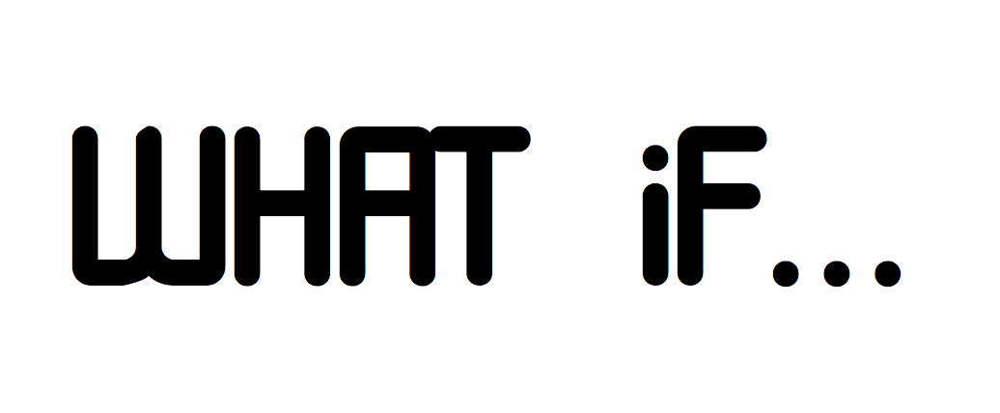

# Control flow

**Learning objectives:**

- Learn the **tools** for controlling flow of execution.

- Learn some technical pitfalls and (perhaps lesser known) useful features.

```{r echo = FALSE, fig.align = 'left', fig.dim = '100%'}

```
```{r echo = FALSE, fig.align = 'right', fig.dim = '100%'}
knitr::include_graphics("images/forloop.png")
```

---

## Introduction

There are two main groups of flow control tools: **choices** and **loops**: 

- Choices (`if`, `switch`, `ifelse`, `dplyr::if_else`, `dplyr::case_when`) allow you to run different code depending on the input. 
    
- Loops (`for`, `while`, `repeat`) allow you to repeatedly run code 


---


## Choices


`if()` and `else`

Use `if` to specify a block of code to be executed, if a specified condition is true. Use `else` to specify a block of code to be executed, if the same condition is false. 

```{r, eval=FALSE}
if (condition) true_action
if (condition) true_action else false_action
```

(Note braces are only *needed* for compound expressions)

```{r eval=FALSE, include=T}
if (test_expression) {   
  true_action
} else {
  false_action
}
```


Can be expanded to more alternatives:

```{r, eval=FALSE}
if (test_expression) {   
  true_action
} else if (other_test_expression) {
  other_action
} else {
  false_action
}
```


## Exercise {-}
Why does this work?
```
x <- 1:10
if (length(x)) "not empty" else "empty"
#> [1] "not empty"

x <- numeric()
if (length(x)) "not empty" else "empty"
#> [1] "empty"
```

`if` returns a value which can be assigned

```{r}
x1 <- if (TRUE) 1 else 2
x2 <- if (FALSE) 1 else 2

c(x1, x2)
```

The book recommends assigning the results of an if statement only when the entire expression fits on one line; otherwise it tends to be hard to read.


## Single if without else {-}

When you use the single argument form without an else statement, if invisibly (Section 6.7.2) returns NULL if the condition is FALSE. Since functions like c() and paste() drop NULL inputs, this allows for a compact expression of certain idioms:

```{r, eval=FALSE}
greet <- function(name, birthday = FALSE) {
  paste0(
    "Hi ", name,
    if (birthday) " and HAPPY BIRTHDAY"
  )
}
greet("Maria", FALSE)
#> [1] "Hi Maria"
greet("Jaime", TRUE)
#> [1] "Hi Jaime and HAPPY BIRTHDAY"
```


```{r, eval=FALSE}
format_lane_text <- function(number){

  paste0(
    number,
    " lane",
    if (number > 1) "s",
    " of sequencing"
  )
}

format_lane_text(1)
#> [1] "1 lane of sequencing"
format_lane_text(4)
#> [1] "4 lanes of sequencing"
```


## Invalid inputs {-}

- *Condition* must evaluate to a *single* `TRUE` or `FALSE`

A single number gets coerced to a logical type. 

```{r, eval=FALSE}
if (56) 1
#> [1] 1
if (0.3) 1
#> [1] 1
if (0) 1
```

If the condition cannot evaluate to a *single* `TRUE` or `FALSE`, an error is (usually) produced.

```{r, eval=FALSE}
if ("text") 1
#> Error in if ("text") 1: argument is not interpretable as logical
if ("true") 1 
#> 1
if (numeric()) 1
#> Error in if (numeric()) 1: argument is of length zero
if (NULL) 1
#> Error in if (NULL) 1 : argument is of length zero
if (NA) 1
#> Error in if (NA) 1: missing value where TRUE/FALSE needed
```


Exception is a logical vector of length greater than 1, which only generates a warning, unless you have `_R_CHECK_LENGTH_1_CONDITION_` set to `TRUE`.   
This seems to have been the default since R-4.2.0

```{r, eval=FALSE}
if (c(TRUE, FALSE)) 1
#>Error in if (c(TRUE, FALSE)) 1 : the condition has length > 1
```

## Vectorized choices {-}

- `ifelse()` is a vectorized version of `if`:

```{r, eval=FALSE}
x <- 1:10
ifelse(x %% 5 == 0, "XXX", as.character(x))
#>  [1] "1"   "2"   "3"   "4"   "XXX" "6"   "7"   "8"   "9"   "XXX"

ifelse(x %% 2 == 0, "even", "odd")
#>  [1] "odd"  "even" "odd"  "even" "odd"  "even" "odd"  "even" "odd"  "even"
```

-  `dplyr::if_else()`

- Book recommends only using `ifelse()`  "only when the yes and no vectors are the same type as it is otherwise hard to predict the output type." 

- `dplyr::if_else()` enforces this recommendation.

**For example:**

```{r eval=FALSE, include=T}
ifelse(c(TRUE,TRUE,FALSE),"a",3)
#> [1] "a" "a" "3"
dplyr::if_else(c(TRUE,TRUE,FALSE),"a",3)
#> Error in `dplyr::if_else()`:
#> ! `false` must be a character vector, not a double vector.
```
 
## Switch {-}

Rather then string together multiple if - else if chains, you can often use `switch`.


```{r message=FALSE, warning=FALSE}
centre <- function(x, type) {
  switch(type,
    mean = mean(x),
    median = median(x),
    trimmed = mean(x, trim = .1),
    stop("Invalid `type` value")
  )
}
```

Last component should always throw an error, as unmatched inputs would otherwise invisibly return NULL.
Book recommends to only use character inputs for `switch()`.

```{r, eval=FALSE}
vec <- c(1:20,50:55)
centre(vec, "mean")
#> [1] 20.19231
centre(vec, "median")
#> [1] 13.5
centre(vec, "trimmed")
#> [1] 18.77273
```

```{r, message=FALSE}
set.seed(123)
x <- rlnorm(100)

centers <- data.frame(type = c('mean', 'median', 'trimmed'))
centers$value = sapply(centers$type, \(t){centre(x,t)})

require(ggplot2)
ggplot(data = data.frame(x), aes(x))+
  geom_density()+
  geom_vline(data = centers, 
             mapping = aes(color = type, xintercept = value), 
             linewidth=0.5,linetype="dashed") +
  xlim(-1,10)+
  theme_bw()
```


Example from book of "falling through" to next value

```{r}
legs <- function(x) {
  switch(x,
    cow = ,
    horse = ,
    dog = 4,
    human = ,
    chicken = 2,
    plant = 0,
    stop("Unknown input")
  )
}
legs("cow")
#> [1] 4
legs("dog")
#> [1] 4
```


## Using `dplyr::case_when` {-}

- `case_when` is a more general `if_else` and can be used often in place of multiple chained `if_else` or sapply'ing `switch`.

- It uses a special syntax to allow any number of condition-vector pairs:

```{r message=FALSE, warning=FALSE}
set.seed(123)
x <- rlnorm(100)

centers <- data.frame(type = c('mean', 'median', 'trimmed'))

centers$value = dplyr::case_when(
  centers$type == 'mean' ~ mean(x),
  centers$type == 'median' ~ median(x),
  centers$type == 'trimmed' ~ mean(x, trim = 0.1),
  .default = 1000
  )

centers
```

 

## Loops

- Iteration over a elements of a vector

`for (item in vector) perform_action`

**First example**
```{r}
for(i in 1:5) {
  print(1:i)
}

x <- numeric(length=5L)
df <- data.frame(x=1:5)

for(i in 1:5) {
  df$y[[i]] <- i+1
}
```


**Second example**: terminate a *for loop* earlier

- `next` skips rest of current iteration
- `break` exits the loop entirely

```{r}
for (i in 1:10) {
  if (i < 3) 
    next

  print(i)
  
  if (i >= 5)
    break
}
```

## Exercise {-}

When the following code is evaluated, what can you say about the vector being iterated?
```
xs <- c(1, 2, 3)
for (x in xs) {
  xs <- c(xs, x * 2)
}
xs
#> [1] 1 2 3 2 4 6
```

## Pitfalls {-}

- Preallocate output containers to avoid *slow* code. 

- Beware that `1:length(v)` when `v` has length 0 results in a iterating backwards over `1:0`, probably not what is intended.  Use `seq_along(v)` instead.

- When iterating over S3 vectors, use  `[[]]` yourself to avoid stripping attributes. 

```
xs <- as.Date(c("2020-01-01", "2010-01-01"))
for (x in xs) {
  print(x)
}
#> [1] 18262
#> [1] 14610
```
vs. 
```
for (i in seq_along(xs)) {
  print(xs[[i]])
}
#> [1] "2020-01-01"
#> [1] "2010-01-01"
```

## Related tools {-}

- `while(condition) action`: performs action while condition is TRUE.
- `repeat(action)`: repeats action forever (i.e. until it encounters break).

- Note that `for` can be rewritten as `while` and while can be rewritten as `repeat` (this goes in one direction only!);  *however*:

>Good practice is to use the least-flexible solution to a problem, so you should use `for` wherever possible.
BUT you shouldn't even use for loops for data analysis tasks as `map()` and `apply()` already provide *less flexible* solutions to most problems. (More in Chapter 9.)

```{r}
for (i in 1:5) {
  print(i)
}


```

```{r}

x_option <- function(x) {
  switch(x,
    a = "option 1",
    b = "option 2",
    c = "option 3"#,
    #stop("Invalid `x` value")
  )
}

```


```{r}
i <- 1

while(i <=5 ) {
  print(i)
  i <- i+1
}
```

```{r}
i <- 1

repeat {
  print(i)
  i <- i+1
  if (i > 5) break
}

```


---


## Meeting Videos

### Cohort 1

`r knitr::include_url("https://www.youtube.com/embed/96eY6YS_3hU")`

### Cohort 2

`r knitr::include_url("https://www.youtube.com/embed/x5I_uHnMxIk")`

### Cohort 3

`r knitr::include_url("https://www.youtube.com/embed/u6UMGWDuxDE")`

### Cohort 4

`r knitr::include_url("https://www.youtube.com/embed/G4YOvwsSw2Q")`

### Cohort 5

`r knitr::include_url("https://www.youtube.com/embed/AZwJjsl8xiI")`

### Cohort 6

`r knitr::include_url("https://www.youtube.com/embed/wg2QZ3rMIqM")`

<details>
<summary> Meeting chat log </summary>

```
00:16:34	Federica Gazzelloni:	https://github.com/r4ds/bookclub-Advanced_R
00:22:28	Federica Gazzelloni:	https://stackoverflow.com/questions/50646133/dplyr-if-else-vs-base-r-ifelse
00:26:20	Trevin:	case_when() is great, makes it easy to read
00:54:01	Trevin:	out[I, ]
00:54:14	Trevin:	out[i, ]
00:55:03	Trevin:	I think you have to specify number of rows and columns before..
00:55:30	Trevin:	iterations = 10
 variables = 2

 output <- matrix(ncol=variables, nrow=iterations)
00:55:43	Trevin:	https://stackoverflow.com/questions/13442461/populating-a-data-frame-in-r-in-a-loop
```
</details>

### Cohort 7

`r knitr::include_url("https://www.youtube.com/embed/W9CoQ15NlOc")`

<details>

<summary>Meeting chat log</summary>
```
00:40:18	Ryan Honomichl:	What type of vector does each of the following calls to ifelse() return?

* "ifelse returns a value with the same shape as test which is filled with elements selected from either yes or no depending on whether the element of test is TRUE or FALSE."
00:42:11	Ryan Honomichl:	"I recommend assigning the results of an if statement only when the entire expression fits on one line; otherwise it tends to be hard to read"
00:42:46	Ryan Honomichl:	* When you use the single argument form without an `else` statement, `if` invisibly returns NULL if the condition is FALSE. 

-   Since functions like c() and paste() drop NULL inputs, this allows for a compact expression of certain idioms
00:54:15	collinberke:	https://docs.google.com/spreadsheets/d/1ScrbEw_-vB9DruaJhjtVY8HLQmuNPqyWeOOjmG6OY1M/edit?usp=sharing
00:58:46	collinberke:	https://www.youtube.com/@safe4democracy/videos
```
</details>
