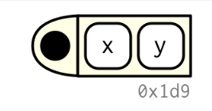

# Functions

**Learning objectives:**

- How to make functions in R
- What are the parts of a function
- Nested functions

## How to make a simple function in R

Let's imagine the structure of a function:

```{r echo=FALSE, fig.align='center',fig.cap="The black dot on the left is the environment. The two blocks to the right are the function arguments."}

```


**Function components**

Functions have three parts, `formals()`, `body()`, and `environment()`.

```{r 06-c01, echo=FALSE, fig.align='center', fig.dim="100%"}
DiagrammeR::mermaid("
   graph LR
     A{formals}-->B(body)
     B-->C(environment)
style A fill:#bbf,stroke:#f66,stroke-width:2px,color:#fff,stroke-dasharray: 5 5
",height = '100%', width = '100%')
```

**Example**

```{r, echo = FALSE, message = FALSE}
coffee_ratings <- readr::read_csv('https://raw.githubusercontent.com/rfordatascience/tidytuesday/master/data/2020/2020-07-07/coffee_ratings.csv')
library(tidyverse)
```

```{r}
coffee_ratings%>%slice(1:3)%>%select(1:5)
```

```{r, function_example}
avg_points <- function(species){
  # this function is for calculating the mean
  avg <-  coffee_ratings %>% 
  filter(species == species) %>% 
  summarise(mean = mean(total_cup_points))
  
  return(avg)
}

```

```{r}
avg_points("Arabica")
```

```{r}
formals(avg_points)
```


```{r}
body(avg_points)
```

```{r}
environment(avg_points)
```

Functions uses attributes, one attribute used by base R is `srcref`, short for **source reference**. It points to the source code used to create the function. It contains code comments and other formatting.
```{r}
attr(avg_points, "srcref")
```

## Primitive functions

Are the core function in base R, such as `sum()`
```{r}
sum
```

Type of primitives:

- builtin 
- special

```{r}
typeof(sum)
```


These core functions have components to NULL.

## Anonymous functions

If you don't provide a name to a function

```{r}
lapply(mtcars%>%select(mpg,cyl), function(x) length(unique(x)))
```


```{r}
vector_len <- function(x) {
  length(unique(x))
}
```

```{r}
lapply(mtcars%>%select(mpg,cyl), vector_len)
```

**Invoking a function**

```{r}
args <- unique(coffee_ratings$species) %>% 
  `[[`(1) %>% 
  as.list()
  
  
  
do.call(avg_points, args)
```


## Function composition

```{r}
square <- function(x) x^2
deviation <- function(x) x - mean(x)
x <- runif(100)
sqrt(mean(square(deviation(x))))
```

```{r}
out <- deviation(x)
out <- square(out)
out <- mean(out)
out <- sqrt(out)
out
```


```{r}
x %>%
  deviation() %>%
  square() %>%
  mean() %>%
  sqrt()
```

## More about functions insights

### Lexical scoping

**Rules**

- Name masking
- Functions versus variables
- A fresh start
- Dynamic lookup


**Debugging**

This function 
```{r}
g12 <- function() x + 1
x <- 15
g12()
```


```{r}
codetools::findGlobals(g12)
```

You can change the function’s environment to an environment which contains nothing:
```{r}
# environment(g12) <- emptyenv()
# g12()
# Error in x + 1 : could not find function "+"
```


### ... (dot-dot-dot)

**Example**

```{r}
i01 <- function(y, z) {
  list(y = y, z = z)
}
i02 <- function(x, ...) {
  i01(...)
}
str(i02(x = 1, y = 2, z = 3))
#> List of 2
#>  $ y: num 2
#>  $ z: num 3
```

### Exiting a function

1. Implicit or explicit returns

2. Invisibility (`<-` most famous function that returns an invisible value)

3. `stop()` to stop a function with an error.

4. Exit handlers


### Function forms

>Everything that exists is an object.
Everything that happens is a function call.
— John Chambers


```{r echo=FALSE}
knitr::include_graphics("images/06_forms.png")
```

---


## Case Study: SIR model function

This is an interesting example taken from a course on Coursera: [Infectious disease modelling-ICL](https://www.coursera.org/specializations/infectious-disease-modelling)

The purpose of this example is to show how to make a model passing through making a function.

First we need to load some useful libraries:

```{r message=FALSE, warning=FALSE, paged.print=FALSE}
library(deSolve)
library(reshape2)
```


Then set the model inputs:

- population size (N)
- number of susceptable (S)
- infected (I)
- recovered (R)

And add the model parameters:

- infection rate ($\beta$)
- recovery rate ($\gamma$)


```{r}
N<- 100000                  # population

state_values<- c(S = N -1,   # susceptible
                 I = 1,      # infected
                 R = 0)      # recovered

parameters<- c(beta = 1/2,  # infection rate days^-1
               gamma = 1/4) # recovery rate days^-1
```


Then we set the **time** as an important factor, which defines the length of time we are looking at this model run. It is intended as the time range in which the infections spread out, let’s say that we are aiming to investigate an infection period of 100 days.

```{r}
times<- seq(0, 100, by = 1)
```

Finally, we set up the **SIR model**, the susceptable, infected and recovered model. How do we do that is passing the paramenters through a function of the time, and state.

Within the model function we calculate one more paramenter, the **force of infection**: $\lambda$ 

```{r}
sir_model<- function(time, state, parameters){
  with(as.list(c(state, parameters)),{
    N<- S + I + R
    lambda = beta * I/N    # force of infection
    dS<- - lambda * S 
    dI<- lambda * S - gamma * I
    dR<- gamma * I
    return(list(c(dS,dI,dR)))
  })
}
```


Once we have our **SIR model** function ready, we can calculate the **output** of the model, with the help of the function `ode()` from {deSolve} package.

```{r}
output<- as.data.frame(ode(y = state_values,
                           times = times,
                           func = sir_model,
                           parms = parameters))
output %>% head
```

In addition to our builtin SIR model function we can have a look at:

```{r eval=FALSE, include=T}
?deSolve::ode()
```

It solves **Ordinary Differential Equations**. 

```{r}
deSolve:::ode
```

```{r}
methods("ode")
```


---

With the help of the {reshape2} package we use the function `melt()` to reshape the output:

```{r}
melt(output,id="time") %>% head
```


The same as usign `pivot_longer()` function.
```{r}
output%>%
  pivot_longer(cols = c("S","I","R"),
               names_to="variable",
               values_to="values") %>%
  arrange(desc(variable)) %>%
  head
```

---


Before to proceed with the visualization of the SIR model output we do a bit of investigations.

**What if we want to see how `melt()` function works?**

**What instruments we can use to see inside the function and understand how it works?**


Using just the function name **melt** or `structure()` function with *melt* as an argument, we obtain the same output. To select just the argument of the function we can do `args(melt)`

```{r}
reshape2:::melt
```


```{r}
body(melt)
```

```{r}
formals(melt)
```

```{r}
environment(melt)
```


```{r}
typeof(melt)
```

> "R functions simulate a closure by keeping an explicit reference to the environment that was active when the function was defined."


ref: [closures](https://www.r-bloggers.com/2015/03/using-closures-as-objects-in-r/)


Try with `methods()`, or `print(methods(melt))`: Non-visible functions are asterisked!

> The S3 method name is followed by an asterisk * if the method definition is not exported from the package namespace in which the method is defined.

```{r}
methods("melt", data)
```

```{r}
methods(class="table")
```

```{r eval=FALSE, include=T}
help(UseMethod)
```


We can access to some of the above calls with `getAnywhere()`, for example here is done for "melt.data.frame":
```{r}
getAnywhere("melt.data.frame")
```


References:

- [stackoverflow article](https://stackoverflow.com/questions/11173683/how-can-i-read-the-source-code-for-an-r-function)
- [Rnews bulletin: R Help Desk](https://www.r-project.org/doc/Rnews/Rnews_2006-4.pdf)


---

Going back to out model output visualization.

```{r}
output_full<- melt(output,id="time")
```

```{r}
output_full$proportion<- output_full$value/sum(state_values)
```

```{r}
ggplot(data = output, aes(x = time, y = I)) + 
  geom_line() + 
  xlab("Time(days)") +
  ylab("Number of Infected") + 
  labs("SIR Model: prevalence of infection")
```

```{r}
ggplot(output_full, aes(time, proportion, color = variable, group = variable)) + 
  geom_line() + 
  xlab("Time(days)") +
  ylab("Prevalence") + 
  labs(color = "Compartment", title = "SIR Model")
```


---


## Meeting Videos

### Cohort 1

`r knitr::include_url("https://www.youtube.com/embed/UwzGhMndWzs")`

### Cohort 2

`r knitr::include_url("https://www.youtube.com/embed/51PMEM4Efb8")`

### Cohort 3

`r knitr::include_url("https://www.youtube.com/embed/Vwuo-e_Ir0s")`

### Cohort 4

`r knitr::include_url("https://www.youtube.com/embed/lg5rzOU6lsg")`

### Cohort 5

`r knitr::include_url("https://www.youtube.com/embed/q8K0Jl5hiV0")`

### Cohort 6

`r knitr::include_url("https://www.youtube.com/embed/BPd6-G9e32I")`

<details>
<summary> Meeting chat log </summary>

```
00:01:11	Oluwafemi Oyedele:	Hi, Good evening
00:01:22	Federica Gazzelloni:	Hello!
00:43:19	Federica Gazzelloni:	https://r4ds.github.io/bookclub-Advanced_R/QandA/docs/welcome.html
00:52:48	Priyanka:	sounds good actually
00:52:59	Federica Gazzelloni:	👍🏻
```
</details>

`r knitr::include_url("https://www.youtube.com/embed/GCDXXkBQrGk")`

<details>
<summary> Meeting chat log </summary>

```
00:09:30	Oluwafemi Oyedele:	Hi, Good evening
00:10:41	Federica Gazzelloni:	Hi
00:14:40	Federica Gazzelloni:	that's great!
00:54:24	Trevin:	Also, sorry if you are repeating 🙂
00:54:52	Arthur Shaw:	@ryan, thank you so much for the awesome synthesis! Could you share your reference list? I'd love to dive more deeply into the material you presented.
00:57:02	Ryan Metcalf:	https://cran.r-project.org/doc/manuals/r-release/R-lang.pdf
00:59:32	Trevin:	https://github.com/COHHIO/RmData
01:01:48	Ryan Metcalf:	https://mastering-shiny.org/
01:02:02	Ryan Metcalf:	https://engineering-shiny.org/
01:02:15	Arthur Shaw:	@trevin, if you get bored with beepr, move to BRRR ;)
01:02:16	Arthur Shaw:	https://github.com/brooke-watson/BRRR
01:09:27	Ryan Metcalf:	This is amazing Trevin! I'll take a closer look. Is it ok to reach out to you with any questions?
01:09:43	Trevin:	Yeah, feel free to reach out
```
</details>

`r knitr::include_url("https://www.youtube.com/embed/NaiQa_u-j1k")`

<details>
<summary> Meeting chat log </summary>

```
00:05:34	Trevin:	I didn't catch that
00:06:02	priyanka gagneja:	i won't be presenting I said .. so you two have the stage
00:08:39	Federica Gazzelloni:	no worries
00:08:46	Federica Gazzelloni:	next time you do it
00:08:56	Federica Gazzelloni:	did you sign up?
00:09:45	Trevin:	Discord is free: https://discord.gg/rstudioconf2022
00:10:04	Trevin:	Free stream link: https://www.rstudio.com/conference/stream
00:24:32	Arthur Shaw:	Maybe silly question: is the magrittr pipe an infix function?
00:32:15	Trevin:	https://colinfay.me/playing-r-infix-functions/
00:33:23	Arthur Shaw:	Maybe another example of an infix function: lubridate's `%within%`
00:33:47	Trevin:	That's a good one too ^
00:33:55	priyanka gagneja:	yes within would be good.
00:40:13	Arthur Shaw:	no
00:49:50	Arthur Shaw:	Sorry for dropping in and out. My WiFi router is having issues today--maybe is failing.
01:08:59	Trevin:	Looking forward to it 🙂
```
</details>
