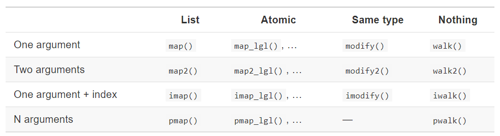

# Functionals 

**Learning objectives:**

- Define functionals.
- Use the `purrr::map()` family of functionals.
- Use the `purrr::walk()` family of functionals.
- Use the `purrr::reduce()` and `purrr::accumulate()` family of functionals.
- Use `purrr::safely()` and `purrr::possibly()` to deal with failure.

9.1. **Introduction**

9.2.  **map()**

9.3. **purrr** style

9.4. **map_** variants

9.5. **reduce()** and **accumulate** family of functions

- Some functions that weren't covered


## What are functionals {-}

## Introduction 

__Functionals__ are functions that take function as input and return a vector as output. Functionals that you probably have used before are: `apply()`, `lapply()` or `tapply()`. 


- alternatives to loops

- a functional is better than a `for` loop is better than `while` is better than `repeat`


### Benefits {-}


- encourages function logic to be separated from iteration logic

- can collapse into vectors/data frames easily


## Map

`map()` has two arguments, a vector and a function. It performs the function on each element of the vector and returns a list. We can also pass in some additional argument into the function.

```{r,echo=FALSE,warning=FALSE,message=FALSE}
knitr::include_graphics(path = 'images/9_2_3_map-arg.png')
```

```{r}
simple_map <- function(x, f, ...) {
out <- vector("list", length(x))
for (i in seq_along(x)) {
out[[i]] <- f(x[[i]], ...)
}
out
}
```

## Benefit of using the map function in purrr {-}

- `purrr::map()` is equivalent to `lapply()`

- returns a list and is the most general

- the length of the input == the length of the output


```{r load,echo=FALSE,warning=FALSE,message=FALSE}
library(tidyverse)
```

## Atomic vectors {-}


- has 4 variants to return atomic vectors
    - `map_chr()`
    - `map_dbl()`
    - `map_int()`
    - `map_lgl()`

```{r}
triple <- function(x) x * 3
map(.x=1:3, .f=triple)

map_dbl(.x=1:3, .f=triple)

map_lgl(.x=c(1, NA, 3), .f=is.na)
```

## Anonymous functions and shortcuts  {-}

 **Anonymous functions** 
```{r}
map_dbl(.x=mtcars, .f=function(x) mean(x, na.rm = TRUE)) %>% 
  head()
```

- the "twiddle" uses a twiddle `~` to set a formula
- can use `.x` to reference the input `map(.x = ..., .f = )`
```{r, eval=FALSE}
map_dbl(.x=mtcars,  .f=~mean(.x, na.rm = TRUE))
```

- can be simplified further as
```{r}
map_dbl(.x=mtcars, .f=mean, na.rm = TRUE)
```

## Modify {-}

Sometimes we might want the output to be the same as the input, then in that case we can use the modify function rather than map

```{r}
df <- data.frame(x=1:3,y=6:4)

map(df, .f=~.x*3)

modify(.x=df,.f=~.x*3)
```

## `purrr` style

```{r}
mtcars %>% 
  map(head, 20) %>% # pull first 20 of each column
  map_dbl(mean) %>% # mean of each vector
  head()
```

An example from `tidytuesday`
```{r, eval=FALSE}
tt <- tidytuesdayR::tt_load("2020-06-30")

# filter data & exclude columns with lost of nulls
list_df <- 
  map(
    .x = tt[1:3], 
    .f = 
      ~ .x %>% 
      filter(issue <= 152 | issue > 200) %>% 
      mutate(timeframe = ifelse(issue <= 152, "first 5 years", "last 5 years")) %>% 
      select_if(~mean(is.na(.)) < 0.2) 
  )


# write to global environment
iwalk(
  .x = list_df,
  .f = ~ assign(x = .y, value = .x, envir = globalenv())
)
```

## `map_*()` variants 

There are many variants




## `map2_*()` {-}

- raise each value `.x` by 2

```{r}
map_dbl(
  .x = 1:5, 
  .f = function(x) x ^ 2
)
```

- raise each value `.x` by another value `.y`

```{r}
map2_dbl(
  .x = 1:5, 
  .y = 2:6, 
  .f = ~ (.x ^ .y)
)
```


## The benefit of using the map over apply family of function {-}
- It is written in C
- It preserves names
- We always know the return values
- We can apply function into multiple input value
- We can pass in some additional arguments to the function


## `walk()` {-}


- We use walk when we want to call a function for it side effect rather than it return value, like generating plots, `write.csv()` or `ggsave()`, `map()` will print more info than you may want

```{r}
map(1:3, ~cat(.x, "\n"))
```

- for these cases, use `walk()` instead
```{r}
walk(1:3, ~cat(.x, "\n"))
```


We can use pwalk to save a list of plot to disk
```{r}
plots <- mtcars %>% 
  split(.$cyl) %>% 
  map(~ggplot(.,aes(mpg,wt))+geom_point())

paths <- stringr::str_c(names(plots),'.png')

pwalk(.l=list(paths,plots),.f=ggsave,path=tempdir())
  

```

- walk, walk2 and pwalk all invisibly return .x the first argument. This makes them suitable for use in the middle of pipelines.


## `imap()` {-}

- `imap()` is like `map2()`except that `.y` is derived from `names(.x)` if named or `seq_along(.x)` if not

- These two produce the same result

```{r}
imap_chr(.x = mtcars, .f = ~ paste(.y, "has a mean of", round(mean(.x), 1))) %>% 
head()
```


## `pmap()` {-}

- you can pass a named list or dataframe as arguments to a function

- for example `runif()` has the parameters `n`, `min` and `max`

```{r}
params <- tibble::tribble(
  ~ n, ~ min, ~ max,
   1L,     1,    10,
   2L,    10,   100,
   3L,   100,  1000
)

pmap(params, runif)
```

- could also be

```{r}
list(
  n = 1:3, 
  min = 10 ^ (0:2), 
  max = 10 ^ (1:3)
) %>% 
pmap(runif)
```

## `reduce()` family

The reduce() function is a powerful functional that allows you to abstract away from a sequence of functions that are applied in a fixed direction.

reduce takes a vector as its first argument, a function as its second argument, and an optional .init argument, it will then apply this function repeatedly to a list until there is only a single element left.

```{r,echo=FALSE,warning=FALSE,message=FALSE}
knitr::include_graphics(path = 'images/reduce-init.png')
```


Let me really quickly demonstrate `reduce()` in action.

Say you wanted to add up the numbers 1 through 5, but only using the plus operator +. You could do something like this

```{r}
1 + 2 + 3 + 4 + 5

```

Which is the same thing as this:

```{r}
set.seed(1234)

reduce(1:5, `+`)
```

And if you want the start value to be something that’s not the first argument of the vector, pass that to the .init argument:

```{r}

identical(
  0.5 + 1 + 2 + 3 + 4 + 5,
  reduce(1:5, `+`, .init = 0.5)
)

```

## ggplot2 Example with reduce {-}

```{r}
ggplot(mtcars, aes(hp, mpg)) + 
  geom_point(size = 8, alpha = .5) +
  geom_point(size = 4, alpha = .5) +
  geom_point(size = 2, alpha = .5)

```

Let us use the reduce `function`

```{r}
reduce(
  c(8, 4, 2),
  ~ .x + geom_point(size = .y, alpha = .5),
  .init = ggplot(mtcars, aes(hp, mpg))
)

```

```{r}
df <- list(age=tibble(name='john',age=30),
    sex=tibble(name=c('john','mary'),sex=c('M','F'),
    trt=tibble(name='Mary',treatment='A')))


df |> reduce(.f = full_join)

reduce(.x = df,.f = full_join)
```

- to see all intermediate steps, use **accumulate()**
```{r}
set.seed(1234)
accumulate(1:5, `+`)
```


## Not covered: `map_df*()` variants {-}

- `map_dfr()` = row bind the results

- `map_dfc()` = column bind the results

```{r}
col_stats <- function(n) {
  head(mtcars, n) %>% 
    summarise_all(mean) %>% 
    mutate_all(floor) %>% 
    mutate(n = paste("N =", n))
}

map((1:2) * 10, col_stats)

map_dfr((1:2) * 10, col_stats)
```

---

## Not covered: `pluck()` {-}

- `pluck()` will pull a single element from a list

```{r}
my_list <- list(
  1:3, 
  10 + (1:5), 
  20 + (1:10)
)

pluck(my_list, 1)

map(my_list, pluck, 1)

map_dbl(my_list, pluck, 1)
```


## Not covered: `flatten()` {-}

- `flatten()` will turn a list of lists into a simpler vector

```{r}
my_list <-
  list(
    a = 1:3,
    b = list(1:3)
  )

map_if(my_list, is.list, pluck)
  
map_if(my_list, is.list, flatten_int)

map_if(my_list, is.list, flatten_int) %>% 
  flatten_int()
```

## Dealing with Failures {-}

## Safely {-}

safely is an adverb, it takes a function (a verb) and returns a modified version. In this case, the modified function will never throw an error. Instead it always returns a list with two elements.

- Result is the original result. If there is an error this will be NULL

- Error is an error object. If the operation was successful this will be NULL.

```{r}
A <- list(1,10,"a")

map(.x = A,.f = safely(log))
  
```

## Possibly {-}

Possibly always succeeds. It is simpler than safely, because you can give it a default value to return when there is an error.

```{r}
A <- list(1,10,"a")

 map_dbl(.x =A,.f = possibly(log,otherwise = NA_real_) )

```


## Meeting Videos

### Cohort 1

`r knitr::include_url("https://www.youtube.com/embed/o0a6aJ4kCkU")`

### Cohort 2

`r knitr::include_url("https://www.youtube.com/embed/YrZ13_4vUMw")`

### Cohort 3

`r knitr::include_url("https://www.youtube.com/embed/DUHXo527mHs")`

### Cohort 4

`r knitr::include_url("https://www.youtube.com/embed/SpDpmhW62Ns")`

### Cohort 5

`r knitr::include_url("https://www.youtube.com/embed/tYqFMtmhmiI")`

### Cohort 6

`r knitr::include_url("https://www.youtube.com/embed/URL")`

<details>
<summary> Meeting chat log </summary>

```
LOG
```
</details>
