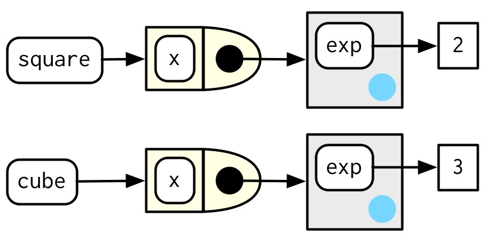

# Function factories

**Learning objectives:**

- Understand what a function factory is
- Recognise how function factories work
- Learn about non-obvious combination of function features
- Generate a family of functions from data


## Introduction


In this chapter we'll talk about function factories. 

A type of functions that make other functions. 

We'll tackle some challegenges in understanding how to make a workflow of functions. 


## What is a function factory?


A **function factory** is a function that makes functions

Factory made function are **manufactured functions**.

```{r 10-1, echo=FALSE, fig.align='center', fig.dim="50%",fig.alt="https://epsis.com/no/operations-centers-focus-on-ways-of-working/",fig.cap="Function factory | Credits: epsis.com"}

```


## How does a function factory work?
```{r 10-2, echo=FALSE, fig.align='center', fig.dim="100%",fig.cap="How does it work? | Credits: kakaakigas.com/how-it-works/"}

```

```{r 10-ex1}
power1 <- function(exp) {
  function(x) {
    x ^ exp
  }
}

square <- power1(2)
cube <- power1(3)
```
`power1()` is the function factory and `square()` and `cube()` are manufactured functions.


**What we know already: Function Features**

1.  first-class functions 
```{r 10-ex2, eval=FALSE}
name <- function(variables) {
  
}
```

2.  function environment `fn_env()`
```{r 10-ex3}
y <- 1
f <- function(x) x + y
rlang::fn_env(f)
```

3.  function execution environment
```{r 10-ex4}
h <- function(x) {
  # 1.
  a <- 2 # 2. assingned value in the environment
  x + a
}
y <- h(1) # 3.
```


A **function factory** is defined as a **functional programming tools**, as well as **functionals**, and **function operators**.

An application would be to tackle the understanding of:

- **Box-Cox transformation**
- **maximum likelihood** problems
- **bootstrap resamples**


### Factory fundamentals

- Environments
- Force calculation
- Super assignments
- Cleaning up


```{r 10-lib}
library(rlang)
library(ggplot2)
library(scales)
```

Looking at manufactored functions, in our example the `square()` function, and imagine to do not know anything about it. The environment can be investigated with `env_print()` function. Two different enviroments can be found, with the same **parent**. 

```{r 10-6}
rlang::env_print(square)
```

To know more about it, **exp** is visible as the engine of the function, the computed value (`square <- power1(2)`) can be retrieved like this:
```{r 10-7}
fn_env(square)$exp
```
```{r 10-8, echo=FALSE, fig.align="center", fig.dim="50%"}

```

To make sure every argument is evaluated, whenever x is assigned to a different value.
```{r 10-9, eval=FALSE}
force()
```

```{r 10-10}
power1 <- function(exp) {
  function(x) {
    x ^ exp
  }
}
square <- power1(x)
x <- 2
square(2)
```
Assign a value to the variable x, while it goes in the environment, see what's happen to our function:
```{r 10-11}
x <- 3
square(2)
```

This is not necessarely wrong, but what if we'd like to set a variable **x** which can assume other values in the environment?

```{r 10-12}
power2 <- function(exp) {
  force(exp)
  function(x) {
    x ^ exp
  }
}

x <- 2
square <- power2(x)
square(2)
```
Look what's happen now:
```{r 10-13}
x <- 3
square(2)
```
Even if we assigned a new value to **x** and it is stored in the environment, our function doesn't take consideration of it and keep doing its calculation based on the first variable assignment.

**The super assignment operator**

```{r 10-14, eval=FALSE}
<<-
```

Another way is to set the function to **mantain the state**, in a way that each invocation will be completely independent, and a new *environment* is created, because considered as a **fresh start** (6.4.3).
```{r 10-15}
new_counter <- function() {
  i <- 0 # first assignment inside the function (fresh start)
  function() {
    i <<- i + 1 # second assignment (super assignment)
    i
  }
}

counter_one <- new_counter()
counter_two <- new_counter()
counter_one()
counter_one()
counter_two()
```


> "As soon as your function starts managing the state of multiple variables, it’s better to switch to R6"

**Cleaning up** using `rm()` inside a function:
```{r 10-16}
f1 <- function(n) {
  x <- runif(n)
  m <- mean(x)
  function() m
}

g1 <- f1(1e6)
lobstr::obj_size(g1)
#> 8,013,104 B

f2 <- function(n) {
  x <- runif(n)
  m <- mean(x)
  rm(x)
  function() m
}

g2 <- f2(1e6)
lobstr::obj_size(g2)
#> 12,944 B
```


### Example of: Graphical factories

Graphical factories **useful function factories**, such as:

1.  Labelling with:

    * formatter functions
    
```{r 10-19}
y <- c(12345, 123456, 1234567)
comma_format()(y)
```
```{r 10-20}
number_format(scale = 1e-3, suffix = " K")(y)
```
They are more commonly used inside a ggplot:
```{r 10-21, include=FALSE}
df <- data.frame(x = 1, y = y)
a_ggplot_object <- ggplot(df, aes(x, y)) + 
  geom_point() + 
  scale_x_continuous(breaks = 1, labels = NULL) +
  labs(x = NULL, y = NULL)
```

```{r 10-22,eval=T}
a_ggplot_object + 
  scale_y_continuous(
  labels = comma_format()
)
```

2.  Using binwidth in facet histograms

      * binwidth_bins
      
```{r}
binwidth_bins <- function(n) {
  force(n)
  
  function(x) {
    (max(x) - min(x)) / n
  }
}
```
   
Or use a concatenation of this typr of detecting number of bins functions:

      - nclass.Sturges()
      - nclass.scott()
      - nclass.FD()
      
```{r}
base_bins <- function(type) {
  fun <- switch(type,
    Sturges = nclass.Sturges,
    scott = nclass.scott,
    FD = nclass.FD,
    stop("Unknown type", call. = FALSE)
  )
  
  function(x) {
    (max(x) - min(x)) / fun(x)
  }
}
```
      

3.  Internals:

      * ggplot2:::plot_dev()


## Non-obvious combinations


- The **Box-Cox** transformation.
- **Bootstrap** resampling.
- **Maximum likelihood** estimation.


### Statistical factories

The **Box-Cox** transformation towards normality:
```{r}
boxcox1 <- function(x, lambda) {
  stopifnot(length(lambda) == 1)
  
  if (lambda == 0) {
    log(x)
  } else {
    (x ^ lambda - 1) / lambda
  }
}
```


```{r}
boxcox2 <- function(lambda) {
  if (lambda == 0) {
    function(x) log(x)
  } else {
    function(x) (x ^ lambda - 1) / lambda
  }
}

stat_boxcox <- function(lambda) {
  stat_function(aes(colour = lambda), fun = boxcox2(lambda), size = 1)
}

plot1 <- ggplot(data.frame(x = c(0, 5)), aes(x)) + 
  lapply(c(0.5, 1, 1.5), stat_boxcox) + 
  scale_colour_viridis_c(limits = c(0, 1.5))

# visually, log() does seem to make sense as the transformation
# for lambda = 0; as values get smaller and smaller, the function
# gets close and closer to a log transformation
plot2 <- ggplot(data.frame(x = c(0.01, 1)), aes(x)) + 
  lapply(c(0.5, 0.25, 0.1, 0), stat_boxcox) + 
  scale_colour_viridis_c(limits = c(0, 1.5))
library(patchwork)
plot1+plot2
```

**Bootstrap generators**


```{r}
boot_permute <- function(df, var) {
  n <- nrow(df)
  force(var)
  
  function() {
    col <- df[[var]]
    col[sample(n, replace = TRUE)]
  }
}

boot_mtcars1 <- boot_permute(mtcars, "mpg")
head(boot_mtcars1())
#> [1] 16.4 22.8 22.8 22.8 16.4 19.2
head(boot_mtcars1())
#> [1] 17.8 18.7 30.4 30.4 16.4 21.0
```
```{r}
boot_model <- function(df, formula) {
  mod <- lm(formula, data = df)
  fitted <- unname(fitted(mod))
  resid <- unname(resid(mod))
  rm(mod)

  function() {
    fitted + sample(resid)
  }
} 

boot_mtcars2 <- boot_model(mtcars, mpg ~ wt)
head(boot_mtcars2())
#> [1] 25.0 24.0 21.7 19.2 24.9 16.0
head(boot_mtcars2())
#> [1] 27.4 21.0 20.3 19.4 16.3 21.3
```

**Maximum likelihood estimation**

$$P(\lambda,x)=\prod_{i=1}^{n}\frac{\lambda^{x_i}e^{-\lambda}}{x_i!}$$
```{r}
lprob_poisson <- function(lambda, x) {
  n <- length(x)
  (log(lambda) * sum(x)) - (n * lambda) - sum(lfactorial(x))
}
```

```{r}
x1 <- c(41, 30, 31, 38, 29, 24, 30, 29, 31, 38)
```

```{r}
lprob_poisson(10, x1)
#> [1] -184
lprob_poisson(20, x1)
#> [1] -61.1
lprob_poisson(30, x1)
#> [1] -31
```

```{r}
ll_poisson1 <- function(x) {
  n <- length(x)

  function(lambda) {
    log(lambda) * sum(x) - n * lambda - sum(lfactorial(x))
  }
}
```
```{r}
ll_poisson2 <- function(x) {
  n <- length(x)
  sum_x <- sum(x)
  c <- sum(lfactorial(x))

  function(lambda) {
    log(lambda) * sum_x - n * lambda - c
  }
}
```

```{r}
ll1 <- ll_poisson2(x1)

ll1(10)
#> [1] -184
ll1(20)
#> [1] -61.1
ll1(30)
#> [1] -31
```
```{r}
optimise(ll1, c(0, 100), maximum = TRUE)
#> $maximum
#> [1] 32.1
#> 
#> $objective
#> [1] -30.3
```
```{r}
optimise(lprob_poisson, c(0, 100), x = x1, maximum = TRUE)
#> $maximum
#> [1] 32.1
#> 
#> $objective
#> [1] -30.3
```

## Function factory applications


Combine functionals and function factories to turn data into many functions.

### Function factories + functionals
```{r}
names <- list(
  square = 2, 
  cube = 3, 
  root = 1/2, 
  cuberoot = 1/3, 
  reciprocal = -1
)
funs <- purrr::map(names, power1)

funs$root(64)
#> [1] 8
funs$root
#> function(x) {
#>     x ^ exp
#>   }
#> <bytecode: 0x7fe85512a410>
#> <environment: 0x7fe85b21f190>
```
```{r}
with(funs, root(100))
#> [1] 10
```

```{r}
attach(funs)
#> The following objects are masked _by_ .GlobalEnv:
#> 
#>     cube, square
root(100)
#> [1] 10
detach(funs)
```


```{r}
rlang::env_bind(globalenv(), !!!funs)
root(100)
#> [1] 10
```

```{r}
rlang::env_unbind(globalenv(), names(funs))
```


## Meeting Videos

### Cohort 1

`r knitr::include_url("https://www.youtube.com/embed/enI5Ynq6olI")`

### Cohort 2

`r knitr::include_url("https://www.youtube.com/embed/U-CoF7MCik0")`

### Cohort 3

`r knitr::include_url("https://www.youtube.com/embed/qgn7WTITnNs")`

### Cohort 4

`r knitr::include_url("https://www.youtube.com/embed/GHp2W4JxVaY")`

### Cohort 5

`r knitr::include_url("https://www.youtube.com/embed/8TGXjzi0n0o")`

### Cohort 6

`r knitr::include_url("https://www.youtube.com/embed/FUoYwYFqT7Q")`

<details>
<summary> Meeting chat log </summary>

```
01:02:25	Trevin:	I'm good with combining 👍
01:02:57	Oluwafemi Oyedele:	I agree with combining the chapter!!!
```
</details>

### Cohort 7

`r knitr::include_url("https://www.youtube.com/embed/URL")`

<details>

<summary>Meeting chat log</summary>
```
LOG
```
</details>
