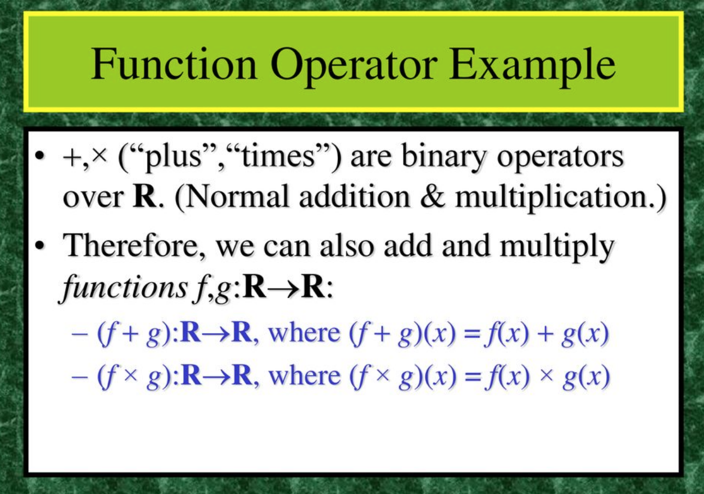
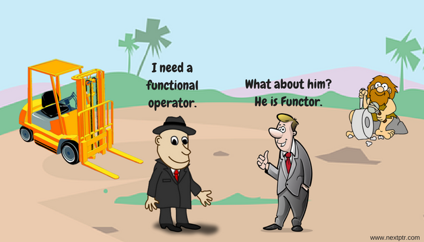

# Function operators

**Learning objectives:**

- define of function operator
- find existing function operators
- how to make your own function operator


## Introduction

In this chapter we'll learn how to use **function operator** as a case of **function factories**. 

And we'll see a case study about how to download many web pages using a function operator.


## Definition and practical examples


```{r 10-01, fig.align='center',fig.dim="50%", fig.cap="Credits: 2001-2003 Michael P.Frank (https://slideplayer.com/slide/17666226/)",echo=FALSE}


```


- A **function operator** is a function that takes one (or more) functions as input and returns a function as output

- Function operators are closely related to **function factories**, infact are a particular case which uses a function as an input.


These are the two libraries to use for finding function operator examples:

```{r 11-01_1}
library(purrr)
library(memoise)
```

**What do they do?**

Caching errors:

      purrr::safely()
      
Caching computations: this function is an example of dynamic programming

      memoise::memoise()


### Other exsitsting function operators


```{r 11-02, echo=FALSE,fig.align='center', fig.cap="Credits: www.nextptr.com"}

```

> purrr comes with three other function operators in a similar vein:

      
      possibly(): returns a default value when there’s an error. It provides no way to tell if an error occured or not, so it’s best reserved for cases when there’s some obvious sentinel value (like NA).

      quietly(): turns output, messages, and warning side-effects into output, message, and warning components of the output.

      auto_browser(): automatically executes browser() inside the function when there’s an error.


## Case study: make your own function operator


```{r 11-03,eval=FALSE}
urls <- c(
  "adv-r" = "https://adv-r.hadley.nz", 
  "r4ds" = "http://r4ds.had.co.nz/"
  # and many many more
)
path <- paste(tempdir(), names(urls), ".html")

walk2(urls, path, download.file, quiet = TRUE)
```


Here we make a function operator that add a little delay in reading each page:

```{r 11-04}
delay_by <- function(f, amount) {
  force(f)
  force(amount)
  
  function(...) {
    Sys.sleep(amount)
    f(...)
  }
}
system.time(runif(100))
#>    user  system elapsed 
#>       0       0       0
system.time(delay_by(runif, 0.1)(100))
#>    user  system elapsed 
#>    0.00    0.00    0.13
```

```{r 11-05, eval=FALSE}
walk2(urls, path, delay_by(download.file, 0.1), quiet = TRUE)
```

## Meeting Videos

### Cohort 1

`r knitr::include_url("https://www.youtube.com/embed/zzUY03gt_pA")`

### Cohort 2

`r knitr::include_url("https://www.youtube.com/embed/fD1QJB2pHik")`

### Cohort 3

`r knitr::include_url("https://www.youtube.com/embed/Re6y5CQzwG4")`

### Cohort 4

`r knitr::include_url("https://www.youtube.com/embed/rVooJFdbePs")`

### Cohort 5

`r knitr::include_url("https://www.youtube.com/embed/XOurCfeJLGc")`

### Cohort 6

`r knitr::include_url("https://www.youtube.com/embed/EPs57es2MsE")`

<details>
<summary> Meeting chat log </summary>

```
00:01:42	Oluwafemi Oyedele:	Hi, Good Evening !!!
00:05:52	Arthur Shaw:	@federica, love the hex stickers behind you. All from rstudio::conf?
00:07:12	Arthur Shaw:	I tried doing the same. I had a hard time ordering them. I also thought I'd make the stickers into magnets so that I could rearrange them in future.
00:48:34	Oluwafemi Oyedele:	Thank you !!!
```
</details>
