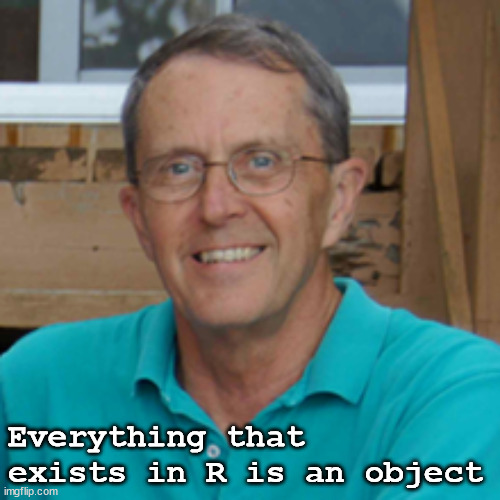
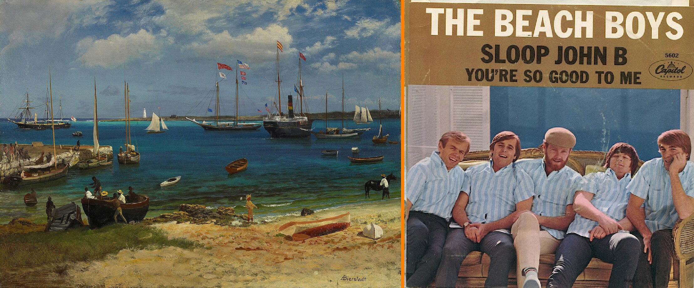
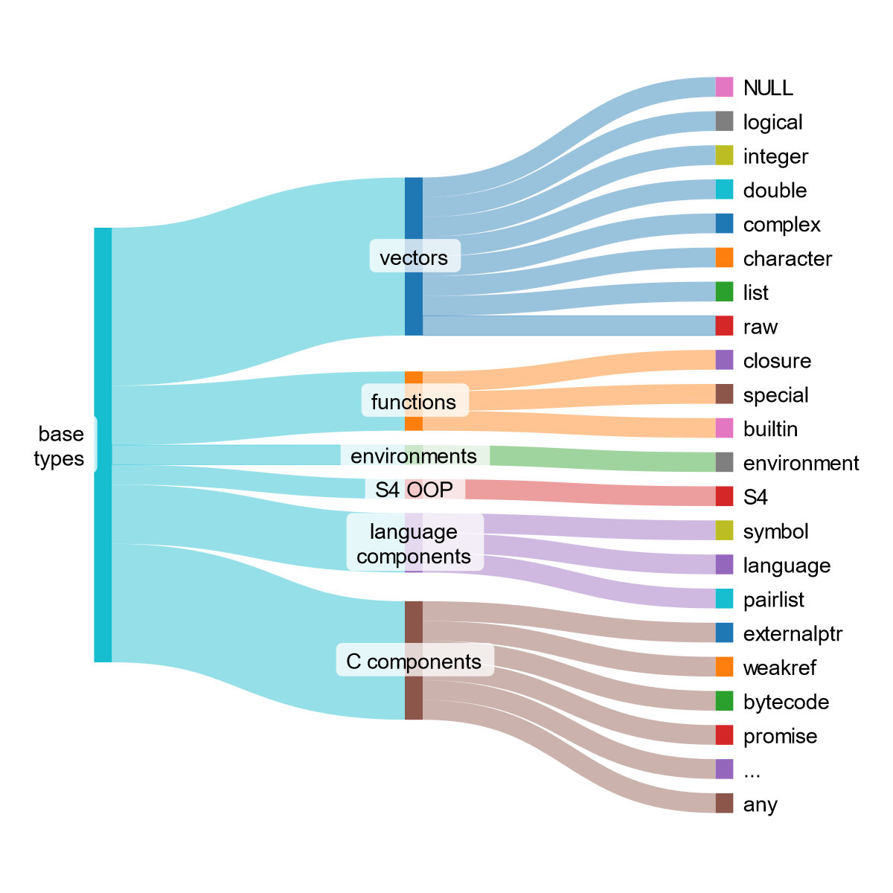

# Base types

**Learning objectives:**

- Understand what OOP means--at the very least for R
- Know how to discern an object's nature--base or OO--and type



<details>
<summary>Session Info</summary>
```{r}
library("DiagrammeR")
```

```{r}
utils::sessionInfo()
```

</details>


## Why OOP is hard in R

- Multiple OOP systems exist: S3, R6, S4, and (now/soon) S7.
- Multiple preferences: some users prefer one system; others, another.
- R's OOP systems are different enough that prior OOP experience may not transfer well.

[](https://xkcd.com/927/)


## OOP: Big Ideas

1. **Polymorphism.** Function has a single interface (outside), but contains (inside) several class-specific implementations.
```{r, eval=FALSE}
# imagine a function with object x as an argument
# from the outside, users interact with the same function
# but inside the function, there are provisions to deal with objects of different classes
some_function <- function(x) {
  if is.numeric(x) {
    # implementation for numeric x
  } else if is.character(x) {
    # implementation for character x
  } ...
}
```

<details>
<summary>Example of polymorphism</summary>

```{r polymorphism_example}
# data frame
summary(mtcars[,1:4])

# statistical model
lin_fit <- lm(mpg ~ hp, data = mtcars)
summary(lin_fit)
```

</details>

2. **Encapsulation.** Function "encapsulates"--that is, encloses in an inviolate capsule--both data and how it acts on data. Think of a REST API: a client interacts with with an API only through a set of discrete endpoints (i.e., things to get or set), but the server does not otherwise give access to its internal workings or state. Like with an API, this creates a separation of concerns: OOP functions take inputs and yield results; users only consume those results.

## OOP: Properties

### Objects have class

- Class defines:
  - Method (i.e., what can be done with object)
  - Fields (i.e., data that defines an instance of the class)
- Objects are an instance of a class

### Class is inherited

- Class is defined:
  - By an object's class (e.g., ordered factor)
  - By the parent of the object's class (e.g., factor)
- Inheritance matters for method dispatch
  - If a method is defined for an object's class, use that method
  - If an object doesn't have a method, use the method of the parent class
  - The process of finding a method, is called dispatch

## OOP in R: Two Paradigms

**1. Encapsulated OOP**

- Objects "encapsulate"
  - Methods (i.e., what can be done)
  - Fields (i.e., data on which things are done)
- Calls communicate this encapsulation, since form follows function
  - Form: `object.method(arg1, arg2)`
  - Function: for `object`, apply `method` for `object`'s class with arguments `arg1` and `arg2`

**2. Functional OOP**

- Methods belong to "generic" functions
- From the outside, look like regular functions: `generic(object, arg2, arg3)`
- From the inside, components are also functions

### Concept Map

```{r, echo = FALSE, eval = TRUE}
DiagrammeR::mermaid("
graph LR

OOP --> encapsulated_OOP
OOP --> functional_OOP

functional_OOP --> S3
functional_OOP --> S4

encapsulated_OOP --> R6
encapsulated_OOP --> RC
")
```

<details>
<summary>Mermaid code</summary>
```{r, echo = TRUE, eval = FALSE}
DiagrammeR::mermaid("
graph LR

OOP --> encapsulated_OOP
OOP --> functional_OOP

functional_OOP --> S3
functional_OOP --> S4

encapsulated_OOP --> R6
encapsulated_OOP --> RC
")
```
</details>

## OOP in base R

- **S3**
  - Paradigm: functional OOP
  - Noteworthy: R's first OOP system
  - Use case: low-cost solution for common problems
  - Downsides: no guarantees
- **S4**
  - Paradigm: functional OOP
  - Noteworthy: rewrite of S3, used by `Bioconductor`
  - Use case: "more guarantees and greater encapsulation" than S3
  - Downsides: higher setup cost than S3
- **RC**
  - Paradigm: encapsulated OOP
  - Noteworthy: special type of S4 object is mutable--in other words, that can be modified in place (instead of R's usual copy-on-modify behavior)
  - Use cases: problems that are hard to tackle with functional OOP (in S3 and S4)
  - Downsides: harder to reason about (because of modify-in-place logic)

## OOP in packages

- **R6**
  - Paradigm: encapsulated OOP
  - Noteworthy: resolves issues with RC
- **R7**
  - Paradigm: functional OOP
  - Noteworthy: 
    - best parts of S3 and S4
    - ease of S3
    - power of S4
    - See more in [rstudio::conf(2022) talk](https://www.rstudio.com/conference/2022/talks/introduction-to-r7/)
- **R.oo**
  - Paradigm: hybrid functional and encapsulated (?)
- **proto**
  - Paradigm: prototype OOP
  - Noteworthy: OOP style used in `ggplot2`

## How can you tell if an object is base or OOP?

### Functions

Two functions:

- `base::is.object()`, which yields TRUE/FALSE about whether is OOP object
- `sloop::otype()`, which says what type of object type: `"base"`, `"S3"`, etc.

An few examples:

```{r}
# Example 1: a base object
is.object(1:10)
sloop::otype(1:10)

# Example 2: an OO object
is.object(mtcars)
sloop::otype(mtcars)
```

### sloop

* **S** **L**anguage **O**bject-**O**riented **P**rogramming

[](https://en.wikipedia.org/wiki/Sloop_John_B)

### Class

OO objects have a "class" attribute:

```{r}
# base object has no class
attr(1:10, "class")

# OO object has one or more classes
attr(mtcars, "class")
```

## What about types?

Only OO objects have a "class" attribute, but every object--whether base or OO--has class

### Vectors

```{r}
typeof(NULL)
typeof(c("a", "b", "c"))
typeof(1L)
typeof(1i)
```


### Functions

```{r}
# "normal" function
my_fun <- function(x) { x + 1 }
typeof(my_fun)
# internal function
typeof(`[`)
# primitive function
typeof(sum)    
```

### Environments

```{r}
typeof(globalenv())
```


### S4

```{r}
mle_obj <- stats4::mle(function(x = 1) (x - 2) ^ 2)
typeof(mle_obj)
```


### Language components

```{r}
typeof(quote(a))
typeof(quote(a + 1))
typeof(formals(my_fun))
```

### Concept Map



<details>
<summary>Sankey graph code</summary>

The graph above was made with [SankeyMATIC](https://sankeymatic.com/)

```
// toggle "Show Values"
// set Default Flow Colors from "each flow's Source"

base\ntypes [8] vectors
base\ntypes [3] functions
base\ntypes [1] environments
base\ntypes [1] S4 OOP
base\ntypes [3] language\ncomponents
base\ntypes [6] C components

vectors [1] NULL
vectors [1] logical
vectors [1] integer
vectors [1] double
vectors [1] complex
vectors [1] character
vectors [1] list
vectors [1] raw

functions [1] closure
functions [1] special
functions [1] builtin

environments [1] environment

S4 OOP [1] S4

language\ncomponents [1] symbol
language\ncomponents [1] language
language\ncomponents [1] pairlist

C components [1] externalptr
C components [1] weakref
C components [1] bytecode
C components [1] promise
C components [1] ...
C components [1] any
```

</details>

## Be careful about the numeric type

1. Often "numeric" is treated as synonymous for double:

```{r}
# create a double and integeger objects
one <- 1
oneL <- 1L
typeof(one)
typeof(oneL)

# check their type after as.numeric()
one |> as.numeric() |> typeof()
oneL |> as.numeric() |> typeof()
```

2. In S3 and S4, "numeric" is taken as either integer or double, when choosing methods:

```{r}
sloop::s3_class(1)
sloop::s3_class(1L)
```

3. `is.numeric()` tests whether an object behaves like a number

```{r}
typeof(factor("x"))
is.numeric(factor("x"))
```

But Advanced R consistently uses numeric to mean integer or double type.

## Meeting Videos

### Cohort 1

`r knitr::include_url("https://www.youtube.com/embed/Fy3JF5Em6qY")`

### Cohort 2

`r knitr::include_url("https://www.youtube.com/embed/9GkgNC15EAw")`

### Cohort 3

`r knitr::include_url("https://www.youtube.com/embed/IL6iJhAsZAY")`

### Cohort 4

`r knitr::include_url("https://www.youtube.com/embed/4la5adcWwKE")`

### Cohort 5

`r knitr::include_url("https://www.youtube.com/embed/NeHtEGab1Og")`

### Cohort 6

`r knitr::include_url("https://www.youtube.com/embed/rfidR7tI_nQ")`

<details>
<summary> Meeting chat log </summary>

```
00:35:02	Trevin:	sloop (“sail the seas of OOP”)
00:42:40	Ryan Metcalf:	Awesome input Trevin! I jumped to the vignette, but didn't see the reference directly.
01:00:01	Trevin:	If you're interested there may be a new “R Packages" cohort starting up soon (also a new version of the book coming out soonish as well?)
01:08:23	Oluwafemi Oyedele:	Thank you !!!
```
</details>

### Cohort 7

`r knitr::include_url("https://www.youtube.com/embed/mOpmvc9h_4M")`

<details>

<summary>Meeting chat log</summary>
```
00:35:43	Stone: base::InternalMethods
00:48:04	collinberke: https://cran.r-project.org/doc/manuals/R-exts.html
```
</details>
