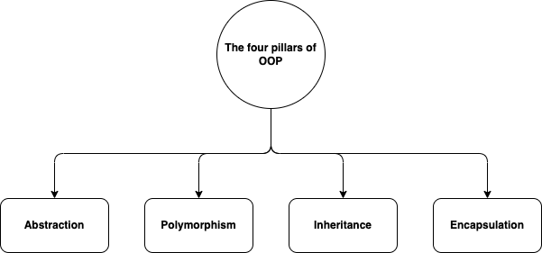

# R6

**Learning objectives:**

- Discuss how to construct an R6 class.
- Overview the different mechanisms of an R6 class.
- Observe various examples of how to use these mechanisms to create R6 classes, objects, fields, and methods.
- Observe the consequences of R6's reference semantics.
- Review the book's arguments for using R6 over the base RC system.

## A review of OOP



## Introducing R6 


* R6 classes are not built into base.
  * It is a separate package.
  * You have to install and attach to use.
  * When used in a package, it needs to be specified as a dependency in the `DESCRIPTION` file.

```{r eval=FALSE}
install.packages("R6")
```

```{r}
library(R6)
```

* R6 classes have two special properties:
  1. Uses an encapsulated OOP paradigm.
     * Methods belong to objects, not generics.
     * Follow the form `object$method()`.
  2. R6 objects are mutable.
     * Modified in place.
     * They follow reference semantics.
* R6 is similar to OOP in other languages.
* However, its use can lead ton non-idiomatic R code.
  * Tradeoffs - follow an OOP paradigm but sacrafice what users are use to. 
  * [Microsoft365R](https://github.com/Azure/Microsoft365R).

## Constructing an R6 class, the basics

* Really simple to do, just use the `R6::R6Class()` function.

```{r}
Accumulator <- R6Class("Accumulator", list(
  sum = 0,
  add = function(x = 1) {
    self$sum <- self$sum + x
    invisible(self)
  }
))
```

* Two important arguments:
  1. `classname` - A string used to name the class (not needed but suggested)
  2. `public` - A list of methods (functions) and fields (anything else)
* Style conventions to follow:
  * Class name should follow `UpperCamelCase`.
  * Methods and fields use `snake_case`.
  * Always assign the result of `R6Class()` into a variable with the same name as the class.
* You can use `self$` to access methods and fields of the current object.

## Constructing an R6 object

* Pretty straight forward, just use `$new()`

```{r}
x <- Accumulator$new()
```

```{r}
x$add(4)
x$sum
```

## R6 objects and method chaining

* To be able to do this, all side-effect R6 methods should return `self` invisibly.

```{r eval=FALSE}
x$add(10)$add(10)$sum
# [1] 24
```

* To improve readability:

```{r eval=FALSE}
x$
  add(10)$
  add(10)$
  sum
# [1] 44
```

## R6 classes' important methods

* `$print()` - Modifies the default printing method
* `$initialize()` - Overides the default behaviour of `$new()`


## Constructing a bank account class

```{r}
BankAccount <- R6Class("BankAccount", list(
  owner = NULL,
  type = NULL,
  balance = 0,
  initialize = function(owner, type) {
    self$owner <- owner
    self$type <- type
  },
  deposit = function(amount) {
    self$balance <- self$balance + amount
    invisible(self)
  },
  withdraw = function(amount) {
    self$balance <- self$balance - amount
    invisible(self)
  },
  print = function(...) {
    cat("Account owner: ", self$owner, "\n", sep = "")
    cat("Account type: ", self$type, "\n", sep = "")
    cat("  Balance: ", self$balance, "\n", sep = "")
    invisible(self)
  }
))
```

## Simple transactions

```{r}
collinsavings <- BankAccount$new("Collin", type = "Checking")
collinsavings$deposit(10)
collinsavings
```

```{r}
collinsavings$withdraw(10)
collinsavings
```

## Meeting Videos

### Cohort 1

`r knitr::include_url("https://www.youtube.com/embed/hPjaOdprgow")`

### Cohort 2

`r knitr::include_url("https://www.youtube.com/embed/LVkDJ28XJUE")`

### Cohort 3

`r knitr::include_url("https://www.youtube.com/embed/rCjQTbQ22qc")`

`r knitr::include_url("https://www.youtube.com/embed/ii6xhOzT_HQ")`

### Cohort 4

`r knitr::include_url("https://www.youtube.com/embed/i_z6pHavhX0")`

### Cohort 5

`r knitr::include_url("https://www.youtube.com/embed/NXmlqK2LxWw")`

### Cohort 6

`r knitr::include_url("https://www.youtube.com/embed/EuTubeJ1VUw")`

<details>
<summary> Meeting chat log </summary>

```
00:11:34	Trevin:	https://engineering-shiny.org/common-app-caveats.html?q=R6#using-r6-as-data-storage
00:39:36	Federica Gazzelloni:	new R7: https://rconsortium.github.io/OOP-WG/
00:40:04	Federica Gazzelloni:	R7 designed to be a successor to S3 and S4
00:40:40	Federica Gazzelloni:	R6: https://r6.r-lib.org/articles/Introduction.html
00:52:44	Trevin:	https://advanced-r-solutions.rbind.io/r6.html#controlling-access
01:00:34	Federica Gazzelloni:	interesting: https://r-craft.org/r-news/object-oriented-programming-oop-in-r-with-r6-the-complete-guide/
01:01:58	Trevin:	https://hadley.shinyapps.io/cran-downloads/
01:02:33	Oluwafemi Oyedele:	Thank you !!!
```
</details>

### Cohort 7

`r knitr::include_url("https://www.youtube.com/embed/URL")`

<details>

<summary>Meeting chat log</summary>
```
LOG
```
</details>
