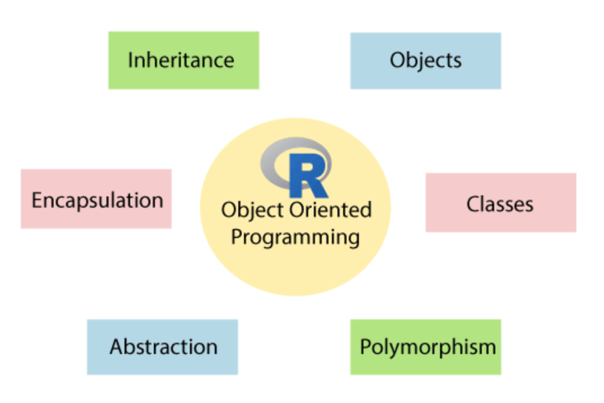
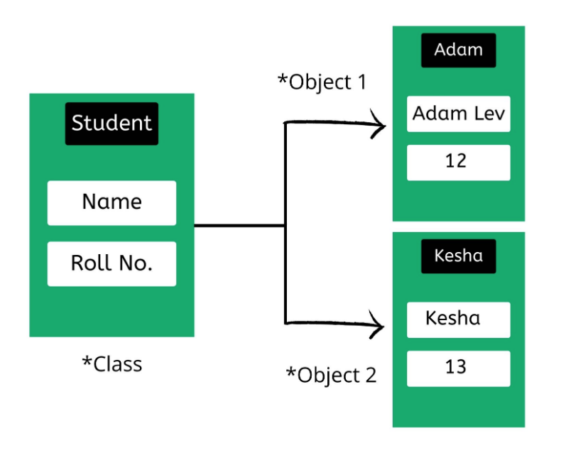
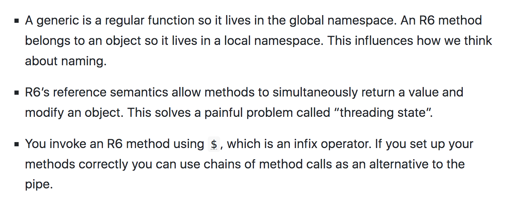

# Trade-offs

**Learning objectives:**

- Understand the Trade-offs between S3, R6 and S4


## Introduction to trade-offs

> “Everything that exists in R is an object”
>
> -- <cite>John Chambers</cite>

R is a functional language, **functions** made in R are **objects** with special **attributes**, called **classes**.

The **object-oriented system (OOP)** is the **environment** where objects and classes are defined and operate with a **scope**.

The **inheritance** concept in OOP allows one class to derive the features and functionalities of another class. This feature facilitates code-reusability.

```{r 16-Trade-offs-1, echo=FALSE,fig.align='center', fig.cap="[OOP](https://www.javatpoint.com/r-object-oriented-programming#:~:text=What%20is%20Object%2DOriented%20Programming,do%20programming%20in%20oops%20style.)"}

```

**What is an object?**

An object is a **data structure** that contains some **methods** based on attributes. 
```{r}
sloop::otype(1:10)
sloop::otype(mtcars)
```


An object is also called an **instance** of a class, and the process of object creation is called **instantiation**.[^1]

[^1]: [R – Object Oriented Programming](https://www.geeksforgeeks.org/r-object-oriented-programming/)
```{r}
class(1:10)
class(mtcars)
```


**What is a class?**

A class is where objects are defined and obtained by **encapsulating** data and functions.


There are different types of classes in OOP:

- **S3**
- **R6**
- **S4**


```{r 16-Trade-offs-2, message=FALSE, warning=FALSE, paged.print=FALSE,echo=FALSE}
library(tidyverse)
```


```{r 16-Trade-offs-3, echo=FALSE,fig.align='center',fig.cap="[r object-oriented programming](https://www.geeksforgeeks.org/r-object-oriented-programming/)"}

```


## Understanding the Trade-offs

Here we look to compare and contrast the OOP objects.


### S4 versus S3

**Which class to use S4 or S3? **

- **S3** is a flexible class, made of a list with attributes and assigned names, it consists of three main **components**:

     - Generic function
     - method
     - attributes
     

     
- **S4** has a more structured approach, is more formal, more strict, and more verbose. It contains functions for defining methods and **generics**. 

For example to define a class:

     S3: class() <- ...
     S4: setClass()
     
**S4 is a combination of increased complexity**, as well as S3, it allows for inheritance of both classes and methods.   
     
S4 is usually good for larger projects, such as **Bioconductor**, and complex systems of interrelated objects:

It minimizes code duplication (an example is the {Matrix} package), and makes it easy to provide a general method that works for all inputs.


### R6 versus S3

When starting with OOP the S3 class is suggested as a default for its simplicity. Then, the tendency would be to lean towards **R6**.

Example of S3: 
    
     plot(data)

Example of R6:

    data$plot
    
**R6** is built on **encapsulated objects**, rather than generic functions.   


**Big differences: general trade-offs**

```{r 16-Trade-offs-4, echo=FALSE,fig.align='center'}

```

#### Namespacing

**Where methods are in the Space?**

- in S3, **Generic functions** are **global**: there is a **global namespace** (same verbs, uniform API). The negatives are related to **homonyms** methods.

- in R6, **Encapsulated methods** are **local**: objects with a **scope**


#### Threading state or accumulator programming


In S3 the challenge is to return a value and modify the object. This can't be done, it violates set guidelines.


As an example, see the **16-example_accumulator_programming.R** in the scripts folder.


Or a way to do **multiple assign** operators with the {zeallot} package.

```{r 16-Trade-offs-5, eval=FALSE}
vignette('unpacking-assignment')
```


#### Method chaining

Useful to compose functions from left-to-right.

Use of the operators:

- S3: `%>%`
- R6: `$`


## Meeting Videos

### Cohort 1

`r knitr::include_url("https://www.youtube.com/embed/W1uc8HbyZvI")`

### Cohort 2

`r knitr::include_url("https://www.youtube.com/embed/bzo37PHCM1I")`

### Cohort 3

`r knitr::include_url("https://www.youtube.com/embed/_byYFTQHp1Y")`

### Cohort 4

`r knitr::include_url("https://www.youtube.com/embed/vdKDPBcOc6Y")`

### Cohort 5

`r knitr::include_url("https://www.youtube.com/embed/3EvqtVYTFVM")`

### Cohort 6

`r knitr::include_url("https://www.youtube.com/embed/URL")`

<details>
<summary> Meeting chat log </summary>

```
LOG
```
</details>
