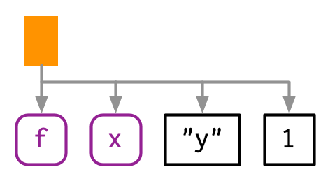
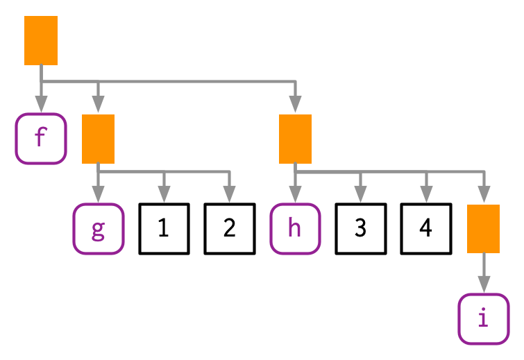
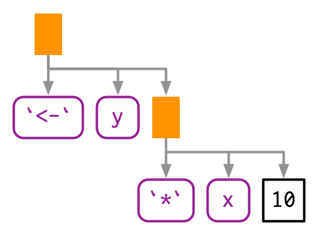
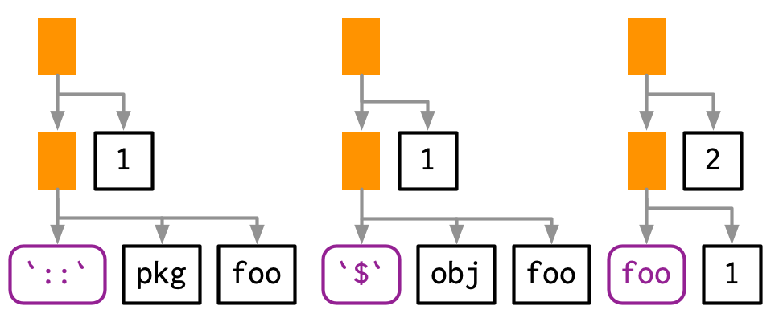
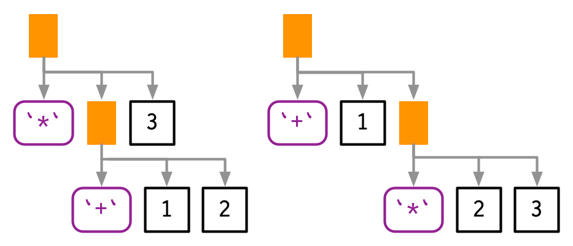

# Expressions

**Learning objectives:**

- We are going to understand the idea of the abstract syntax tree (AST) which is the tree like structure that underlie all R code.

- We are going to understand the data structures that underlie the AST such as constants, symbols and calls which are collectively known as expression.

- We are going to explore the idea behind parsing, the act of converting the linear sequence of character in code into the AST, and we will use that idea to explore some details of R’s grammar.

- We are going to see how we are going to use recursive functions to compute on the language, i.e. writting functions that compute with expressions.

- We are going to see how to work with three more specialized data structures: **pairlists**, **missing arguments**, and **expression vectors**.

```{r,message=FALSE,warning=FALSE}
library(rlang)
library(lobstr)
```
## Introduction

- To compute on the language, we first need to understand its structure. This requires some new vocabulary, some new tools, and some new ways of thinking about R code. The first of these is the distinction between an operation and its result.


```{r,error=TRUE}
y <- x * 10
```
- We can capture the intent of the code without executing it using the rlang package.

```{r}
z <- rlang::expr(y <- x * 10)

z
```
- We can the evaluate the expression using the **base::eval** function.
```{r}

x <- 4

base::eval(expr =(y <- x * 10))
```

**Evaluating multiple expressions**

- We can write multiple expressions at once & it acts similar to source()

- expression() returns a vector and can be passed to eval()
```{r}
eval(expression(
x <- 4,
x * 10
))
```

exprs() does not and has to be used in a loop
```{r}
for (i in exprs(x <- 4,x * 10)) {
print(i)
print(eval(i))
}
```
## Abstract Syntact Tree (AST)

- Expression is an object that captures the structure of code without evaluating it.

- Expressions are also called abstract syntax trees (ASTs) because the structure of code is hierarchical and can be naturally represented as a tree. Understanding this tree structure is crucial for inspecting and modifying expressions.


```{r,eval=FALSE}
f(x, "y", 1)
```




**With lobstr::ast():**

```{r}
lobstr::ast(f(x, "y", 1))
```

- Some function might also contain more call like the example below:

```{r,eval=FALSE}
f(g(1, 2), h(3, 4, i())):
```


```{r}
lobstr::ast(f(g(1, 2), h(3, 4, i())))
```
- We can read the **hand-drawn diagrams** from left-to-right (ignoring vertical position), and the **lobstr-drawn diagrams** from top-to-bottom (ignoring horizontal position).

- The depth within the tree is determined by the nesting of function calls. This also determines evaluation order, **as evaluation generally proceeds from deepest-to-shallowest, but this is not guaranteed because of lazy evaluation**.

##  Infix calls

- Infix calls are function in which the function names comes in between the arguments while the prefix calls the function names comes before it arguments.

- Every call in R can be written in tree form because any call can be written in prefix form. Take **y <- x * 10** again: what are the functions that are being called? It is not as easy to spot as f(x, 1) because this expression contains **two infix calls:** **<-** and *. That means that these two lines of code are equivalent:

```{r,eval=FALSE}
y <- x * 10

`<-`(y, `*`(x, 10))
```




```{r}
lobstr::ast(y <- x * 10)
```

- There is no difference between the ASTs, and if you generate an expression with prefix calls, R will still print it in infix form:

```{r}
rlang::expr(`<-`(y, `*`(x, 10)))
```
**18.2.4 Exercises**

## Constants
- Scalar constants are the simplest component of the AST. 

- A constant is either **NULL** or a **length-1** atomic vector (or scalar) like TRUE, 1L, 2.5 or "x". 
- We can test for a constant with **rlang::is_syntactic_literal()**.

- Constants are self-quoting in the sense that the expression used to represent a constant is the same constant:
```{r}
identical(expr(TRUE), TRUE)
```
```{r}
identical(expr(1), 1)
```
```{r}
identical(expr(2L), 2L)
```
```{r}
identical(expr("x"), "x")
```

## Symbols
- A symbol represents the name of an object like **x**, **mtcars**, or **mean**. In base R, the terms symbol and name are used interchangeably (i.e. **is.name()** is identical to **is.symbol())**, but this book used symbol consistently because **“name”** has many other meanings.

- You can create a symbol in two ways: by capturing code that references an object with **expr()**, or turning a string into a symbol with **rlang::sym():**
```{r}
expr(x)
```
```{r}
sym("x")
```
- Symbol can be turned back into a string with **as.character()** or **rlang::as_string()**. as_string() has the advantage of clearly signalling that you’ll get a character vector of length 1.

```{r}
as_string(expr(x))
```
- We can recognise a symbol because it’s printed without quotes, **str()** tells you that it’s a symbol, and **is.symbol()** is TRUE:

```{r}
str(expr(x))
```
```{r}
is.symbol(expr(x))
```
- The symbol type is not vectorised, i.e. a symbol is always length 1. If you want multiple symbols, you’ll need to put them in a list, using **rlang::syms()**.

## Calls

- A call object represents a captured function call. 

- Call objects are a special type of list90 where the first component specifies the function to call (usually a symbol), and the remaining elements are the arguments for that call. 

- Call objects create branches in the AST, because calls can be nested inside other calls.

- You can identify a call object when printed because it looks just like a function call. Confusingly **typeof()** and **str()** print **language 91** for call objects, but **is.call()** returns TRUE:

```{r}
lobstr::ast(read.table("important.csv", row.names = FALSE))
```
```{r}
x <- expr(read.table("important.csv", row.names = FALSE))
```
```{r}
typeof(x)
```
```{r}
is.call(x)
```

## Subsetting

- Calls generally behave like lists, i.e. you can use standard subsetting tools. The first element of the call object is the function to call, which is usually a symbol:

```{r}
x[[1]]
```

```{r}
is.symbol(x[[1]])
```
- The remainder of the elements are the arguments:

```{r}
as.list(x[-1])
```
- We can extract individual arguments with [[ or, if named, $:
```{r}
x[[2]]
```
```{r}
x$row.names
```
- We can determine the number of arguments in a call object by subtracting 1 from its length:
```{r}
length(x) - 1
```
- Extracting specific arguments from calls is challenging because of R’s flexible rules for argument matching: it could potentially be in any location, with the full name, with an abbreviated name, or with no name. 

- To work around this problem, you can use **rlang::call_standardise()** which standardises all arguments to use the full name:
```{r}
rlang::call_standardise(x)
```
- But If the function uses ... it’s not possible to standardise all arguments.

- Calls can be modified in the same way as lists:
```{r}
x$header <- TRUE
x
```
## Function position
- The first element of the call object is the function position. This contains the function that will be called when the object is evaluated, and is usually a symbol.

```{r}
lobstr::ast(foo())
```

- While R allows you to surround the name of the function with quotes, the parser converts it to a symbol:

```{r}
lobstr::ast("foo"())
```
- However, sometimes the function doesn’t exist in the current environment and you need to do some computation to retrieve it: for example, if the function is in another package, is a method of an R6 object, or is created by a function factory. In this case, the function position will be occupied by another call:
```{r}
lobstr::ast(pkg::foo(1))
```

```{r}
lobstr::ast(obj$foo(1))
```
```{r}
lobstr::ast(foo(1)(2))
```




## Constructing

- You can construct a call object from its components using rlang::call2(). The first argument is the name of the function to call (either as a string, a symbol, or another call). The remaining arguments will be passed along to the call:

```{r}
call2("mean", x = expr(x), na.rm = TRUE)
```
```{r}
call2(expr(base::mean), x = expr(x), na.rm = TRUE)
```
- Infix calls created in this way still print as usual.

```{r}
call2("<-", expr(x), 10)
```

**18.3.5 Exercises**

## Parsing and grammar
- The process by which a computer language takes a string and constructs an expression is called parsing, and is governed by a set of rules known as a grammar.

- We are going to use **lobstr::ast()** to explore some of the details of R’s grammar, and then show how you can transform back and forth between expressions and strings.

  **Operator precedence**
- Infix functions introduce two sources of ambiguity.

- The first source of ambiguity arises from infix functions: what does 1 + 2 * 3 yield? Do you get 9 (i.e. (1 + 2) * 3), or 7 (i.e. 1 + (2 * 3))? In other words, which of the two possible parse trees below does R use?




- Programming languages use conventions called operator precedence to resolve this ambiguity. We can use **ast()** to see what R does:

```{r}
lobstr::ast(1 + 2 * 3)
```
- Predicting the precedence of other operators is harder. There’s one particularly surprising case in R: ! has a much lower precedence (i.e. it binds less tightly) than you might expect. This allows you to write useful operations like:
```{r}
lobstr::ast(!x %in% y)
```
- **R has over 30 infix operators divided into 18 precedence** groups. While the details are described in **?Syntax**, very few people have memorised the complete ordering. If there’s any confusion, use parentheses!

**Associativity**
- The second source of ambiguity is introduced by repeated usage of the same infix function. For example, is 1 + 2 + 3 equivalent to **(1 + 2) + 3** or to **1 + (2 + 3)**? This normally doesn’t matter because **x + (y + z) == (x + y) + z**, i.e. addition is associative, but is needed because some S3 classes define + in a non-associative way.

- For example, ggplot2 overloads + to build up a complex plot from simple pieces; this is non-associative because earlier layers are drawn underneath later layers (i.e. **geom_point()** + **geom_smooth()** does not yield the same plot as **geom_smooth()** + **geom_point())**.

- In R, most operators are left-associative, i.e. the operations on the left are evaluated first:

```{r}
lobstr::ast(1 + 2 + 3)
```
 **Parsing and deparsing**
- Most of the time you type code into the console, and R takes care of turning the characters you’ve typed into an AST. But occasionally you have code stored in a string, and you want to parse it yourself. You can do so using **rlang::parse_expr()**:

```{r}
x1 <- "y <- x + 10"
x1
```
```{r}
is.call(x1)
```

```{r}
x2 <- rlang::parse_expr(x1)

x2

```

```{r}
is.call(x2)
```
- **parse_expr()** always returns a single expression. If you have multiple expression separated by ; or \n, you’ll need to use **rlang::parse_exprs()**. It returns a list of expressions:

```{r}
x3 <- "a <- 1; a + 1"
```
```{r}
rlang::parse_exprs(x3)
```
- If we find ourselve working with strings containing code very frequently, we should reconsider our process. We are going to address this in Chapter 19 where we are going to generate expressions using **quasiquotation** more safely.

- The inverse of parsing is deparsing: given an expression, you want the string that would generate it. This happens automatically when you print an expression, and you can get the string with **rlang::expr_text()**:
```{r}
z <- expr(y <- x + 10)
```
```{r}
expr_text(z)
```
 **18.4.4 Exercises**

##  Pairlists
- Pairlists are a remnant of R’s past and have been replaced by lists almost everywhere. The only place you are likely to see pairlists in R is when working with calls to the function, as the formal arguments to a function are stored in a pairlist:
```{r}
f <- expr(function(x, y = 10) x + y)
```
```{r}
args <- f[[2]]
args
```
```{r}
typeof(args)
```
- Fortunately, whenever you encounter a pairlist, you can treat it just like a regular list:

```{r}
pl <- pairlist(x = 1, y = 2)
```
```{r}
length(pl)
```
```{r}
pl$x
```
## Expression vectors
- an expression vector is just a list of expressions. The only difference is that calling eval() on an expression evaluates each individual expression. 

- Expression vectors are only produced by two base functions: expression() and parse():

```{r}
exp1 <- parse(text = c("
x <- 4
x
"))
```
```{r}
exp2 <- expression(x <- 4, x)
```

```{r}
typeof(exp1)
typeof(exp2)
```

```{r}
exp1
exp2
```
- Like calls and pairlists, expression vectors behave like lists:
```{r}
length(exp1)
exp1[[1]]
```

## Meeting Videos

### Cohort 1

`r knitr::include_url("https://www.youtube.com/embed/2NixH3QAerQ")`

### Cohort 2

`r knitr::include_url("https://www.youtube.com/embed/mYOUgzoRcjI")`

### Cohort 3

`r knitr::include_url("https://www.youtube.com/embed/5RLCRFli6QI")`

`r knitr::include_url("https://www.youtube.com/embed/F8df5PMNC8Y")`

### Cohort 4

`r knitr::include_url("https://www.youtube.com/embed/tSVBlAP5DIY")`

### Cohort 5

`r knitr::include_url("https://www.youtube.com/embed/Jc_R4yFsYeE")`

### Cohort 6

`r knitr::include_url("https://www.youtube.com/embed/K8w28ee3CR8")`
