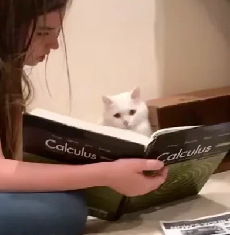
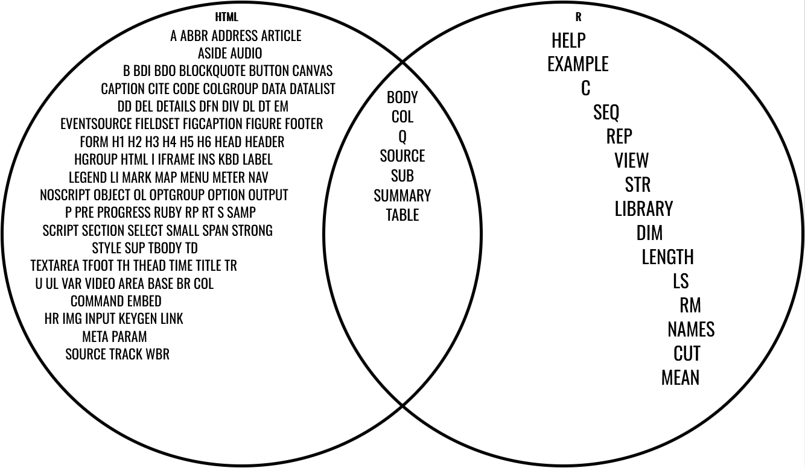

# Translating R code

**Learning objectives:**

- Build DSL (domain specific languages) to aid interoperability between R, HTML and LaTeX
- Reinforce metaprogramming concepts (expressions, quasiquotation, evaluation)

```{r, echo = FALSE, eval = TRUE}
DiagrammeR::mermaid("
graph LR

expressions --> R
quasiquotation --> R
evaluation --> R

R --> HTML
R --> LaTeX
")
```

<details>
<summary>Mermaid code</summary>
```{r, echo = TRUE, eval = FALSE}
DiagrammeR::mermaid("
graph LR

expressions --> R
quasiquotation --> R
evaluation --> R

R --> HTML
R --> LaTeX
")
```

</details>

<details>
<summary>Session Info</summary>
```{r, message = FALSE, warning = FALSE}
library(DiagrammeR) #for Mermaid flowchart
library(lobstr)     #abstract syntax trees
library(purrr)      #functional programming
library(rlang)      #tidy evaluation

# from section 18.5
expr_type <- function(x) {
  if (rlang::is_syntactic_literal(x)) {
    "constant"
  } else if (is.symbol(x)) {
    "symbol"
  } else if (is.call(x)) {
    "call"
  } else if (is.pairlist(x)) {
    "pairlist"
  } else {
    typeof(x)
  }
}
flat_map_chr <- function(.x, .f, ...) {
  purrr::flatten_chr(purrr::map(.x, .f, ...))
}
switch_expr <- function(x, ...) {
  switch(expr_type(x),
    ...,
    stop("Don't know how to handle type ", typeof(x), call. = FALSE)
  )
}
```

```{r}
utils::sessionInfo()
```

</details>

## Case Study: MCQ

We are going to use R code to generate HTML or LaTeX to produce multiple-choice questions such as

### Pop Quiz!

1. What is the **derivative** of $f(x) = 1 + 2\cos(3\pi x + 4)$?

    a. $f'(x) = 6\pi\sin(3\pi x + 4)$
    b. $f'(x) = -6\pi\sin(3\pi x + 4)$
    c. $f'(x) = 24\pi\sin(3\pi x + 4)$
    d. $f'(x) = -24\pi\sin(3\pi x + 4)$




---

As developers, we may be asking ourselves:

* What are the expressions?
* What are the symbols?
* Will we have to quote inputs from the user (math teacher)?


## HTML

We are trying to produce

```{}
<body>
  <h1 id = 'pop_quiz'>Pop Quiz</h1>
  <ol>
    <li>What is the <b>derivative</b> of $f(x) = 1 + 2\cos(3\pi x + 4)$?</li>
    <ol>
      <li>$f'(x) = 6\pi\sin(3\pi x + 4)$</li>
      <li>$f'(x) = -6\pi\sin(3\pi x + 4)$</li>
      <li>$f'(x) = 24\pi\sin(3\pi x + 4)$</li>
      <li>$f'(x) = -24\pi\sin(3\pi x + 4)$</li>
    </ol>
  </ol>
  
</body>
```

using DSL

```{r, eval = FALSE}
with_html(
  body(
    h1("Pop quiz!", id = "pop_quiz"),
    ol(
      li("What is the ", b("derivative"),  "of $f(x) = 1 + 2cos(3pi x + 4)$?"),
      ol(
        li("$f'(x) = 6pi*sin(3pi x + 4)$"),
        li("$f'(x) = -6pi*sin(3pi x + 4)$"),
        li("$f'(x) = 24pi*sin(3pi x + 4)$"),
        li("$f'(x) = -24pi*sin(3pi x + 4)$")
      )
    ),
    img(src = "images/translating/calculus_cat.png", width = 100, height = 100)
  )
)
```

In particular,

* **tags** such as `<b></b>` have *attributes*
* **void tags** such as ``
* special characters: `&`, `<`, and `>`


<details>
<summary>HTML verification</summary>

```{=html}
<body>
  <h1 id = 'pop_quiz'>Pop Quiz</h1>
  <ol>
    <li>What is the <b>derivative</b> of $f(x) = 1 + 2\cos(3\pi x + 4)$?</li>
    <ol>
      <li>$f'(x) = 6\pi\sin(3\pi x + 4)$</li>
      <li>$f'(x) = -6\pi\sin(3\pi x + 4)$</li>
      <li>$f'(x) = 24\pi\sin(3\pi x + 4)$</li>
      <li>$f'(x) = -24\pi\sin(3\pi x + 4)$</li>
    </ol>
  </ol>
  
</body>
```

</details>


## Escaping

* need to escape `&`, `<`, and `>`
* don't "double escape"
* leave HTML alone

### S3 Class

```{r}
html <- function(x) structure(x, class = "advr_html")

#dispatch
print.advr_html <- function(x, ...) {
  out <- paste0("<HTML> ", x)
  cat(paste(strwrap(out), collapse = "\n"), "\n", sep = "")
}
```

### Generic

```{r}
escape <- function(x) UseMethod("escape")
escape.character <- function(x) {
  x <- gsub("&", "&amp;", x)
  x <- gsub("<", "&lt;", x)
  x <- gsub(">", "&gt;", x)
  html(x)
}
escape.advr_html <- function(x) x
```

### Checks

```{r}
escape("This is some text.")
escape("x > 1 & y < 2")
escape(escape("This is some text. 1 > 2")) #double escape
escape(html("<hr />")) #already html
```


## Named Components

```{}
li("What is the ", b("derivative"),  "of $f(x) = 1 + 2\cos(3\pi x + 4)$?")
```

* aiming to classify `li` and `b` as **named components**

```{r}
dots_partition <- function(...) {
  dots <- list2(...)
  
 if (is.null(names(dots))) {
  is_named <- rep(FALSE, length(dots))
} else {
  is_named <- names(dots) != ""
}
  
  list(
    named = dots[is_named],
    unnamed = dots[!is_named]
  )
}
```

### Check

```{r}
str(dots_partition(company = "Posit",
                   software = "RStudio",
                   "DSLC",
                   "Cohort 9"))
```

<details>
<summary>HTML Attributes</summary>

Found among the textbook's [source code](https://github.com/hadley/adv-r/blob/master/dsl-html-attributes.r)

```{r}
html_attributes <- function(list) {
  if (length(list) == 0) return("")

  attr <- map2_chr(names(list), list, html_attribute)
  paste0(" ", unlist(attr), collapse = "")
}
html_attribute <- function(name, value = NULL) {
  if (length(value) == 0) return(name) # for attributes with no value
  if (length(value) != 1) stop("`value` must be NULL or length 1")

  if (is.logical(value)) {
    # Convert T and F to true and false
    value <- tolower(value)
  } else {
    value <- escape_attr(value)
  }
  paste0(name, "='", value, "'")
}
escape_attr <- function(x) {
  x <- escape.character(x)
  x <- gsub("\'", '&#39;', x)
  x <- gsub("\"", '&quot;', x)
  x <- gsub("\r", '&#13;', x)
  x <- gsub("\n", '&#10;', x)
  x
}
```


</details>


## Tags (calls)

```{r}
tag <- function(tag) {
  new_function(
    exprs(... = ), #arguments of new function
    expr({         #body of the new function
      
      #classify tags as named components
      dots <- dots_partition(...)
      
      #focus on named components as the tags
      attribs <- html_attributes(dots$named)
      
      # otherwise, nested code
      children <- map_chr(dots$unnamed, escape)

      # paste brackets, tag names, and attributes together
      # then unquote user arguments
      html(paste0(
        !!paste0("<", tag), attribs, ">",
        paste(children, collapse = ""),
        !!paste0("</", tag, ">")
      ))
    }),
    caller_env() #return the environment
  )
}
```

<details>
<summary>Void tags</summary>

```{r}
void_tag <- function(tag) {
  new_function(
    exprs(... = ), #allows for missing arguments
    expr({
      dots <- dots_partition(...)
      
      # error check
      if (length(dots$unnamed) > 0) {
        abort(!!paste0("<", tag, "> must not have unnamed arguments"))
      }
      attribs <- html_attributes(dots$named)

      html(paste0(!!paste0("<", tag), attribs, " />"))
    }),
    caller_env()
  )
}
```

</details>

### Checks

```{r}
tag("ol")
```

```{r}
img <- void_tag("img")
```

```{r, error = TRUE, results = "asis"}
img()
```

```{r}
img(src = "images/translating/calculus_cat.png",
    width = 100,
    height = 100)
```


## Tags (processing)

<details>
<summary>Venn Diagram</summary>

```{r}
tags <- c("a", "abbr", "address", "article", "aside", "audio",
  "b","bdi", "bdo", "blockquote", "body", "button", "canvas",
  "caption","cite", "code", "colgroup", "data", "datalist",
  "dd", "del","details", "dfn", "div", "dl", "dt", "em",
  "eventsource","fieldset", "figcaption", "figure", "footer",
  "form", "h1", "h2", "h3", "h4", "h5", "h6", "head", "header",
  "hgroup", "html", "i","iframe", "ins", "kbd", "label",
  "legend", "li", "mark", "map","menu", "meter", "nav",
  "noscript", "object", "ol", "optgroup", "option", "output",
  "p", "pre", "progress", "q", "ruby", "rp","rt", "s", "samp",
  "script", "section", "select", "small", "span", "strong",
  "style", "sub", "summary", "sup", "table", "tbody", "td",
  "textarea", "tfoot", "th", "thead", "time", "title", "tr",
  "u", "ul", "var", "video"
)

void_tags <- c("area", "base", "br", "col", "command", "embed",
  "hr", "img", "input", "keygen", "link", "meta", "param",
  "source", "track", "wbr"
)
```

</details>

```{r}
html_tags <- c(
  tags |>          #list of tag names from HTML
    set_names() |> #named variable to avoid reserved words!
    map(tag),      #make them function calls
  void_tags |>
    set_names() |>
    map(void_tag)
)
```


### Example

```{r}
html_tags$ol(
  html_tags$li("What is the ", 
               html_tags$b("derivative"),
               "of $f(x) = 1 + 2cos(3pi x + 4)$?"))
```


## Bringing the HTML Together

```{r}
with_html <- function(code) {
  eval_tidy(enquo(code), html_tags)
}
```

### Main Example

```{r}
with_html(
  body(
    h1("Pop quiz!", id = "pop_quiz"),
    ol(
      li("What is the ", b("derivative"),  "of $f(x) = 1 + 2cos(3pi x + 4)$?"),
      ol(
        li("$f'(x) = 6pi*sin(3pi x + 4)$"),
        li("$f'(x) = -6pi*sin(3pi x + 4)$"),
        li("$f'(x) = 24pi*sin(3pi x + 4)$"),
        li("$f'(x) = -24pi*sin(3pi x + 4)$")
      )
    ),
    img(src = "images/translating/calculus_cat.png", width = 100, height = 100)
  )
)
```

### Check

```{=html}
<h1 id='pop_quiz'>Pop quiz!</h1><ol><li>What is the <b>derivative</b> of $f(x) = 1 + 2cos(3pi x + 4)$?</li><ol><li>$f'(x) = 6pi*sin(3pi x + 4)$</li><li>$f'(x) = -6pi*sin(3pi x + 4)$</li><li>$f'(x) = 24pi*sin(3pi x + 4)$</li><li>$f'(x) = -24pi*sin(3pi x + 4)$</li></ol></ol>
```


## LaTeX

```{r}
latex <- function(x) structure(x, class = "advr_latex")
print.advr_latex <- function(x) { cat("<LATEX> ", x, "\n", sep = "") }
```

### to_math

```{r, eval = FALSE}
to_math <- function(x) {
  expr <- enexpr(x)
  latex(              #return LaTeX code
    eval_bare(        #eval_bare to ensure use of latex environment 
      expr,           #expression (not quosure)
      latex_env(expr) #need to define latex_env
    ))
}
```

## Known Symbols

```{r}
greek_letters <- c(
  "alpha", "beta", "chi", "delta", "Delta", "epsilon", "eta", 
"gamma", "Gamma", "iota", "kappa", "lambda", "Lambda", "mu", 
"nu", "omega", "Omega", "phi", "Phi", "pi", "Pi", "psi", "Psi", 
"rho", "sigma", "Sigma", "tau", "theta", "Theta", "upsilon", 
"Upsilon", "varepsilon", "varphi", "varrho", "vartheta", "xi", 
"Xi", "zeta"
)

greek_env <- rlang::as_environment(
  rlang::set_names(
    paste0("\\", greek_letters), #latex values
    greek_letters                #R names
  )
)
```

```{r}
str(as.list(greek_env))
```


## Known Functions

### Unary Operations

```{r}
unary_op <- function(left, right) {
  new_function(
    exprs(e1 = ),
    expr(
      paste0(!!left, e1, !!right)
    ),
    caller_env()
  )
}
```

```{r}
#example
unary_op("\\sqrt{", "}")
```

### Binary Operations

```{r}
binary_op <- function(sep) {
  new_function(
    exprs(e1 = , e2 = ),
    expr(
      paste0(e1, !!sep, e2)
    ),
    caller_env()
  )
}
```

```{r}
#example
binary_op("+")
```

<details>
<summary>Even more LaTeX syntax</summary>

```{r}
known_func_env <- child_env(
  .parent = empty_env(),
  
  # Binary operators
  `+` = binary_op(" + "),
  `-` = binary_op(" - "),
  `*` = binary_op(" * "),
  `/` = binary_op(" / "),
  `^` = binary_op("^"),
  `[` = binary_op("_"),

  # Grouping
  `{` = unary_op("\\left{ ", " \\right}"),
  `(` = unary_op("\\left( ", " \\right)"),
  paste = paste,

  # Other math functions
  sqrt = unary_op("\\sqrt{", "}"),
  sin =  unary_op("\\sin(", ")"),
  cos =  unary_op("\\cos(", ")"),
  tan =  unary_op("\\tan(", ")"),
  log =  unary_op("\\log(", ")"),
  abs =  unary_op("\\left| ", "\\right| "),
  frac = function(a, b) {
    paste0("\\frac{", a, "}{", b, "}")
  },

  # Labelling
  hat =   unary_op("\\hat{", "}"),
  tilde = unary_op("\\tilde{", "}")
)
```

</details>


## Unknown Symbols

```{r}
names_grabber <- function(x) {
  switch_expr(x,
              constant = character(),
              symbol =   as.character(x),
              call =     flat_map_chr(as.list(x[-1]), names_grabber)
  ) |>
    unique()
}
```

$$x + y + f(a, b, c, 10)$$

```{r}
names_grabber(expr(x + y + f(a, b, c, 10)))
```

```{r}
lobstr::ast(expr(x + y + f(a, b, c, 10)))
```


## Unknown Functions

```{r}
calls_grabber <- function(x) {
  switch_expr(x,
    constant = ,
    symbol =   character(),
    call = {
      fname <- as.character(x[[1]])
      children <- flat_map_chr(as.list(x[-1]), calls_grabber)
      c(fname, children)
    }
  ) |>
    unique()
}
```

$$f(g + b, c, d(a))$$

```{r}
names_grabber(expr(f(g + b, c, d(a))))
calls_grabber(expr(f(g + b, c, d(a))))
lobstr::ast(expr(f(g + b, c, d(a))))
```

---

```{r}
seek_closure <- function(op) {
  # change math font for function names
  # apply ending parenthesis
  new_function(
    exprs(... = ),
    expr({
      contents <- paste(..., collapse = ", ")
      paste0(!!paste0("\\mathrm{", op, "}("), contents, ")")
    })
  )
}
```

## Bringing the LaTeX Together

```{r}
latex_env <- function(expr) {
  
  # Unknown Functions
  calls <- calls_grabber(expr)
  call_list <- map(set_names(calls), seek_closure)
  call_env <- as_environment(call_list)

  # Known Functions
  known_func_env <- env_clone(known_func_env, call_env)

  # Unknown Symbols
  names <- names_grabber(expr)
  symbol_env <- as_environment(set_names(names), parent = known_func_env)

  # Known symbols
  greek_env <- env_clone(greek_env, parent = symbol_env)
  greek_env
}

to_math <- function(x) {
  expr <- enexpr(x)
  latex(              #return LaTeX code
    eval_bare(        #eval_bare to ensure use of latex environment 
      expr,           #expression (not quosure)
      latex_env(expr) #need to define latex_env
    ))
}
```

### Check

```{r}
to_math(sin(pi) + f(a))
```


## Meeting Videos

### Cohort 1

`r knitr::include_url("https://www.youtube.com/embed/fixyitpXrwY")`

`r knitr::include_url("https://www.youtube.com/embed/h3RNPyhIjas")`

### Cohort 2

`r knitr::include_url("https://www.youtube.com/embed/pj0hTW1CtbI")`

### Cohort 3

(no video)

### Cohort 4

`r knitr::include_url("https://www.youtube.com/embed/0TclsXa085Y")`

### Cohort 5

`r knitr::include_url("https://www.youtube.com/embed/v_dkrIEdmKE")`

### Cohort 6

`r knitr::include_url("https://www.youtube.com/embed/_-uwFjO5CyM")`

<details>
<summary> Meeting chat log </summary>

```
00:30:16	Arthur Shaw:	https://www.w3schools.com/html/html_entities.asp
00:32:29	Arthur Shaw:	Beta symbol in HTML: &Beta;
00:56:55	Arthur Shaw:	https://dbplyr.tidyverse.org/articles/translation-function.html
00:57:48	Arthur Shaw:	https://dtplyr.tidyverse.org/index.html
00:58:43	Arthur Shaw:	https://dtplyr.tidyverse.org/articles/translation.html
```
</details>
