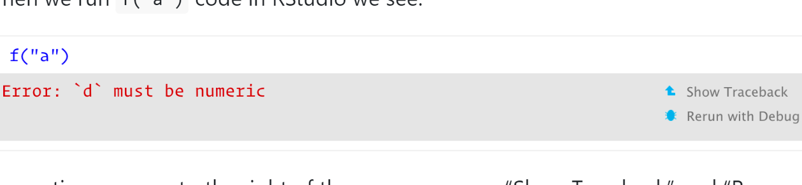
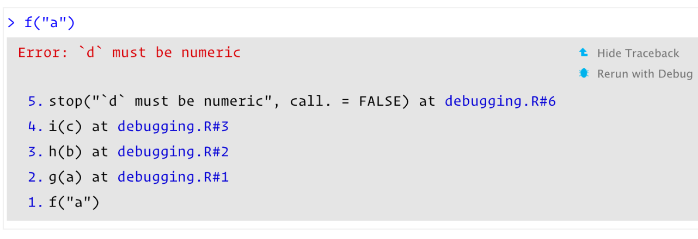
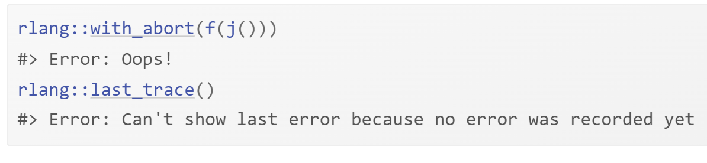

# Debugging

**Learning objectives:**

- General strategy for finding and fixing errors.

- We are going to explore the traceback() function which helps us to locate exactly where an error occurred.

- We are going to explore how to pause the execution of a function and launch environment where we can interactively explore what’s happening.

- We are going to explore the challenging problem of debugging when you’re running code non-interactively.

- We are going to explore a handful of non-error problems that occasionally also need debugging.

## Introduction

Finding bug in code, is a process of confirming the many things that we believe are true — until we find one which is not true.

**—Norm Matloff**

**Stretegies for finding and fixing errors**

**Google!**:
Whenever you see an error message, start by googling it. If you’re lucky, you’ll discover that it’s a common error with a known solution. When googling, improve your chances of a good match by removing any variable names or values that are specific to your problem.

We can automate this process with the **errorist107** and **searcher108** packages. See their websites for more details.

**Make it repeatable**:
- To find the root cause of an error, you’re going to need to execute the code many times as you consider and reject hypotheses. 

- To make that iteration as quick as possible, it’s worth some upfront investment to make the problem both easy and fast to reproduce.

**Figure out where it is**:
If you’re lucky, one of the tools in the following section will help you to quickly identify the line of code that’s causing the bug. Usually, however, you’ll have to think a bit more about the problem. It’s a great idea to adopt the scientific method. **Generate hypotheses**, **design experiments to test them**, and **record your results**. This may seem like a lot of work, but a systematic approach will end up saving you time. 

**Fix it and test it**:
Once you’ve found the bug, you need to figure out how to fix it and to check that the fix actually worked. Again, it’s very useful to have automated tests in place. Not only does this help to ensure that you’ve actually fixed the bug, it also helps to ensure you haven’t introduced any new bugs in the process. In the absence of automated tests, make sure to carefully record the correct output, and check against the inputs that previously failed.

**Locating errors**:
Once you’ve made the error repeatable, the next step is to figure out where it comes from. The most important tool for this part of the process is **traceback()**, which shows you the sequence of calls (also known as the **call stack**, Section 7.5) that lead to the error.

- Here’s a simple example: we can see that **f()** calls **g()** calls **h()** calls **i()**, which checks if its argument is numeric:


When we run **f("a")** code in RStudio we see:




Two options appear to the right of the error message: **“Show Traceback”** and **“Rerun with Debug”**. If you click **“Show traceback”** you see:


If you’re not using RStudio, you can use **traceback()** to get the same information (sans pretty formatting):




**NB:** You read the **traceback()** output from bottom to top: the initial call is **f()**, which calls **g()**, then **h()**, then **i()**, which triggers the error. If you’re calling code that you source()d into R, the traceback will also display the location of the function, in the form **filename.r#linenumber**. These are clickable in RStudio, and will take you to the corresponding line of code in the editor.

##  Lazy evaluation
One drawback to **traceback()** is that it always **linearises** the call tree, which can be confusing if there is much lazy evaluation involved (Section 7.5.2). For example, take the following example where the error happens when evaluating the first argument to f():


We can also use **rlang::with_abort()** and **rlang::last_trace()** to see the call tree. Here, I think it makes it much easier to see the source of the problem. Look at the last branch of the call tree to see that the error comes from j() calling k().



NB: rlang::last_trace() is ordered in the opposite way to traceback(). We’ll come back to that issue in **Section 22.4.2.4.**

## Interactive debugger
Sometimes, the precise location of the error is enough to let us to track it down and fix it. Frequently, however, we need more information, and the easiest way to get it is with the interactive debugger which allows you to pause execution of a function and interactively explore its state.

If you’re using RStudio, the easiest way to enter the interactive debugger is through RStudio’s **“Rerun with Debug”** tool. This reruns the command that created the error, pausing execution where the error occurred. Otherwise, you can insert a call to browser() where you want to pause, and re-run the function. For example, we could insert a call browser() in g():


**browser()** is just a regular function call which means that you can run it conditionally by wrapping it in an if statement:


In either case, you’ll end up in an interactive environment inside the function where you can run arbitrary R code to explore the current state. You’ll know when you’re in the interactive debugger because you get a special prompt.


In RStudio, you’ll see the corresponding code in the editor (with the statement that will be run next highlighted), objects in the current environment in the Environment pane, and the call stack in the Traceback pane.

## Browser() commands
As well as allowing you to run regular R code, browser() provides a few special commands. You can use them by either typing short text commands, or by clicking a button in the RStudio toolbar


- Next, n: executes the next step in the function. If you have a variable named n, you’ll need print(n) to display its value.

- Step into,  or s: works like next, but if the next step is a function, it will step into that function so you can explore it interactively.

- Finish,  or f: finishes execution of the current loop or function.

- Continue, c: leaves interactive debugging and continues regular execution of the function. This is useful if you’ve fixed the bad state and want to check that the function proceeds correctly.

- Stop, Q: stops debugging, terminates the function, and returns to the global workspace. Use this once you’ve figured out where the problem is, and you’re ready to fix it and reload the code.

There are two other slightly less useful commands that aren’t available in the toolbar:

- Enter: repeats the previous command. I find this too easy to activate accidentally, so I turn it off using options(browserNLdisabled = TRUE).

- where: prints stack trace of active calls (the interactive equivalent of traceback).

##  Alternatives
There are three alternatives to using browser(): setting breakpoints in RStudio, options(error = recover), and debug() and other related functions.

## Breakpoints
In RStudio, you can set a breakpoint by clicking to the left of the line number, or pressing **Shift + F9.** Breakpoints behave similarly to browser() but they are easier to set (one click instead of nine key presses), and you don’t run the risk of accidentally including a browser() statement in your source code. There are two small downsides to breakpoints:

- There are a few unusual situations in which breakpoints will not work. [Read breakpoint troubleshooting for more details](https://support.posit.co/hc/en-us/articles/200534337-Breakpoint-Troubleshooting)

- RStudio currently does not support conditional breakpoints.

## Recover()
Another way to activate browser() is to use options(error = recover). Now when you get an error, you’ll get an interactive prompt that displays the traceback and gives you the ability to interactively debug inside any of the frames:


You can return to default error handling with options(error = NULL)

## Debug()

Another approach is to call a function that inserts the browser() call:

- **debug()** inserts a browser statement in the first line of the specified function. undebug() removes it. Alternatively, you can use **debugonce()** to browse only on the next run.

- **utils::setBreakpoint()** works similarly, but instead of taking a function name, it takes a file name and line number and finds the appropriate function for you.

These two functions are both special cases of **trace()**, which inserts arbitrary code at any position in an existing function. trace() is occasionally useful when you’re debugging code that you don’t have the source for. To remove tracing from a function, use untrace(). You can only perform one trace per function, but that one trace can call multiple functions.

## Call stack
Unfortunately, the call stacks printed by **traceback()**, browser() & where, and recover() are not consistent. The following table shows how the call stacks from a simple nested set of calls are displayed by the three tools. The numbering is different between traceback() and where, and recover() displays calls in the opposite order.


RStudio displays calls in the same order as traceback(). rlang functions use the same ordering and numbering as recover(), but also use indenting to reinforce the hierarchy of calls.

## Non-interactive debugging

This section will give us some useful tools when debugging, when we can’t explore interactively, it’s particularly important to spend some time making the problem as small as possible so we can iterate quickly. Sometimes **callr::r(f, list(1, 2))** can be useful; this calls **f(1, 2)** in a fresh session, and can help to reproduce the problem.

You might also want to double check for these common issues:

- Is the global environment different? Have you loaded different packages? Are objects left from previous sessions causing differences?

- Is the working directory different?

- Is the PATH environment variable, which determines where external commands (like git) are found, different?

- Is the R_LIBS environment variable, which determines where library() looks for packages, different?

## Dump.frames()

dump.frames() is the equivalent to recover() for non-interactive code; it saves a last.dump.rda file in the working directory. Later, an interactive session, you can load("last.dump.rda"); debugger() to enter an interactive debugger with the same interface as recover(). This lets you “cheat”, interactively debugging code that was run non-interactively.


## Print debugging

If dump.frames() doesn’t help, a good fallback is print debugging, where you insert numerous print statements to precisely locate the problem, and see the values of important variables. Print debugging is slow and primitive, but it always works, so it’s particularly useful if you can’t get a good traceback. Start by inserting coarse-grained markers, and then make them progressively more fine-grained as you determine exactly where the problem is.


Print debugging is particularly useful for compiled code because it’s not uncommon for the compiler to modify your code to such an extent you can’t figure out the root problem even when inside an interactive debugger.

## RMarkdown
Debugging code inside RMarkdown files requires some special tools. First, if you’re knitting the file using RStudio, switch to calling **rmarkdown::render("path/to/file.Rmd")** instead. This runs the code in the current session, which makes it easier to debug. If doing this makes the problem go away, you’ll need to figure out what makes the environments different.

If the problem persists, you’ll need to use your interactive debugging skills. Whatever method you use, you’ll need an extra step: in the error handler, you’ll need to call sink(). This removes the default sink that knitr uses to capture all output, and ensures that you can see the results in the console. For example, to use recover() with RMarkdown, you’d put the following code in your setup block:


This will generate a “no sink to remove” warning when knitr completes; you can safely ignore this warning.

If you simply want a **traceback**, the easiest option is to use **rlang::trace_back()**, taking advantage of the **rlang_trace_top_env** option. This ensures that you only see the traceback from your code, instead of all the functions called by RMarkdown and knitr.


## Non-error failures
There are other ways for a function to fail apart from throwing an error:

- A function may generate an unexpected warning. The easiest way to track down warnings is to convert them into errors with options(warn = 2) and use the the call stack, like doWithOneRestart(), withOneRestart(), regular debugging tools. When you do this you’ll see some extra calls withRestarts(), and .signalSimpleWarning(). Ignore these: they are internal functions used to turn warnings into errors.

- A function may generate an unexpected message. You can use rlang::with_abort() to turn these messages into errors:

```{r,error=TRUE}
f <- function() g()
g <- function() message("Hi!")
f()


rlang::with_abort(f(), "message")

rlang::last_trace()
```

- A function might never return. This is particularly hard to debug automatically, but sometimes terminating the function and looking at the traceback() is informative. Otherwise, use use print debugging, as in Section 22.5.2.

- The worst scenario is that your code might crash R completely, leaving you with no way to interactively debug your code. This indicates a bug in compiled (C or C++) code.

## Link to some useful resources on debugging

- Jenny Bryan's ["Object of type closure is not subsettable"](https://github.com/jennybc/debugging#readme) talk from rstudio::conf 2020

- Jenny Bryan and Jim Hester's book: ["What They Forgot to Teach You About R"](https://rstats.wtf/) Ch11

- Hadley's video on a [minimal reprex for a shiny app](https://www.youtube.com/watch?v=9w8ANOAlWy4) 

## Meeting Videos

### Cohort 1

`r knitr::include_url("https://www.youtube.com/embed/ROMefwMuqXU")`

### Cohort 2

`r knitr::include_url("https://www.youtube.com/embed/N43p4txxxlY")`

### Cohort 3

`r knitr::include_url("https://www.youtube.com/embed/Jdb00nepeWQ")`

### Cohort 4

`r knitr::include_url("https://www.youtube.com/embed/tOql7ZD6P58")`

### Cohort 5

`r knitr::include_url("https://www.youtube.com/embed/EqsSWUQ6ZW0")`

### Cohort 6

`r knitr::include_url("https://www.youtube.com/embed/YvT-knh1baA")`

<details>
<summary> Meeting chat log </summary>

```
00:12:43	Trevin Flickinger:	Hello everyone!
00:13:03	Oluwafemi Oyedele:	Hello, Good evening!!!
00:22:10	Trevin Flickinger:	My connection is slow so I’ll be in the chat
00:32:45	Trevin Flickinger:	If you start with “continue” it should error out after the first call
00:56:18	Trevin Flickinger:	Sys.frame(-1) shows it goes back one frame
00:59:55	fg:	thanks
01:03:11	Arthur Shaw:	Anyone else lose the presentation?
01:03:20	fg:	yes
01:03:22	fg:	?
01:04:26	Trevin Flickinger:	I thought that was my internet connection
01:05:07	Trevin Flickinger:	Thank you!
01:08:42	Trevin Flickinger:	I need to use debug( ) more as well
01:10:15	Trevin Flickinger:	21st works for me
01:10:29	Oluwafemi Oyedele:	Same here!!!
```
</details>
