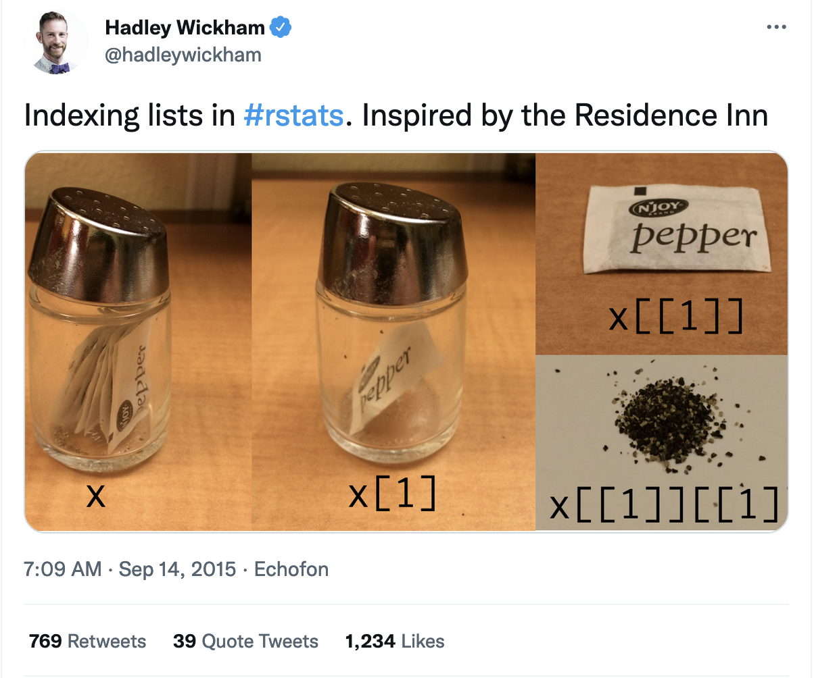

## Learning objectives:

- Learn about the 6 ways to subset atomic vectors
- Learn about the 3 subsetting operators: `[[`, `[`, and `$`
- Learn how subsetting works with different vector types
- Learn how subsetting can be combined with assignment

## Selecting multiple elements

### Atomic Vectors

- 6 ways to subset atomic vectors

Let's take a look with an example vector.

```{r atomic_vector}
x <- c(1.1, 2.2, 3.3, 4.4)
```

**Positive integer indices**

```{r positive_int}
# return elements at specified positions which can be out of order
x[c(4, 1)]

# duplicate indices return duplicate values
x[c(2, 2)]

# real numbers truncate to integers
# so this behaves as if it is x[c(3, 3)]
x[c(3.2, 3.8)]
```

**Negative integer indices**

```{r, error=TRUE}
### excludes elements at specified positions
x[-c(1, 3)] # same as x[c(-1, -3)] or x[c(2, 4)]

### mixing positive and negative is a no-no
x[c(-1, 3)]
```

**Logical Vectors**

```{r logical_vec}
x[c(TRUE, TRUE, FALSE, TRUE)]

x[x < 3]

cond <- x > 2.5
x[cond]
```

- **Recyling rules** applies when the two vectors are of different lengths
- the shorter of the two is recycled to the length of the longer
- Easy to understand if x or y is 1, best to avoid other lengths

```{r}
x[c(F, T)] # equivalent to: x[c(FALSE, TRUE, FALSE, TRUE)]
```

**Missing values (NA)**

```{r missing}
# Missing values in index will also return NA in output
x[c(NA, TRUE)]
```

**Nothing**

```{r nothing}
# returns the original vector
x[]
```

**Zero**

```{r zero}
# returns a zero-length vector
x[0]
```

**Character vectors**

```{r character}
# if name, you can use to return matched elements
(y <- setNames(x, letters[1:4]))

y[c("d", "b", "a")]

# Like integer indices, you can repeat indices
y[c("a", "a", "a")]

# When subsetting with [, names are always matched exactly
z <- c(abc = 1, def = 2)
z
z[c("a", "d")]
```

### Lists

- Subsetting works the same way
- `[` always returns a list
- `[[` and `$` let you pull elements out of a list

```{r}
my_list <- list(a = c(T, F), b = letters[5:15], c = 100:108)
my_list
```

**Return a (named) list**

```{r}
l1 <- my_list[2]
l1
```

**Return a vector**

```{r}
l2 <- my_list[[2]]
l2
l2b <- my_list$b
l2b
```

**Return a specific element**

```{r}
l3 <- my_list[[2]][3]
l3
l4 <- my_list[['b']][3]
l4
l4b <- my_list$b[3]
l4b
```

**Visual Representation**

 

See this stackoverflow article for more detailed information about the differences: https://stackoverflow.com/questions/1169456/the-difference-between-bracket-and-double-bracket-for-accessing-the-el

### Matrices and arrays

You can subset higher dimensional structures in three ways:

- with multiple vectors
- with a single vector
- with a matrix

```{r}
a <- matrix(1:12, nrow = 3)
colnames(a) <- c("A", "B", "C", "D")

# single row
a[1, ]

# single column
a[, 1]

# single element
a[1, 1]

# two rows from two columns
a[1:2, 3:4]

a[c(TRUE, FALSE, TRUE), c("B", "A")]

# zero index and negative index
a[0, -2]
```

**Subset a matrix with a matrix**

```{r}
b <- matrix(1:4, nrow = 2)
b
a[b]
```

```{r}
vals <- outer(1:5, 1:5, FUN = "paste", sep = ",")
vals

select <- matrix(ncol = 2, byrow = TRUE, 
                 c(1, 1,
                   3, 1,
                   2, 4))
select

vals[select]
```

Matrices and arrays are just special vectors; can subset with a single vector
(arrays in R stored column wise)

```{r}
vals[c(3, 15, 16, 17)]
```

### Data frames and tibbles

Data frames act like both lists and matrices

- When subsetting with a single index, they behave like lists and index the columns, so `df[1:2]` selects the first two columns.
- When subsetting with two indices, they behave like matrices, so `df[1:3, ]` selects the first three rows (and all the columns).

```{r penguins, error=TRUE}
library(palmerpenguins)
penguins <- penguins

# single index selects first two columns
two_cols <- penguins[2:3] # or penguins[c(2,3)]
head(two_cols)

# equivalent to the above code
same_two_cols <- penguins[c("island", "bill_length_mm")]
head(same_two_cols)

# two indices separated by comma (first two rows of 3rd and 4th columns)
penguins[1:2, 3:4]

# Can't do this...
penguins[[3:4]][c(1:4)]
# ...but this works...
penguins[[3]][c(1:4)]
# ...or this equivalent...
penguins$bill_length_mm[1:4]
```

Subsetting a tibble with `[` always returns a tibble

### Preserving dimensionality

- Data frames and tibbles behave differently
- tibble will default to preserve dimensionality, data frames do not
- this can lead to unexpected behavior and code breaking in the future
- Use `drop = FALSE` to preserve dimensionality when subsetting a data frame or use tibbles


```{r}
tb <- tibble::tibble(a = 1:2, b = 1:2)

# returns tibble
str(tb[, "a"])
tb[, "a"] # equivalent to tb[, "a", drop = FALSE]

# returns integer vector
# str(tb[, "a", drop = TRUE])
tb[, "a", drop = TRUE]
```

```{r}
df <- data.frame(a = 1:2, b = 1:2)

# returns integer vector
# str(df[, "a"])
df[, "a"]

# returns data frame with one column
# str(df[, "a", drop = FALSE])
df[, "a", drop = FALSE]
```
**Factors**

Factor subsetting drop argument controls whether or not levels (rather than dimensions) are preserved.

```{r}
z <- factor(c("a", "b", "c"))
z[1]
z[1, drop = TRUE]
```

## Selecting a single element

`[[` and `$` are used to extract single elements (note: a vector can be a single element)

### `[[]]`

Because `[[]]` can return only a single item, you must use it with either a single positive integer or a single string. 

```{r train}
x <- list(1:3, "a", 4:6)
x[[1]]
```

Hadley Wickham recommends using `[[]]` with atomic vectors whenever you want to extract a single value to reinforce the expectation that you are getting and setting individual values. 

### `$`

- `x$y` is equivalent to `x[["y"]]`

the `$` operator doesn't work with stored vals

```{r}
var <- "cyl"

# Doesn't work - mtcars$var translated to mtcars[["var"]]
mtcars$var

# Instead use [[
mtcars[[var]]
```

`$` allows partial matching, `[[]]` does not

```{r}
x <- list(abc = 1)
x$a

x[["a"]]

```

Hadley advises to change Global settings:

```{r}
options(warnPartialMatchDollar = TRUE)
x$a
```

tibbles don't have this behavior

```{r}
penguins$s
```

### missing and out of bound indices

- Due to the inconsistency of how R handles such indices, `purrr::pluck()` and `purrr::chuck()` are recommended

```{r, eval=FALSE}
x <- list(
  a = list(1, 2, 3),
  b = list(3, 4, 5)
)
purrr::pluck(x, "a", 1)
# [1] 1
purrr::pluck(x, "c", 1)
# NULL
purrr::pluck(x, "c", 1, .default = NA)
# [1] NA
```

### `@` and `slot()`
- `@` is `$` for S4 objects (to be revisited in Chapter 15)

- `slot()` is `[[ ]]` for S4 objects

## Subsetting and Assignment

- Subsetting can be combined with assignment to edit values

```{r}
x <- c("Tigers", "Royals", "White Sox", "Twins", "Indians")

x[5] <- "Guardians"

x
```

- length of the subset and assignment vector should be the same to avoid recycling

You can use NULL to remove a component

```{r}
x <- list(a = 1, b = 2)
x[["b"]] <- NULL
str(x)
```

Subsetting with nothing can preserve structure of original object

```{r, eval=FALSE}
# mtcars[] <- lapply(mtcars, as.integer)
# is.data.frame(mtcars)
# [1] TRUE
# mtcars <- lapply(mtcars, as.integer)
#> is.data.frame(mtcars)
# [1] FALSE
```

## Applications

Applications copied from cohort 2 slide

### Lookup tables (character subsetting)

```{r, eval=FALSE}
x <- c("m", "f", "u", "f", "f", "m", "m")
lookup <- c(m = "Male", f = "Female", u = NA)
lookup[x]
#        m        f        u        f        f        m        m 
#   "Male" "Female"       NA "Female" "Female"   "Male"   "Male"
```

### Matching and merging by hand (integer subsetting)

- The `match()` function allows merging a vector with a table

```{r, eval=FALSE}
grades <- c("D", "A", "C", "B", "F")
info <- data.frame(
  grade = c("A", "B", "C", "D", "F"),
  desc = c("Excellent", "Very Good", "Average", "Fair", "Poor"),
  fail = c(F, F, F, F, T)
)
id <- match(grades, info$grade)
id
# [1] 3 2 2 1 3
info[id, ]
#   grade      desc  fail
# 4     D      Fair FALSE
# 1     A Excellent FALSE
# 3     C   Average FALSE
# 2     B Very Good FALSE
# 5     F      Poor  TRUE
```

### Random samples and bootstrapping (integer subsetting)

```{r, eval=FALSE}
# mtcars[sample(nrow(mtcars), 3), ] # use replace = TRUE to replace
#                     mpg cyl  disp  hp drat    wt  qsec vs am gear carb
# Lotus Europa       30.4   4  95.1 113 3.77 1.513 16.90  1  1    5    2
# Mazda RX4          21.0   6 160.0 110 3.90 2.620 16.46  0  1    4    4
# Cadillac Fleetwood 10.4   8 472.0 205 2.93 5.250 17.98  0  0    3    4
```

### Ordering (integer subsetting)

```{r, eval=FALSE}
# mtcars[order(mtcars$mpg), ]
#                      mpg cyl  disp  hp drat    wt  qsec vs am gear carb
# Cadillac Fleetwood  10.4   8 472.0 205 2.93 5.250 17.98  0  0    3    4
# Lincoln Continental 10.4   8 460.0 215 3.00 5.424 17.82  0  0    3    4
# Camaro Z28          13.3   8 350.0 245 3.73 3.840 15.41  0  0    3    4
# Duster 360          14.3   8 360.0 245 3.21 3.570 15.84  0  0    3    4
# Chrysler Imperial   14.7   8 440.0 230 3.23 5.345 17.42  0  0    3    4
# Maserati Bora       15.0   8 301.0 335 3.54 3.570 14.60  0  1    5    8
# ...
```

### Expanding aggregated counts (integer subsetting)

- We can expand a count column by using `rep()`

```{r, eval=FALSE}
df <- tibble::tibble(x = c("Amy", "Julie", "Brian"), n = c(2, 1, 3))
df[rep(1:nrow(df), df$n), ]
# A tibble: 6 x 2
#   x         n
#   <chr> <dbl>
# 1 Amy       2
# 2 Amy       2
# 3 Julie     1
# 4 Brian     3
# 5 Brian     3
# 6 Brian     3
```

###  Removing columns from data frames (character)

- We can remove a column by subsetting, which does not change the object

```{r, eval=FALSE}
df[, 1]
# A tibble: 3 x 1
#   x    
#   <chr>
# 1 Amy  
# 2 Julie
# 3 Brian
```

- We can also delete the column using `NULL`

```{r, eval=FALSE}
df$n <- NULL
df
# A tibble: 3 x 1
#   x    
#   <chr>
# 1 Amy  
# 2 Julie
# 3 Brian
```

### Selecting rows based on a condition (logical subsetting)

```{r, eval=FALSE}
# mtcars[mtcars$gear == 5, ]
#                 mpg cyl  disp  hp drat    wt qsec vs am gear carb
# Porsche 914-2  26.0   4 120.3  91 4.43 2.140 16.7  0  1    5    2
# Lotus Europa   30.4   4  95.1 113 3.77 1.513 16.9  1  1    5    2
# Ford Pantera L 15.8   8 351.0 264 4.22 3.170 14.5  0  1    5    4
# Ferrari Dino   19.7   6 145.0 175 3.62 2.770 15.5  0  1    5    6
# Maserati Bora  15.0   8 301.0 335 3.54 3.570 14.6  0  1    5    8
```

### Boolean algebra versus sets (logical and integer)

- `which()` gives the indices of a Boolean vector

```{r, eval=FALSE}
(x1 <- 1:10 %% 2 == 0) # 1-10 divisible by 2
#  [1] FALSE  TRUE FALSE  TRUE FALSE  TRUE FALSE  TRUE FALSE  TRUE
(x2 <- which(x1))
# [1]  2  4  6  8 10
(y1 <- 1:10 %% 5 == 0) # 1-10 divisible by 5
#  [1] FALSE FALSE FALSE FALSE  TRUE FALSE FALSE FALSE FALSE  TRUE
(y2 <- which(y1))
# [1]  5 10
x1 & y1
# [1] FALSE FALSE FALSE FALSE FALSE FALSE FALSE FALSE FALSE  TRUE
```

## Meeting Videos

### Cohort 1

`r knitr::include_url("https://www.youtube.com/embed/eLMpCc0t1cg")`

### Cohort 2

`r knitr::include_url("https://www.youtube.com/embed/Mhq-TX4eA64")`

### Cohort 3

`r knitr::include_url("https://www.youtube.com/embed/CvvXkXiF3Ig")`

### Cohort 4

`r knitr::include_url("https://www.youtube.com/embed/Hxghhpe9fYs")`

### Cohort 5

`r knitr::include_url("https://www.youtube.com/embed/qtUgKhw39Yo")`

### Cohort 6

`r knitr::include_url("https://www.youtube.com/embed/-WjBA6yqW0Q")`

<details>
<summary> Meeting chat log </summary>

```
00:36:02	Arthur Shaw:	TIL that the subset operator has parameters. Thanks, Trevin!
00:38:55	Vaibhav Janve:	its interesting that carriage "a" has two set of wheels instread of 4. I wonder that choice is because its atomic.
00:40:44	Arthur Shaw:	@Vaibhav, because the load is lighter, the carriage needs fewer axles? ;)  I agree: it's a confusing graphical choice.
00:41:11	Vaibhav Janve:	lol
01:05:53	Vaibhav Janve:	Thank you Trevin!
```
</details>

### Cohort 7

`r knitr::include_url("https://www.youtube.com/embed/LBU-Ew_IM7A")`

`r knitr::include_url("https://www.youtube.com/embed/W9CoQ15NlOc")`

<details>

<summary>Meeting chat log</summary>
```
00:40:18	Ryan Honomichl:	What type of vector does each of the following calls to ifelse() return?

* "ifelse returns a value with the same shape as test which is filled with elements selected from either yes or no depending on whether the element of test is TRUE or FALSE."
00:42:11	Ryan Honomichl:	"I recommend assigning the results of an if statement only when the entire expression fits on one line; otherwise it tends to be hard to read"
00:42:46	Ryan Honomichl:	* When you use the single argument form without an `else` statement, `if` invisibly returns NULL if the condition is FALSE. 

-   Since functions like c() and paste() drop NULL inputs, this allows for a compact expression of certain idioms
00:54:15	collinberke:	https://docs.google.com/spreadsheets/d/1ScrbEw_-vB9DruaJhjtVY8HLQmuNPqyWeOOjmG6OY1M/edit?usp=sharing
00:58:46	collinberke:	https://www.youtube.com/@safe4democracy/videos
```
</details>
