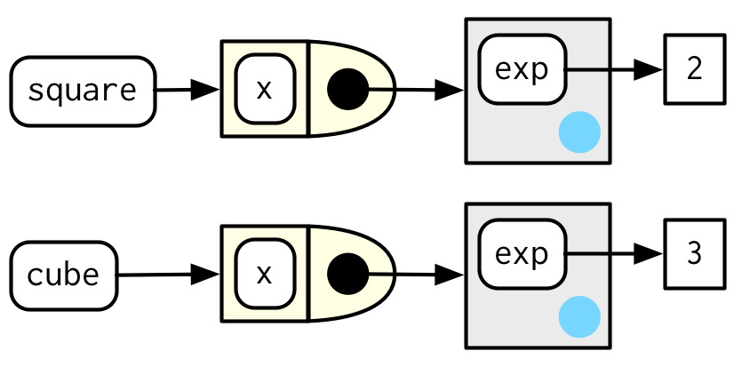

# Function factories

**Learning objectives:**

- Understand what a function factory is
- Recognise how function factories work
- Learn about non-obvious combination of function features
- Generate a family of functions from data

```{r, message = FALSE}
library(rlang)
library(ggplot2)
library(scales)
```


## What is a function factory?


A **function factory** is a function that makes (returns) functions

Factory made function are **manufactured functions**.

```{r 10-1, echo=FALSE, fig.align='center', fig.dim="50%",fig.alt="https://epsis.com/no/operations-centers-focus-on-ways-of-working/",fig.cap="Function factory | Credits: epsis.com"}

```


## How does a function factory work?
```{r 10-2, echo=FALSE, fig.align='center', fig.dim="100%",fig.cap="How does it work? | Credits: kakaakigas.com/how-it-works/"}

```

```{r 10-ex1}
power1 <- function(exp) {
  function(x) {
    x ^ exp
  }
}

square <- power1(2)
cube <- power1(3)
```
`power1()` is the function factory and `square()` and `cube()` are manufactured functions.

## Important to remember

1. R has First-class functions (can be created with `function()` and `<-`)

> R functions are objects in their own right, a language property often called “first-class functions”  
> -- [Section 6.2.3](https://adv-r.hadley.nz/functions.html?q=first%20class#first-class-functions)

2. Functions capture (enclose) environment in which they are created

```{r 10-ex3}
f <- function(x) function(y) x + y
fn_env(f)    # The function f()
fn_env(f())  # The function created by f()
```

3. Functions create a new environment on each run
```{r 10-ex4}
f <- function(x) {
  function() x + 1
}
ff <- f(1)
ff()
ff()
```


## Fundamentals - Environment

- Environment when function is created defines arguments in the function
- Use `env_print(fun)` and `fn_env()` to explore

```{r}
env_print(square)
fn_env(square)$exp
```

{width=50% fig-align=center}

## Fundamentals - Forcing

- Lazy evaluation means arguments only evaluated when used
- "[can] lead to a real head-scratcher of a bug"

```{r}
x <- 2
square <- power1(x)
x <- 3
square(4)
```

- *Only applies if passing object as argument*
- Here argument `2` evaluated when function called

```{r}
square <- power1(2)
x <- 3
square(4)
```

So use `force()`! (Unless you want it to change with the `x` in the parent environment)

## Forcing - Reiterated

Only required if the argument is **not** evaluated before the new function is created:
```{r}
power1 <- function(exp) {
  stopifnot(is.numeric(exp))
  function(x) x ^ exp
}

x <- 2
square <- power1(x)
x <- 3
square(4)
```

## Fundamentals - Stateful functions

Because

- The enclosing environment is unique and constant, and
- We have `<<-` (super assignment)

We can *change* that enclosing environment and keep track of that state
across iterations (!)

- `<-` Assignment in *current* environment
- `<<-` Assignment in *parent* environment

```{r 10-15}
new_counter <- function() {
  i <- 0        
  function() {
    i <<- i + 1 # second assignment (super assignment)
    i
  }
}

counter_one <- new_counter()
counter_two <- new_counter()
c(counter_one(), counter_one(), counter_one())
c(counter_two(), counter_two(), counter_two())
```


> "As soon as your function starts managing the state of multiple variables, it’s better to switch to R6"

## Fundamentals - Garbage collection

- Because environment is attached to (enclosed by) function, temporary objects
don't go away.

**Cleaning up** using `rm()` inside a function:
```{r 10-16}
f_dirty <- function(n) {
  x <- runif(n)
  m <- mean(x)
  function() m
}

f_clean <- function(n) {
  x <- runif(n)
  m <- mean(x)
  rm(x)            # <---- Important part!
  function() m
}

lobstr::obj_size(f_dirty(1e6))
lobstr::obj_size(f_clean(1e6))

```


## Useful Examples - Histograms and binwidth

**Useful when...**  

- You need to pass a function  
- You don't want to have to re-write the function every time 
  (the *default* behaviour of the function should be flexible)


For example, these bins are not appropriate
```{r}
#| fig-asp: 0.3
sd <- c(1, 5, 15)
n <- 100
df <- data.frame(x = rnorm(3 * n, sd = sd), sd = rep(sd, n))

ggplot(df, aes(x)) + 
  geom_histogram(binwidth = 2) + 
  facet_wrap(~ sd, scales = "free_x") + 
  labs(x = NULL)
```

We could just make a function...
```{r}
#| fig-asp: 0.3
binwidth_bins <- function(x) (max(x) - min(x)) / 20

ggplot(df, aes(x = x)) + 
  geom_histogram(binwidth = binwidth_bins) + 
  facet_wrap(~ sd, scales = "free_x") + 
  labs(x = NULL)
```

But if we want to change the number of bins (20) we'd have to re-write the function
each time.

If we use a factory, we don't have to do that.
```{r}
#| fig-asp: 0.3
binwidth_bins <- function(n) {
  force(n)
  function(x) (max(x) - min(x)) / n
}

ggplot(df, aes(x = x)) + 
  geom_histogram(binwidth = binwidth_bins(20)) + 
  facet_wrap(~ sd, scales = "free_x") + 
  labs(x = NULL, title = "20 bins")

ggplot(df, aes(x = x)) + 
  geom_histogram(binwidth = binwidth_bins(5)) + 
  facet_wrap(~ sd, scales = "free_x") + 
  labs(x = NULL, title = "5 bins")
```

> Similar benefit in Box-cox example

## Useful Examples - Wrapper

**Useful when...**

- You want to create a function that wraps a bunch of other functions

For example, `ggsave()` wraps a bunch of different graphics device functions: 

```{r}
# (Even more simplified)
plot_dev <- function(ext, dpi = 96) {
  force(dpi)
  
  switch(
    ext,
    svg = function(filename, ...) svglite::svglite(file = filename, ...),
    png = function(...) grDevices::png(..., res = dpi, units = "in"),
    jpg = ,
    jpeg = function(...) grDevices::jpeg(..., res = dpi, units = "in"),
    stop("Unknown graphics extension: ", ext, call. = FALSE)
  )
}
```

Then `ggsave()` uses

```
ggsave <- function(...) {
  dev <- plot_dev(device, filename, dpi = dpi)
  ...
  dev(filename = filename, width = dim[1], height = dim[2], bg = bg, ...)
  ...
}
```

Otherwise, would have to do something like like a bunch of if/else statements.

## Useful Examples - Optimizing

**Useful when...**

- Want to pass function on to `optimise()`/`optimize()`
- Want to perform pre-computations to speed things up
- Want to re-use this for other datasets

(*Skipping to final results from section*)

Here, using MLE want to to find the most likely value of lambda for a Poisson distribution
and this data.
```{r}
x1 <- c(41, 30, 31, 38, 29, 24, 30, 29, 31, 38)
```

We'll create a function that creates a lambda assessment function for a given 
data set.

```{r}
ll_poisson <- function(x) {
  n <- length(x)
  sum_x <- sum(x)
  c <- sum(lfactorial(x))

  function(lambda) {
    log(lambda) * sum_x - n * lambda - c
  }
}
```

We can use this on different data sets, but here use ours `x1`
```{r}
ll <- ll_poisson(x1)
ll(10)  # Log-probility of a lambda = 10
```

Use `optimise()` rather than trial and error
```{r}
optimise(ll, c(0, 100), maximum = TRUE)
```

Result: Highest log-probability is -30.3, best lambda is 32.1


## Function factories + functionals

Combine functionals and function factories to turn data into many functions.

```{r}
names <- list(
  square = 2, 
  cube = 3, 
  root = 1/2, 
  cuberoot = 1/3, 
  reciprocal = -1
)
funs <- purrr::map(names, power1)
names(funs)
funs$root(64)
funs$square(3)
```

Avoid the prefix with

- `with()` - `with(funs, root(100))`
  - Temporary, clear, short-term
- `attach()` - `attach(funs)` / `detach(funs)`
  - Added to search path (like package function), cannot be overwritten, but can be attached multiple times!
- `rlang::env_bind` - `env_bind(globalenv(), !!!funs)` / `env_unbind(gloablenv(), names(funs))`
  - Added to global env (like created function), can be overwritten

<!--
## EXTRA - Previous set of slides

Graphical factories **useful function factories**, such as:

1.  Labelling with:

    * formatter functions
    
```{r 10-19}
y <- c(12345, 123456, 1234567)
comma_format()(y)
```
```{r 10-20}
number_format(scale = 1e-3, suffix = " K")(y)
```
They are more commonly used inside a ggplot:
```{r 10-21, include=FALSE}
df <- data.frame(x = 1, y = y)
a_ggplot_object <- ggplot(df, aes(x, y)) + 
  geom_point() + 
  scale_x_continuous(breaks = 1, labels = NULL) +
  labs(x = NULL, y = NULL)
```

```{r 10-22, eval=T}
a_ggplot_object + 
  scale_y_continuous(
  labels = comma_format()
)
```

2.  Using binwidth in facet histograms

      * binwidth_bins
      
```{r}
binwidth_bins <- function(n) {
  force(n)
  
  function(x) {
    (max(x) - min(x)) / n
  }
}
```
   
Or use a concatenation of this typr of detecting number of bins functions:

      - nclass.Sturges()
      - nclass.scott()
      - nclass.FD()
      
```{r}
base_bins <- function(type) {
  fun <- switch(type,
    Sturges = nclass.Sturges,
    scott = nclass.scott,
    FD = nclass.FD,
    stop("Unknown type", call. = FALSE)
  )
  
  function(x) {
    (max(x) - min(x)) / fun(x)
  }
}
```
      

3.  Internals:

      * ggplot2:::plot_dev()


## Non-obvious combinations


- The **Box-Cox** transformation.
- **Bootstrap** resampling.
- **Maximum likelihood** estimation.


### Statistical factories

The **Box-Cox** transformation towards normality:
```{r}
boxcox1 <- function(x, lambda) {
  stopifnot(length(lambda) == 1)
  
  if (lambda == 0) {
    log(x)
  } else {
    (x ^ lambda - 1) / lambda
  }
}
```


```{r}
boxcox2 <- function(lambda) {
  if (lambda == 0) {
    function(x) log(x)
  } else {
    function(x) (x ^ lambda - 1) / lambda
  }
}

stat_boxcox <- function(lambda) {
  stat_function(aes(colour = lambda), fun = boxcox2(lambda), size = 1)
}

plot1 <- ggplot(data.frame(x = c(0, 5)), aes(x)) + 
  lapply(c(0.5, 1, 1.5), stat_boxcox) + 
  scale_colour_viridis_c(limits = c(0, 1.5))

# visually, log() does seem to make sense as the transformation
# for lambda = 0; as values get smaller and smaller, the function
# gets close and closer to a log transformation
plot2 <- ggplot(data.frame(x = c(0.01, 1)), aes(x)) + 
  lapply(c(0.5, 0.25, 0.1, 0), stat_boxcox) + 
  scale_colour_viridis_c(limits = c(0, 1.5))
library(patchwork)
plot1+plot2
```

**Bootstrap generators**


```{r}
boot_permute <- function(df, var) {
  n <- nrow(df)
  force(var)
  
  function() {
    col <- df[[var]]
    col[sample(n, replace = TRUE)]
  }
}

boot_mtcars1 <- boot_permute(mtcars, "mpg")
head(boot_mtcars1())
#> [1] 16.4 22.8 22.8 22.8 16.4 19.2
head(boot_mtcars1())
#> [1] 17.8 18.7 30.4 30.4 16.4 21.0
```
```{r}
boot_model <- function(df, formula) {
  mod <- lm(formula, data = df)
  fitted <- unname(fitted(mod))
  resid <- unname(resid(mod))
  rm(mod)

  function() {
    fitted + sample(resid)
  }
} 

boot_mtcars2 <- boot_model(mtcars, mpg ~ wt)
head(boot_mtcars2())
#> [1] 25.0 24.0 21.7 19.2 24.9 16.0
head(boot_mtcars2())
#> [1] 27.4 21.0 20.3 19.4 16.3 21.3
```

**Maximum likelihood estimation**

$$P(\lambda,x)=\prod_{i=1}^{n}\frac{\lambda^{x_i}e^{-\lambda}}{x_i!}$$
```{r}
lprob_poisson <- function(lambda, x) {
  n <- length(x)
  (log(lambda) * sum(x)) - (n * lambda) - sum(lfactorial(x))
}
```

```{r}
x1 <- c(41, 30, 31, 38, 29, 24, 30, 29, 31, 38)
```

```{r}
lprob_poisson(10, x1)
#> [1] -184
lprob_poisson(20, x1)
#> [1] -61.1
lprob_poisson(30, x1)
#> [1] -31
```

```{r}
ll_poisson1 <- function(x) {
  n <- length(x)

  function(lambda) {
    log(lambda) * sum(x) - n * lambda - sum(lfactorial(x))
  }
}
```
```{r}
ll_poisson2 <- function(x) {
  n <- length(x)
  sum_x <- sum(x)
  c <- sum(lfactorial(x))

  function(lambda) {
    log(lambda) * sum_x - n * lambda - c
  }
}
```

```{r}
ll1 <- ll_poisson2(x1)

ll1(10)
#> [1] -184
ll1(20)
#> [1] -61.1
ll1(30)
#> [1] -31
```
```{r}
optimise(ll1, c(0, 100), maximum = TRUE)
#> $maximum
#> [1] 32.1
#> 
#> $objective
#> [1] -30.3
```
```{r}
optimise(lprob_poisson, c(0, 100), x = x1, maximum = TRUE)
#> $maximum
#> [1] 32.1
#> 
#> $objective
#> [1] -30.3
```

## Function factory applications


Combine functionals and function factories to turn data into many functions.

### Function factories + functionals
```{r}
names <- list(
  square = 2, 
  cube = 3, 
  root = 1/2, 
  cuberoot = 1/3, 
  reciprocal = -1
)
funs <- purrr::map(names, power1)

funs$root(64)
#> [1] 8
funs$root
#> function(x) {
#>     x ^ exp
#>   }
#> <bytecode: 0x7fe85512a410>
#> <environment: 0x7fe85b21f190>
```
```{r}
with(funs, root(100))
#> [1] 10
```

```{r}
attach(funs)
#> The following objects are masked _by_ .GlobalEnv:
#> 
#>     cube, square
root(100)
#> [1] 10
detach(funs)
```


```{r}
rlang::env_bind(globalenv(), !!!funs)
root(100)
#> [1] 10
```

```{r}
rlang::env_unbind(globalenv(), names(funs))
```


-->


## Meeting Videos

### Cohort 1

`r knitr::include_url("https://www.youtube.com/embed/enI5Ynq6olI")`

### Cohort 2

`r knitr::include_url("https://www.youtube.com/embed/U-CoF7MCik0")`

### Cohort 3

`r knitr::include_url("https://www.youtube.com/embed/qgn7WTITnNs")`

### Cohort 4

`r knitr::include_url("https://www.youtube.com/embed/GHp2W4JxVaY")`

### Cohort 5

`r knitr::include_url("https://www.youtube.com/embed/8TGXjzi0n0o")`

### Cohort 6

`r knitr::include_url("https://www.youtube.com/embed/FUoYwYFqT7Q")`

<details>
<summary> Meeting chat log </summary>

```
01:02:25	Trevin:	I'm good with combining 👍
01:02:57	Oluwafemi Oyedele:	I agree with combining the chapter!!!
```
</details>

### Cohort 7

`r knitr::include_url("https://www.youtube.com/embed/7GLyO3IntgE")`
