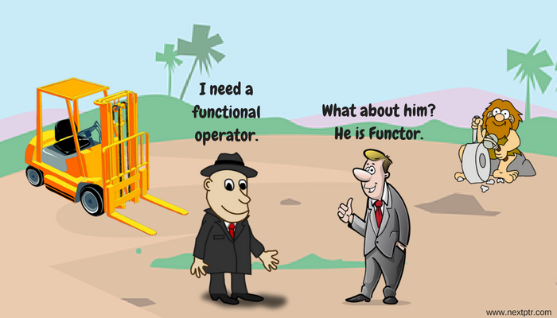

## Learning objectives:

- Define function operator
- Explore some existing function operators
- Make our own function operator


## Introduction 

<!--- ```{r 10-01, fig.align='center',fig.dim="50%", fig.cap="Credits: 2001-2003 Michael P.Frank (https://slideplayer.com/slide/17666226/)",echo=FALSE}


``` --->

- A **function operator** is a function that takes one (or more) functions as input and returns a function as output.

- Function operators are a special case of **function factories**, since they return functions.

- They are often used to wrap an existing function to provide additional capability, similar to python's **decorators**. 

```{r 11-01_0}
chatty <- function(f) {
  force(f)
  
  function(x, ...) {
    res <- f(x, ...)
    cat("Processing ", x, "\n", sep = "")
    res
  }
}

f <- function(x) x ^ 2
s <- c(3, 2, 1)

purrr::map_dbl(s, chatty(f))

```

## Existing function operators 

Two function operator examples are `purrr:safely()` and `memoise::memoise()`.  These can be found in `purr` and `memoise`:

```{r 11-01_1}
library(purrr)
library(memoise)
```

## purrr::safely {-}

Capturing Errors: turns errors into data!

      
```{r 11-02_0}
x <- list(
  c(0.512, 0.165, 0.717),
  c(0.064, 0.781, 0.427),
  c(0.890, 0.785, 0.495),
  "oops"
)
```

```{r 11-02_0b, eval=FALSE}
map_dbl(x, sum)
#> Error in .Primitive("sum")(..., na.rm = na.rm): invalid 'type' (character) of
#> argument
```


```{r 11-02_0c}
# note use of map (not map_dbl), safely returns a lisst

out <- map(x, safely(sum))
str(transpose(out))
```
      


## Other `purrr` function operators {-}

<!---
```{r 11-02, echo=FALSE,fig.align='center', fig.cap="Credits: www.nextptr.com"}

```
--->

> purrr comes with three other function operators in a similar vein:

      
      possibly(): returns a default value when there’s an error. It provides no way to tell if an error occured or not, so it’s best reserved for cases when there’s some obvious sentinel value (like NA).

      quietly(): turns output, messages, and warning side-effects into output, message, and warning components of the output.

      auto_browser(): automatically executes browser() inside the function when there’s an error.


## memoise::memoise {-}

Caching computations: avoid repeated computations!
 

```{r 11-02_01}
slow_function <- function(x) {
  Sys.sleep(1)
  x * 10 * runif(1)
}
system.time(print(slow_function(1)))
system.time(print(slow_function(1)))
```

```{r 11-02_02}
fast_function <- memoise::memoise(slow_function)
system.time(print(fast_function(1)))
system.time(print(fast_function(1)))
```

> Be careful about memoising impure functions! 

## Exercise {-}

How does `safely()` work?  
The source code looks like this:

```{r 11-02_exp1}
safely
```

The real work is done in `capture_error` which is defined in the package **namespace**. We can access it with the `:::` operator. (Could also grab it from the function's environment.)

```{r 11-02_exp2}
purrr:::capture_error
```

## Case study: make your own function operator


```{r 11-03_01,eval=FALSE}
urls <- c(
  "adv-r" = "https://adv-r.hadley.nz", 
  "r4ds" = "http://r4ds.had.co.nz/"
  # and many many more
)
path <- paste(tempdir(), names(urls), ".html")

walk2(urls, path, download.file, quiet = TRUE)
```


Here we make a function operator that add a little delay in reading each page:

```{r 11-03_02}
delay_by <- function(f, amount) {
  force(f)
  force(amount)
  
  function(...) {
    Sys.sleep(amount)
    f(...)
  }
}
system.time(runif(100))

system.time(delay_by(runif, 0.1)(100))

```


And another to add a dot after nth invocation:

```{r 11_03-04}
dot_every <- function(f, n) {
  force(f)
  force(n)
  
  i <- 0
  function(...) {
    i <<- i + 1
    if (i %% n == 0) cat(".")
    f(...)
  }
}

walk(1:100, dot_every(runif, 10))

```

Can now use both of these function operators to express our desired result:

```{r 11-03_05, eval=FALSE}
walk2(
  urls, path, 
  download.file %>% dot_every(10) %>% delay_by(0.1), 
  quiet = TRUE
)
```

## Exercise {-}

2) Should you memoise file.download? Why or why not?

 

## Meeting Videos

### Cohort 1

`r knitr::include_url("https://www.youtube.com/embed/zzUY03gt_pA")`

### Cohort 2

`r knitr::include_url("https://www.youtube.com/embed/fD1QJB2pHik")`

### Cohort 3

`r knitr::include_url("https://www.youtube.com/embed/Re6y5CQzwG4")`

### Cohort 4

`r knitr::include_url("https://www.youtube.com/embed/rVooJFdbePs")`

### Cohort 5

`r knitr::include_url("https://www.youtube.com/embed/XOurCfeJLGc")`

### Cohort 6

`r knitr::include_url("https://www.youtube.com/embed/EPs57es2MsE")`

<details>
<summary> Meeting chat log </summary>

```
00:01:42	Oluwafemi Oyedele:	Hi, Good Evening !!!
00:05:52	Arthur Shaw:	@federica, love the hex stickers behind you. All from rstudio::conf?
00:07:12	Arthur Shaw:	I tried doing the same. I had a hard time ordering them. I also thought I'd make the stickers into magnets so that I could rearrange them in future.
00:48:34	Oluwafemi Oyedele:	Thank you !!!
```
</details>

### Cohort 7

`r knitr::include_url("https://www.youtube.com/embed/WDehjcuc7xs")`

<details>

<summary>Meeting chat log</summary>
```
00:18:21	collinberke: Jenny Bryan debugging: https://www.youtube.com/watch?v=vgYS-F8opgE
00:31:10	collinberke: https://purrr.tidyverse.org/reference/slowly.html
00:47:43	Robert Hilly: By guys!
```
</details>
