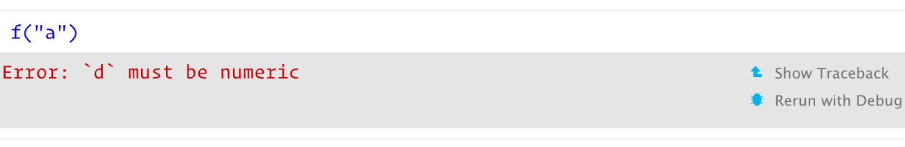
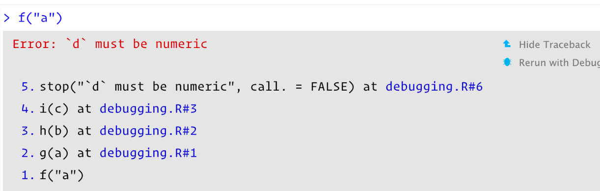
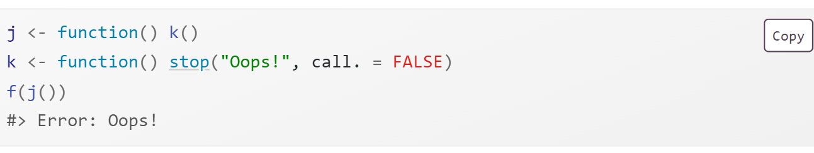
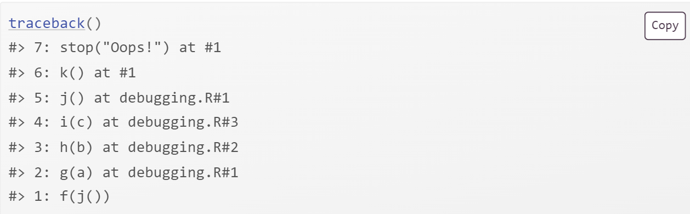
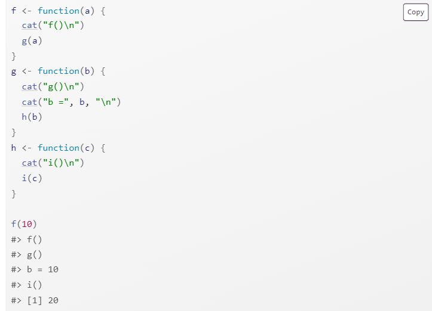

## Learning objectives:

- General strategy for finding and fixing errors.

- Explore the `traceback()` function to locate exactly where an error occurred

- Explore how to pause the execution of a function and launch environment where we can interactively explore what’s happening

- Explore debugging when you’re running code non-interactively

- Explore non-error problems that occasionally also need debugging

## Introduction {-}

> Finding bug in code, is a process of confirming the many things that we believe are true — until we find one which is not true.

**—Norm Matloff**

> Debugging is like being the detective in a crime movie where you're also the murderer. 

**-Filipe Fortes**

### Strategies for finding and fixing errors {-}

#### Google! {-}
Whenever you see an error message, start by googling it. We can automate this process with the [{errorist}](https://github.com/coatless-rpkg/errorist) and [{searcher}](https://github.com/coatless-rpkg/searcher) packages. 

#### Make it repeatable {-}
To find the root cause of an error, you’re going to need to execute the code many times as you consider and reject hypotheses. It’s worth some upfront investment to make the problem both easy and fast to reproduce.

#### Figure out where it is {-}
To find the bug, adopt the scientific method: **generate hypotheses**, **design experiments to test them**, and **record your results**. This may seem like a lot of work, but a systematic approach will end up saving you time. 

#### Fix it and test it {-}
Once you’ve found the bug, you need to figure out how to fix it and to check that the fix actually worked. It’s very useful to have automated tests in place. 

## Locating errors {-}
The most important tool for finding errors is `traceback()`, which shows you the sequence of calls (also known as the **call stack**) that lead to the error.

- Here’s a simple example where `f()` calls `g()` calls `h()` calls `i()`, which checks if its argument is numeric:


When we run `f("a")` code in RStudio we see:




If you click **“Show traceback”** you see:



You read the `traceback()` output from bottom to top: the initial call is `f()`, which calls `g()`, then `h()`, then `i()`, which triggers the error. 

##  Lazy evaluation {-}
One drawback to `traceback()` is that it always **linearises** the call tree, which can be confusing if there is much lazy evaluation involved. For example, take the following example where the error happens when evaluating the first argument to `f()`:





Note: `rlang::with_abort()` is no longer an exported object from 'namespace:rlang'. There is an [open issue](https://github.com/hadley/adv-r/issues/1740) about a fix for the chapter but no drop-in replacement.


## Interactive debugger {-}
Enter the interactive debugger is wwith RStudio’s **“Rerun with Debug”** tool. This reruns the command that created the error, pausing execution where the error occurred. Otherwise, you can insert a call to `browser()` where you want to pause, and re-run the function. 


`browser()` is just a regular function call which means that you can run it conditionally by wrapping it in an `if` statement:


## `browser()` commands {-}
`browser()` provides a few special commands. 


- Next, `n`: executes the next step in the function.

- Step into,  or `s`: works like next, but if the next step is a function, it will step into that function so you can explore it interactively.

- Finish,  or `f`: finishes execution of the current loop or function.

- Continue, `c`: leaves interactive debugging and continues regular execution of the function. 
- Stop, `Q`: stops debugging, terminates the function, and returns to the global workspace. 


##  Alternatives {-}
There are three alternatives to using `browser()`: setting breakpoints in RStudio, `options(error = recover)`, and `debug()` and other related functions.

## Breakpoints {-}
In RStudio, you can set a breakpoint by clicking to the left of the line number, or pressing **Shift + F9.** There are two small downsides to breakpoints:

- There are a few unusual situations in which breakpoints will not work. [Read breakpoint troubleshooting for more details](https://support.posit.co/hc/en-us/articles/200534337-Breakpoint-Troubleshooting)

- RStudio currently does not support conditional breakpoints.

## `recover()` {-}
When you set `options(error = recover)`, when you get an error, you’ll get an interactive prompt that displays the traceback and gives you the ability to interactively debug inside any of the frames:


You can return to default error handling with `options(error = NULL)`.

## `debug()` {-}

Another approach is to call a function that inserts the `browser()` call:

- `debug()` inserts a browser statement in the first line of the specified function. undebug() removes it. 

- `utils::setBreakpoint()` works similarly, but instead of taking a function name, it takes a file name and line number and finds the appropriate function for you.


## Call stack {-}
The call stacks printed by `traceback()`, `browser()` & `where`, and `recover()` are not consistent. 


RStudio displays calls in the same order as `traceback()`. rlang functions use the same ordering and numbering as `recover()`, but also use indenting to reinforce the hierarchy of calls.

## Non-interactive debugging {-}

When you can’t explore interactively...

### `callr::r()` {-}

`callr::r(f, list(1, 2))` calls `f(1, 2)` in a fresh session to help diagnose:

- Is the global environment different? Have you loaded different packages? Are objects left from previous sessions causing differences?

- Is the working directory different?

- Is the `PATH` environment variable different?

- Is the `R_LIBS` environment variable different?

### `dump.frames()` {-}

`dump.frames()` is the equivalent to `recover()` for non-interactive code.


### Print debugging {-}

Insert numerous print statements to precisely locate the problem, and see the values of important variables. Print debugging is particularly useful for compiled code.




### RMarkdown {-}

- If you’re knitting the file using RStudio, switch to calling `rmarkdown::render("path/to/file.Rmd")` instead to run the code in the current session. 

- For interactive debugging, you’ll need to call `sink()` in the error handler. For example, to use `recover()` with RMarkdown, you’d put the following code in your setup block:

{height="110"}


## Non-error failures {-}
There are other ways for a function to fail apart from throwing an error:

- A function may generate an unexpected warning. Convert warnings into errors with `options(warn = 2)` and use the the call stack.

- A function may generate an unexpected message. The removal of `with_abort()` from {rlang} breaks this solution.

- A function might never return. 

- The worst scenario is that your code might crash R completely, leaving you with no way to interactively debug your code. This indicates a bug in compiled (C or C++) code.

## Link to some useful resources on debugging {-}

- Jenny Bryan's ["Object of type closure is not subsettable"](https://github.com/jennybc/debugging#readme) talk from rstudio::conf 2020

- Jenny Bryan and Jim Hester's book: ["What They Forgot to Teach You About R"](https://rstats.wtf/debugging-r) Ch12

- Hadley's video on a [minimal reprex for a shiny app](https://www.youtube.com/watch?v=9w8ANOAlWy4) 

## Meeting Videos {-}

### Cohort 1 {-}

`r knitr::include_url("https://www.youtube.com/embed/ROMefwMuqXU")`

### Cohort 2 {-}

`r knitr::include_url("https://www.youtube.com/embed/N43p4txxxlY")`

### Cohort 3 {-}

`r knitr::include_url("https://www.youtube.com/embed/Jdb00nepeWQ")`

### Cohort 4 {-}

`r knitr::include_url("https://www.youtube.com/embed/tOql7ZD6P58")`

### Cohort 5 {-}

`r knitr::include_url("https://www.youtube.com/embed/EqsSWUQ6ZW0")`

### Cohort 6 {-}

`r knitr::include_url("https://www.youtube.com/embed/YvT-knh1baA")`

<details>
<summary> Meeting chat log </summary>

```
00:12:43	Trevin Flickinger:	Hello everyone!
00:13:03	Oluwafemi Oyedele:	Hello, Good evening!!!
00:22:10	Trevin Flickinger:	My connection is slow so I’ll be in the chat
00:32:45	Trevin Flickinger:	If you start with “continue” it should error out after the first call
00:56:18	Trevin Flickinger:	Sys.frame(-1) shows it goes back one frame
00:59:55	fg:	thanks
01:03:11	Arthur Shaw:	Anyone else lose the presentation?
01:03:20	fg:	yes
01:03:22	fg:	?
01:04:26	Trevin Flickinger:	I thought that was my internet connection
01:05:07	Trevin Flickinger:	Thank you!
01:08:42	Trevin Flickinger:	I need to use debug( ) more as well
01:10:15	Trevin Flickinger:	21st works for me
01:10:29	Oluwafemi Oyedele:	Same here!!!
```
</details>

### Cohort 7 {-}

`r knitr::include_url("https://www.youtube.com/embed/T_uFW9xXoJk")`
